# <p align="center"></p>

<p align="center">
  <a href="./README.md">English</a> | <b>Deutsch</b> | <a href="./README.it.md">Italiano</a> | <a href="./README.es.md">Español</a> | <a href="./README.fr.md">Français</a> | <a href="./README.ru.md">Русский</a>
</p>

<p align="center">
  <strong>Das sovereign Office- und Produktivitäts-Betriebssystem für absolute Datensouveränität.</strong><br>
  <em>Local-First · Zero-Telemetry · VWC-Militärverschlüsselung · Post-Quantum Ready · 20 Native Sovereign Apps</em>
</p>

<p align="center">
  <a href="#-schnellstart--installation"></a>
  <a href="#-architektur--technologie-deep-tech"></a>
  <a href="#-architektur--technologie-deep-tech"></a>
  <a href="#-architektur--technologie-deep-tech"></a>
  <a href="#-sicherheit--kryptografie-military-grade--pqc"></a>
  <a href="#-sicherheit--kryptografie-military-grade--pqc"></a>
  <a href="#-lizenz--vision"></a>
</p>

---

> [!IMPORTANT]
> ### 🚀 Bevorstehende offizielle Veröffentlichung
> **Astraea Workspace befindet sich in den finalen Vorbereitungen für den offiziellen Start.**
> Vorkompilierte Installationspakete für **Windows**, **macOS** und **Linux** sowie die ersten öffentlichen Downloads stehen in Kürze hier zur Verfügung. Gib dem Repository ein **Sternchen ⭐ (Star)** und aktiviere die **Benachrichtigungen 👀 (Watch)**, um den Start nicht zu verpassen!

---

## 📦 Editionen: Astraea Open-Core (Kostenlos) vs. Astraea Premium (Pro)

Dieses Repository beinhaltet **Astraea Open-Core**, das 100 % freie und quelloffene Fundament unter der **GNU AGPLv3**. Für anspruchsvolle Teams, Unternehmen und erweiterte Daten-Governance bietet **Astraea Premium** professionelle relationale Datenbanken, Projektsteuerung und Ende-zu-Ende-verschlüsselte Mesh-Synchronisation:

| Anwendung / Funktion | Open-Core (Kostenlos) <br><sub>*Sovereign Personal Office*</sub> | Premium / Pro (Paid) <br><sub>*Enterprise Governance & Sync*</sub> | Dateiformat | Umfang & Hauptfähigkeiten |
| :--- | :---: | :---: | :---: | :--- |
| 📝 **Astraea Writer** | ✅ **Enthalten** | ✅ Enthalten | `.vdoc` | Volle Textverarbeitung, Typografie, Tabellen, DOCX/PDF-Export |
| 📊 **Astraea Grid** | ✅ **Enthalten** | ✅ Enthalten | `.vgrid` | Volle Multi-Sheet-Tabellenkalkulation, Formeln, XLSX/CSV-Export |
| 📽️ **Astraea Present** | ✅ **Enthalten** | ✅ Enthalten | `.vpresent` | Vektor-Folienpräsentationen, Animationen, PPTX/PDF-Austausch |
| 🧠 **Astraea Notes** | ✅ **Enthalten** | ✅ Enthalten | `.vnote` | Zettelkasten-PKM, bidirektionaler Wissensgraph, Markdown |
| 📄 **Astraea PDF Studio** | ✅ **Enthalten** | ✅ Enthalten | `.vpdf` | PDF-Viewer, strukturierte Annotationen, Signatur & Schwärzung |
| ✅ **Astraea Tasks** | ✅ **Enthalten** | ✅ Enthalten | `.vtask` | Persönliche Aufgabenverwaltung, Unteraufgaben & Prioritäten |
| 🎨 **Astraea Whiteboard** | ✅ **Enthalten** | ✅ Enthalten | `.vboard` | Unendliche Vektor-Leinwand, Mindmaps, Diagramme & Handoff |
| 🛡️ **Astraea Vault** | ✅ **Enthalten** | ✅ Enthalten | `.vvault` | Lokaler militärisch verschlüsselter Tresor für Passwörter & Dateien |
| 🚀 **Astraea Projects** | 🔒 *Pro-Upgrade* | ⭐ **Enthalten** | `.vproj` | Gantt-Diagramme, Kritischer Pfad (CPM), Meilensteine & Phasen |
| 📋 **Astraea Planner** | 🔒 *Pro-Upgrade* | ⭐ **Enthalten** | `.vplan` | Team-Kanban-Boards, WIP-Limits & Team-Workload-Tracking |
| 🗄️ **Astraea Database** | 🔒 *Pro-Upgrade* | ⭐ **Enthalten** | `.vdb` | Relationale No-Code-DB, typisierte Schemata & Writer-Berichte |
| 📝 **Astraea Forms** | 🔒 *Pro-Upgrade* | ⭐ **Enthalten** | `.vform` | Visueller Formular- & Survey-Builder mit Verzweigungslogik |
| 🌐 **Astraea Spaces** | 🔒 *Pro-Upgrade* | ⭐ **Enthalten** | `.vspace` | Mandantenfähige Team-Räume & granulare RBAC-Rechte |
| 📡 **GaiaCom Bridge** | 🔒 *Pro-Upgrade* | ⭐ **Enthalten** | `.vgcom` | E2EE Peer-to-Peer-Mesh-Sync (LAN, BLE & Air-Gapped) |

| Editions-Vergleich | **Astraea Open-Core** | **Astraea Premium / Pro** |
| :--- | :--- | :--- |
| **Zielgruppe** | Einzelanwender, Forscher, Privatsphäre-Enthusiasten | Teams, Unternehmen, regulierte Organisationen |
| **Preise** | **100% Kostenlos für immer** | **Kommerzielle Lizenz / Pro-Abo** |
| **Lizenz** | GNU Affero General Public License v3.0 (AGPLv3) | Proprietäre kommerzielle Enterprise-Lizenz |
| **Telemetrie** | **Null Telemetrie (100% Air-Gapped)** | **Null Telemetrie (100% Air-Gapped)** |
| **Datenspeicherung** | 100% Local-First Speicher | Local-First + E2EE Multi-Device Mesh-Sync |

### 💰 Preise & Lizenzmodell (Einmalkauf — Kein Abo-Zwang)

| Edition / Lizenz | Verfügbarkeit | Einmalkauf | Zukünftige Major-Updates (ab v2.0) |
| :--- | :---: | :---: | :---: |
| **Astraea Open-Core** | Open Source (AGPLv3) | **0,00 €** *(Kostenlos für immer)* | **Kostenlos für immer** |
| **Astraea Premium (Beta Early-Bird)** | **November 2026 – Februar 2027** | **39,99 €** <br><sub>*(~42 % Einführungsrabatt)*</sub> | **~45,99 €** <br><sub>*(33 % Treuerabatt)*</sub> |
| **Astraea Premium (Regulär)** | Ab März 2027 | **69,00 €** | **~45,99 €** <br><sub>*(33 % Treuerabatt)*</sub> |
| **Astraea Non-Profit & Education** | Gemeinnützig, Schulen, Universitäten | **36,99 €** | **9,99 €** |

> [!TIP]
> **Keine Abo-Falle**: Alle Lizenzen sind **vollwertige Einmalkäufe** (Perpetual License). Einmal gekauft, gehört die Arbeitsumgebung dauerhaft dir – ohne monatliche oder jährliche Gebühren. Erscheint später eine neue Major-Version (ab v2.0), erhalten Bestandskunden **33 % garantierten Treuerabatt** (für Non-Profits nur 9,99 €) auf das Upgrade – oder nutzen ihre bestehende Version einfach für immer weiter.


---

## 📑 Inhaltsverzeichnis

0. [📦 Open-Core vs. Premium Edition](#-editionen-astraea-open-core-kostenlos-vs-astraea-premium-pro)
1. [🌟 Was ist Astraea Workspace? (Einfach erklärt)](#-was-ist-astraea-workspace-einfach-erklärt)
2. [💡 Warum Astraea? Die Vorteile gegenüber Microsoft 365 & Google](#-warum-astraea-die-vorteile-gegenüber-microsoft-365--google)
3. [🚀 Die 20 integrierten Sovereign Applications](#-die-20-integrierten-sovereign-applications)
4. [⚖️ Großer Vergleich: Astraea vs. M365 vs. Google vs. LibreOffice](#-großer-vergleich-astraea-vs-m365-vs-google-vs-libreoffice)
5. [🛡️ Sicherheit & Kryptografie (Military-Grade & PQC)](#-sicherheit--kryptografie-military-grade--pqc)
6. [🏗️ Architektur & Technologie (Deep Tech)](#-architektur--technologie-deep-tech)
7. [⚡ Schnellstart & Installation](#-schnellstart--installation)
8. [📊 Status des Masterplans (100% Final)](#-status-des-masterplans-100-final)
9. [🧩 Integrierte Systeme, Abhängigkeiten & Drittanbieter-Lizenzen (SBOM)](#-integrierte-systeme-abhängigkeiten--drittanbieter-lizenzen-sbom)
10. [📜 Lizenz & Vision](#-lizenz--vision)
11. [📚 Offizielle Whitepaper & PDF-Dokumentation](#-offizielle-whitepaper--pdf-dokumentation)

---

## 🌟 Was ist Astraea Workspace? (Einfach erklärt)

Stell dir eine vollständige Office- und Kreativ-Suite vor – mit Textverarbeitung, Tabellen, Präsentationen, Notizen, PDF-Studio, Projektmanagement, Whiteboards und Datenbanken –, die **vollständig auf deinem eigenen Computer läuft**. 

**Keine Cloud, kein Überwachungs-Tracking, kein Abo-Zwang.**

Traditionelle Cloud-Lösungen wie Microsoft 365 oder Google Workspace speichern jedes deiner Worte auf fremden US-Servern, analysieren deine Inhalte für Werbezwecke oder KI-Training und sperren dich bei Zahlungsausfall aus deiner eigenen Arbeit aus.

**Astraea Workspace bricht dieses Monopol radikal:**
- 🏠 **100 % Local-First:** Alle deine Dokumente, Projekte und Datenbanken liegen verschlüsselt auf deiner eigenen Festplatte. Du kannst im Flugzeug, im Bunker oder auf einer einsamen Berghütte ohne Internetverbindung nahtlos arbeiten.
- 🔒 **Zero Telemetry:** Nicht ein einziges Bit an Analysedaten, Nutzungsstatistiken oder Tastaturanschlägen verlässt heimlich deinen Rechner.
- 🗃️ **Ein einheitliches Dokumenten-Ökosystem:** Statt 20 isolierter Programme teilen sich alle Anwendungen das **Workspace Object Model (WOM)**. Tabellen, Formulare oder Aufgaben lassen sich nahtlos und reaktiv in Dokumente einbetten.
- ⚡ **Ressourcenschonend:** Dank eines hochoptimierten **Rust-Kerns** und **Tauri v2** verbraucht Astraea im Leerlauf unter 120 MB RAM – im Vergleich zu den oft 1 bis 2 GB Speicherhunger moderner Web- und Electron-Apps.

---

## 💡 Warum Astraea? Die Vorteile gegenüber Microsoft 365 & Google

| Traditionelle Cloud-Suiten (M365, Google) | Das Astraea Workspace-Versprechen |
| :--- | :--- |
| ❌ **Deine Daten liegen auf fremden Servern** (Cloud-Act, DSGVO-Risiken, US-Jurisdiktion). | ✅ **Vollständige Datensouveränität:** Deine Daten verlassen deinen Rechner nur, wenn du sie explizit per Air-Gap oder Ende-zu-Ende verschlüsselt teilst. |
| ❌ **Versteckte Telemetrie & KI-Scraping:** Inhalte werden zur Modell-Optimierung analysiert. | ✅ **Garantierte Zero-Telemetry:** NetGate blockiert jeden unautorisierten Netzwerkverkehr vor dem DNS-Lookup. |
| ❌ **Monatliche Lizenzgebühren (Abo-Falle):** Wer nicht zahlt, verliert den Zugriff auf seine Dokumente. | ✅ **Freie Open-Source-Software (AGPLv3):** Einmal heruntergeladen, gehört die Arbeitsumgebung dauerhaft dir. |
| ❌ **Träge Web-Oberflächen / Electron-Bloat:** Gigabytes an Arbeitsspeicher für simple Editoren. | ✅ **Blitzschneller nativer Rust-Kern:** Minimaler Speicherbedarf, flüssiges 60/120fps Scrolling und echte Offline-Geschwindigkeit. |
| ❌ **Proprietäre Container & Vendor Lock-in:** Schwere Migration zu alternativen Plattformen. | ✅ **VWC v3 & offene Standards:** Sichere native Container, vollständiger Im- und Export für DOCX, XLSX, PPTX, PDF, CSV und Markdown. |

---

## 🚀 Die 20 integrierten Sovereign Applications

Astraea Workspace ist kein simples Schreibprogramm, sondern eine in sich geschlossene, souveräne Arbeitswelt mit **20 spezialisierten Applikationen**:

```mermaid
graph TD
    A[Astraea Workspace Hub] --> B[Office & Publishing]
    A --> C[Wissen & Kreativität]
    A --> D[Projekt & Aufgaben]
    A --> E[Daten, Formulare & BI]
    A --> F[Sicherheit & Vernetzung]

    B --> B1[Writer .vdoc]
    B --> B2[Grid .vgrid]
    B --> B3[Present .vpresent]
    B --> B4[Publish .vpub]

    C --> C1[Notes .vnote]
    C --> C2[Whiteboard .vboard]
    C --> C3[Draw .vdraw]
    C --> C4[PDF Studio .vpdf]

    D --> D1[Tasks .vtask]
    D --> D2[Planner .vplan]
    D --> D3[Projects .vproj]

    E --> E1[Forms .vform]
    E --> E2[Database .vdb]
    E --> E3[Insight .vinsight]

    F --> F1[Vault .vvault]
    F --> F2[Spaces .vspace]
    F --> F3[Connect .vconn]
    F --> F4[Automate .vauto]
    F --> F5[Admin .vadmin]
    F --> F6[GaiaCom .vgcom]
```



### 1. Office & Dokumentenerstellung
- 📝 **Astraea Writer (`.vdoc`)**: Moderne Textverarbeitung für Berichte, Bücher und Korrespondenz. Mit typografischem Feinschliff, Formatvorlagen, automatischen Inhaltsverzeichnissen, Tabellen und sicherem DOCX/PDF-Export.
- 📊 **Astraea Grid (`.vgrid`)**: Hochentwickelte Multi-Sheet-Tabellenkalkulation mit Hunderten mathematischer und kaufmännischer Formeln, reaktiven Diagrammen, Pivot-Tabellen und XLSX-Interoperabilität.
- 📽️ **Astraea Present (`.vpresent`)**: Vektorbasierte Folienpräsentationen. Mit Szenen-Layern, Animationen, Übergängen, Presenter-Modus und PPTX/PDF-Austausch.
- 📖 **Astraea Publish (`.vpub`)**: Desktop-Publishing (DTP) für anspruchsvolle Magazine, Flyer, Plakate und Broschüren mit Druckraster- und Schnittmarkenunterstützung.

### 2. Wissen, Ideation & Kreativität
- 🧠 **Astraea Notes (`.vnote`)**: Persönliches Wissensmanagement (PKM). Mit bidirektionalen Wiki-Links (`[[Note]]`), interaktiver 2D/3D-Wissensgraph-Visualisierung und Markdown-Unterstützung.
- 🎨 **Astraea Whiteboard (`.vboard`)**: Unendliche Vektor-Leinwand für Brainstormings, Mindmaps, Flussdiagramme und Sticky Notes. Nahtloser Handoff zu Astraea Present.
- 🖌️ **Astraea Draw (`.vdraw`)**: Vektorzeichenstudio mit Bézier-Kurven, SVG-Standards, präzisen Ebenen und Zeichenwerkzeugen.
- 📄 **Astraea PDF Studio (`.vpdf`)**: Blitzschneller PDF-Viewer und -Editor mit strukturierten Annotationen, digitaler Vektor-Signatur und audit-sicherer Schwärzung (Redaction).

### 3. Organisation & Projektsteuerung
- ✅ **Astraea Tasks (`.vtask`)**: Universelle Aufgabenverwaltung mit Prioritäten, hierarchischen Unteraufgaben, Fälligkeiten und Verknüpfung mit beliebigen Dokumenten.
- 📋 **Astraea Planner (`.vplan`)**: Visuelle Kanban-Boards mit Work-in-Progress (WIP)-Limits, Swimlanes, Kalenderansichten und Team-Workload-Tracking.
- 🚀 **Astraea Projects (`.vproj`)**: Professionelles Projektmanagement mit Phasen, Meilensteinen, interaktiven Gantt-Diagrammen, kritischen Pfaden und Risikomatrizen.

### 4. Daten, Formulare & Business Intelligence
- 📝 **Astraea Forms (`.vform`)**: Visueller Umfragen- und Formular-Designer mit Validierungsregeln und Verzweigungslogik. Antworten werden lokal erfasst und fließen direkt in Astraea Grid oder Database.
- 🗄️ **Astraea Database (`.vdb`)**: Strukturierte, typisierte relationale No-Code-Datenbank. Mit anpassbaren Tabellen-, Galerie- und Kanban-Ansichten sowie Berichtsverknüpfung zu Writer.
- 📈 **Astraea Insight (`.vinsight`)**: Lokales Business-Intelligence- und Dashboard-Tool. Visualisiert Trends, KPIs und Kennzahlen direkt aus deinen lokalen Daten – ohne Cloud-BI-Zwang.

### 5. Sicherheit, Automation & Vernetzung
- 🛡️ **Astraea Vault (`.vvault`)**: Militärisch verschlüsselter Datensafe für Passwörter, API-Tokens, Verträge und Geheimdokumente mit automatischer SHA-256 Integritätsprüfung.
- 🌐 **Astraea Spaces (`.vspace`)**: Kontextbezogene Arbeitsbereiche zur sauberen Trennung von privaten Projekten, Unternehmensdaten und Kundenaufträgen mit rollenbasierter Zugriffskontrolle (RBAC).
- 🔌 **Astraea Connect (`.vconn`)**: Kontrollierte externe Schnittstellen und WebHooks unter strenger NetGate-Überwachung.
- ⚡ **Astraea Automate (`.vauto`)**: Lokale Workflow-Engine für zeit- und ereignisgesteuerte Automationen (IFTTT/Zapier-Alternative) – 100 % lokal ohne Drittanbieter-Server.
- 🔒 **Astraea Admin (`.vadmin`)**: Zentrales Verwaltungs-Dashboard für Sicherheitsrichtlinien, Hardware-Schlüssel, Audit-Logs und Compliance-Konfigurationen.
- 📡 **Astraea GaiaCom (`.vgcom`)**: Ende-zu-Ende verschlüsselte Peer-to-Peer-Kommunikation für Chat, Dateiaustausch und Air-Gapped-Synchronisation via LAN, BLE oder QR-Code.

---

## 📚 Offizielle Whitepaper & PDF-Dokumentation

Detaillierte Ausarbeitungen, Sicherheitsanalysen und Fachpublikationen zum Download:

| Dokumenttitel | Sprache | Art | Direkter Download |
| :--- | :---: | :---: | :---: |
| **01. Was ist Astraea Workspace? (Vision & Grundlagen)** | 🇩🇪 Deutsch | Offizielle Broschüre | [📥 PDF herunterladen](./01_Astraea_Workspace_Was_es_ist_DE.pdf) |
| **02. Premium Sicherheit & Souveränität (Sicherheitsanalyse)** | 🇩🇪 Deutsch | Technisches Whitepaper | [📥 PDF herunterladen](./02_Astraea_Workspace_Premium_Sicherheit_Souveraenitaet_DE.pdf) |
| **03. Produktivität & Datenfluss (Architektur & Praxis)** | 🇩🇪 Deutsch | System-Whitepaper | [📥 PDF herunterladen](./03_Astraea_Workspace_Premium_Produktivitaet_Datenfluss_DE.pdf) |

<details>
<summary><b>🌐 Whitepaper in weiteren Sprachen anzeigen (EN, IT, ES, FR, RU)</b></summary>

| Dokumenttitel | Sprache | Download-Link |
| :--- | :---: | :---: |
| 01. What is Astraea Workspace? | 🇬🇧 English | [📥 Download PDF](./01_Astraea_Workspace_What_It_Is_EN.pdf) |
| 02. Premium Security & Sovereignty | 🇬🇧 English | [📥 Download PDF](./02_Astraea_Workspace_Premium_Security_Sovereignty_EN.pdf) |
| 01. Che cos'è Astraea Workspace? | 🇮🇹 Italiano | [📥 Download PDF](./01_Astraea_Workspace_Che_Cose_IT.pdf) |
| 02. Sicurezza Premium & Sovranità | 🇮🇹 Italiano | [📥 Download PDF](./02_Astraea_Workspace_Premium_Sicurezza_Sovranita_IT.pdf) |
| 01. ¿Qué es Astraea Workspace? | 🇪🇸 Español | [📥 Download PDF](./01_Astraea_Workspace_Que_Es_ES.pdf) |
| 02. Seguridad Premium & Soberanía | 🇪🇸 Español | [📥 Download PDF](./02_Astraea_Workspace_Premium_Seguridad_Soberania_ES.pdf) |
| 01. Qu'est-ce qu'Astraea Workspace ? | 🇫🇷 Français | [📥 Download PDF](./01_Astraea_Workspace_Ce_Que_Cest_FR.pdf) |
| 02. Sécurité Premium & Souveraineté | 🇫🇷 Français | [📥 Download PDF](./02_Astraea_Workspace_Premium_Securite_Souverainete_FR.pdf) |
| 01. Что такое Astraea Workspace? | 🇷🇺 Русский | [📥 Download PDF](./01_Astraea_Workspace_What_It_Is_RU.pdf) |
| 02. Премиальная безопасность и суверенитет | 🇷🇺 Русский | [📥 Download PDF](./02_Astraea_Workspace_Premium_Security_Sovereignty_RU.pdf) |

</details>

---

## ⚖️ Großer Vergleich: Astraea vs. M365 vs. Google vs. LibreOffice

| Kriterium | Astraea Workspace | Microsoft 365 | Google Workspace | LibreOffice |
| :--- | :---: | :---: | :---: | :---: |
| **Datenspeicherung** | 🔒 **100% Lokal** | ☁️ Microsoft Cloud | ☁️ Google Cloud | 💻 Lokal |
| **Telemetrie & Tracking** | 🚫 **Null (Zero-Telemetry)** | ⚠️ Stark ausgeprägt | ⚠️ Extrem ausgeprägt | ⚪ Minimal / Opt-out |
| **Verschlüsselung im Ruhezustand** | 🛡️ **AES-256-GCM + PQC Kyber** | 🔑 Provider-managed | 🔑 Provider-managed | ⚠️ Nur Basisschutz |
| **Offline-Funktionalität** | ⚡ **100% Autonom** | ⚠️ Eingeschränkt / Sync-Zwang | ❌ Kaum nutzbar | ⚡ 100% Autonom |
| **Netzwerk-Firewall (App-Ebene)** | 🛡️ **NetGate Pre-DNS Deny** | ❌ Keine | ❌ Keine | ❌ Keine |
| **Integrierte Werkzeuge** | 💎 **20 All-in-One Apps** | 📦 ~6 Hauptprogramme | 📦 ~5 Web-Apps | 📦 6 Programme |
| **Lizenzmodell** | 📜 **Open Source (AGPLv3)** | 💳 Teures Monatsabo | 💳 Teures Monatsabo | 📜 Open Source (MPL) |
| **Moderne Benutzeroberfläche** | 🎨 **Modern (React 19 / Glass)** | 🪟 Überladen / Werbung | 🌐 Standard Web-UI | 🏛️ Veraltet / 90er-Look |
| **Ressourcenverbrauch (RAM)** | 🚀 **~100–150 MB (Rust Core)** | 🐢 1.5–3.0 GB | 🐢 Hoher Browser-RAM | ⚖️ ~300–600 MB |

---

## 🛡️ Sicherheit & Kryptografie (Military-Grade & PQC)

Astraea Workspace wurde nach dem Prinzip des **Zero-Trust Local Computing** entworfen. Sicherheit ist kein nachträgliches Feature, sondern das Fundament:

### 1. VWC v3 (Virtual Workspace Container)
Alle Dokumente werden in einem verschlüsselten nativen Container abgelegt:
- **Symmetrische Verschlüsselung:** Wahlweise **AES-256-GCM** (hardwarebeschleunigt via AES-NI) oder **ChaCha20-Poly1305**.
- **Schlüsselableitung:** **Argon2id** mit strikt parametrierten Speicher- und Zeitkosten gegen GPU- und ASIC-Brute-Force-Angriffe.
- **Integritätsschutz:** Jeder Datenblock wird über SHA-256 / HMAC validiert, um Bit-Rot und böswillige Manipulationen sofort zu erkennen.

### 2. Post-Quantum Cryptography (PQC Ready)
Für zukünftige Bedrohungen durch Quantencomputer integriert Astraea hybride Post-Quanten-Verfahren nach NIST-Standard:
- **Schlüsselaustausch:** **ML-KEM-768 (Kyber)** kombiniert mit klassischem X25519.
- **Digitale Signaturen:** **ML-DSA-65 (Dilithium)** für fälschungssichere Dokumentensignaturen und Release-Validierungen.

### 3. NetGate: Zero-Trust Netzwerk-Sandboxing
Im Gegensatz zu gewöhnlicher Software besitzt keine Astraea-Komponente standardmäßigen Internetzugriff:
- **Pre-DNS Default-Deny:** Jeder Verbindungsversuch wird noch vor der DNS-Auflösung auf Kernel-/Socket-Ebene abgefangen.
- **Explizite Freigabe:** Erst wenn der Nutzer einer Applikation oder einem Connector eine temporäre, eng begrenzte Erlaubnis erteilt, wird die Verbindung geroutet.

### 4. KeyVault & Hardware-Integration
Die Schlüsselverwaltung nutzt native Hardware-Sicherheitsmodule des Betriebssystems:
- **Windows:** Windows Data Protection API (DPAPI) + Credential Guard.
- **macOS:** Apple Keychain Services mit Secure Enclave Anbindung.
- **Linux:** Freedesktop Secret Service API / libsecret mit Fail-Closed-Garantie.
- **Zwei-Faktor-Entsperrung:** Kombination aus Gerätebindung und persönlicher PIN/Passphrase.

---

## 🏗️ Architektur & Technologie (Deep Tech)

Astraea kombiniert eine blitzschnelle, speichersichere native Systemarchitektur mit einer reaktiven, modernen Benutzeroberfläche:

```text
┌────────────────────────────────────────────────────────────────────────┐
│                   Astraea Desktop Shell (Tauri v2)                    │
│                                                                        │
│   ┌────────────────────────────────────────────────────────────────┐   │
│   │               React 19 / TypeScript 5.8 UI Layer               │   │
│   │  • 20 Sovereign Views (Writer, Grid, Present, Notes, etc.)     │   │
│   │  • Unified Workspace Object Model (WOM) Reactive State         │   │
│   │  • Lucide Icons & Tailwind CSS Design Tokens                   │   │
│   └───────────────────────────────┬────────────────────────────────┘   │
│                                   │                                    │
│                    110 Type-Safe IPC Endpoints                         │
│                    (Tauri Native Command Bus)                          │
│                                   │                                    │
│   ┌───────────────────────────────▼────────────────────────────────┐   │
│   │                 Rust Workspace Core (42 Crates)                │   │
│   │  • VWC Container & Argon2id Crypto Engine                      │   │
│   │  • PQC Module (ML-KEM / ML-DSA Post-Quantum)                   │   │
│   │  • Formula Calculation Engine & Pivot Matrix Processor        │   │
│   │  • BM25 ACL-Filtered Lexical Search Index Engine (Modul 39)    │   │
│   │  • Deterministic Automation IR Engine (Modul 40)               │   │
│   │  • NetGate Pre-DNS Zero-Trust Sandboxing Gateway               │   │
│   │  • High-Performance OOXML / PDF Streaming Parsers             │   │
│   └────────────────────────────────────────────────────────────────┘   │
└───────────────────────────────────┬────────────────────────────────────┘
                                    ▼
       Native OS File System / Hardware Keystores (DPAPI / Keychain)
```

> [!NOTE]
> Für die vollständige technische Dokumentation aller 42 Rust-Crates, 110 IPC-Befehle, Datenflüsse und Spezifikationen konsultiere bitte die Datei [`ARCHITECTURE.md`](./ARCHITECTURE.md).

### Dependency-Governance & Supply-Chain-Architektur

Um die Angriffsfläche in der Software-Lieferkette (*Supply-Chain Attack Surface*) auf ein absolutes Minimum zu reduzieren, verfolgt Astraea Workspace eine strikte **First-Party-Core-Strategie**: Sämtliche geschäftskritischen Subsysteme — darunter das **Workspace Object Model (WOM)**, alle 20 Anwendungs-Editoren, die Formel- und Layout-Berechnung, der lexikalische **BM25-Suchindex** (`vgt-search`), die deterministische **Automation-IR** (`vgt-automation`), die **Policy-Engine** (`vgt-policy`) sowie die **OOXML/ODF/PDF-Interoperabilität** (`vgt-interop`) — sind vollständig als nativer First-Party-Code implementiert. Externe Bibliotheken werden gezielt auf Betriebssystem-Brücken (Tauri v2) und formal auditierte kryptografische mathematische Primitive beschränkt.

| Architektur-Dimension | Konventionelle Web- / Electron-Suiten | **Astraea Workspace** | Sicherheits- & Architektur-Implikation |
| :--- | :---: | :---: | :--- |
| **Direkte Frontend-Laufzeitpakete** | 120 – 350+ NPM-Pakete | **5 Pakete** (+ 1 lokaler PDF-Worker) | Minimale transitive Abhängigkeitskette im UI-Layer; keine externen State- oder Telemetrie-SDKs |
| **Externe Editor- & Dokument-Engines** | 8 – 15 Drittanbieter-Frameworks | **0** (100 % First-Party WOM & Editoren) | Keine Abhängigkeit von fremden Editor-Lebenszyklen; deterministische Datenmodelle über alle 20 Apps |
| **Such-, Interop- & Regel-Engines** | Externe Volltext- & Scripting-Runtimes | **100 % First-Party Rust-Crates** | Speichersichere Ausführung ohne eingebettete Drittanbieter-VMs oder schwere Parser-Abhängigkeiten |
| **Kryptografische & PQC-Primitive** | Einzelne Standard-TLS-Bibliothek | **~18 spezialisierte, auditierte Crates** | Bewusste Nutzung geprüfter Constant-Time-Primitive für 5-Wege-Hybrid-PQC und 4-Schichten-Kaskade |
| **Supply-Chain-Verifizierbarkeit** | Komplexe, schwer prüfbare Lizenzbäume | **SPDX 2.3 SBOM & SLSA v1 Provenance** | 100 % AGPLv3-kompatibler Abhängigkeitsbaum, vollständig offline-fähig (Air-Gap) und reproduzierbar prüfbar |

*(Das vollständige Verzeichnis aller integrierten Subsysteme, Versionen und Lizenzen befindet sich in [Kapitel 9: Integrierte Systeme, Abhängigkeiten & Drittanbieter-Lizenzen (SBOM)](#-integrierte-systeme-abhängigkeiten--drittanbieter-lizenzen-sbom).)*

---

## ⚡ Schnellstart & Installation

### Systemvoraussetzungen
- **Betriebssystem:** Windows 10/11 (64-Bit / ARM64), macOS 12+ (Apple Silicon / Intel) oder moderne Linux-Distributionen (Ubuntu 22.04+, Fedora 38+, Arch Linux).
- **Arbeitsspeicher:** Mindestens 4 GB RAM (8 GB empfohlen).
- **Speicherplatz:** ca. 250 MB für die Binärdatei.

### Entwickler-Build & Selbstkompilierung

#### 1. Voraussetzungen installieren
- [Node.js](https://nodejs.org/) (Version 20 LTS oder 22 LTS)
- [Rust & Cargo](https://rustup.rs/) (Version 1.78 oder neuer)
- [Tauri CLI v2](https://tauri.app/): `cargo install tauri-cli --version "^2" --locked`

#### 2. Benutzeroberfläche (UI) kompilieren
```bash
# In das UI-Verzeichnis wechseln
cd ui

# Abhängigkeiten reproduzierbar installieren
npm ci

# TypeScript-Typprüfung und Production-Build
npm run typecheck
npm run build
```

#### 3. Native Desktop-App ausführen
```bash
# In das Desktop-Crate-Verzeichnis wechseln
cd crates/vgt-desktop

# Entwicklungsmodus mit Hot-Reload starten
cargo tauri dev

# Fertiges Installationspaket für dein Betriebssystem schnüren
cargo tauri build
```

### Sicherer Modus (Safe Mode) & Diagnose
Sollte eine Konfiguration fehlerhaft sein, bietet Astraea einen geschützten **Safe Mode**:
```bash
cargo tauri dev -- --safe-mode
```
Diagnoseberichte verbleiben immer lokal auf deinem System und enthalten **weder Dokumenteninhalte noch persönliche Identifikatoren**.

---

## 📊 Status des Masterplans (100% Final)

Astraea Workspace hat mit dem Checkpoint **2026-09-26** den Masterplan vollständig erfüllt:

| Modulbereich | Umfang | Status |
| :--- | :---: | :---: |
| **Kern-Module (00 bis 30)** | Basis-Architektur, Shell, WOM, 14 Office-Apps | **100% ABGESCHLOSSEN** |
| **Krypto & Sicherheit (31 bis 34)** | VWC Container, KeyVault, PQC, NetGate Sandboxing | **100% ABGESCHLOSSEN** |
| **Speicher & Sync (35 bis 38)** | Snapshots, Recovery, Crash-Journaling, GaiaCom E2EE | **100% ABGESCHLOSSEN** |
| **Suchmaschine & Indizierung (39)** | BM25 lokaler Index, ACL-Filterung, Facetten | **100% ABGESCHLOSSEN** |
| **Automatisierungs-Engine (40)** | Deterministische native Automation IR, Sandboxing | **100% ABGESCHLOSSEN** |
| **Richtlinien & Templates (41 bis 42)**| Native Policy Engine, Asset/Theme-Katalog | **100% ABGESCHLOSSEN** |
| **Gesamt-Scorecard** | **3334 von 3334 Implementierungspunkten** | 🏆 **100.00% FINAL** |

---

## 🧩 Integrierte Systeme, Abhängigkeiten & Drittanbieter-Lizenzen (SBOM)

Für vollständige Transparenz, reproduzierbare Audits und Lizenz-Compliance dokumentiert dieser Abschnitt sämtliche in **Astraea Workspace** integrierten Subsysteme, gebündelten Komponenten (Vendored Assets), Bibliotheken und deren jeweilige Open-Source-Lizenzen.

### 1. Primäre VGT-Eigenintegrationen (First-Party Subsystems)

Astraea Workspace integriert zwei eigenständige VGT-Kernsysteme direkt in den Workspace-Quellbaum:

| Integriertes System | Pfad im Repository | Ursprung / Version / Commit | Sprache | Lizenz | Funktion in Astraea Workspace |
| :--- | :--- | :--- | :---: | :---: | :--- |
| **VGT Infinity Cryptographic Core** (`vgt-infinity-core`) | `vendor/infinity` | Git-Mirror Snapshot `55b05a697a189d0ec583cdcf340beeba1efc9130` (`v0.2.0`) | Rust | **AGPL-3.0-only** | Hybride Post-Quantum-Kryptografie (PQC-Fünffach-KEM), symmetrische 4-Schichten-Kaskade (*Top Secret Mode* `0x04`) und Dual-Signatur-Bündel |
| **Astraea Embedded GaiaCom Node** (`gaiacom/backend`) | `native/gaiacom-node` | Eingebetteter Go-Companion-Baum (Go `1.25.0`) | Go | **AGPL-3.0-only** | Lokaler Zero-Cloud-P2P-Sync-Knoten, mDNS-Discovery, Bluetooth-LE-Transport, Relay-Transport und CRDT-Raumreplikation |
| **Astraea Rust Workspace Core** (21 `vgt-*` Crates) | `crates/vgt-*` | Workspace Release `v0.1.0` (Rust `2021` Edition) | Rust | **AGPL-3.0-only** | WOM-Dokumentenbaum, VWC-v3-Container, KeyVault, lokaler BM25-Suchindex, Automation-IR, Policy-Engine, Interop & Tauri-Shell |

---

### 2. Gebündelte Drittanbieter-Laufzeitkomponenten (Vendored Assets & Isolated Providers)

Um 100 % Offline-Fähigkeit (**Air-Gap**) ohne externe CDN-Abrufe zu garantieren, werden ausgewählte Drittanbieter-Komponenten lokal gebündelt oder über isolierte Provider-Adapter angebunden:

| Komponente | Pfad / Einbindung | Version / Referenz | Lizenz | Verwendung & Lizenz-Status |
| :--- | :--- | :---: | :---: | :--- |
| **Mozilla PDF.js Worker** (`pdfjs-dist`) | `.vendor/pdfjs-dist` & `ui/public/vendor/pdfjs/pdf.worker.min.mjs` | `5.5.207` (SHA-256: `a8d200fdf60c6644...56824269`) | **Apache-2.0** | Lokales Offline-Rendering und Text-Layer-Extraktion in **Astraea PDF Studio** (keine Netzwerk-Requests) |
| **PQClean / `pqcrypto` (`pqcrypto-hqc`)** | Optionaler FFI-/Sidecar-Provider in `vendor/infinity` | `0.4.0` (PQClean C-Referenz) | **MIT / Public Domain** | Code-basierte Post-Quantum-Schlüsselkapselung **HQC-256** für das *Top Secret*-Profil (standardmäßig über Prozess-Isolierung / Sidecar) |
| **PQMagic / `pqmagic` (`AIGIS-ENC`)** | Optionaler Sidecar-Provider (`vgt-infinity-pqmagic-sidecar`) | `1.0.7` (PQMagic High-Performance PQC) | **MIT / Apache-2.0** | Asymmetrische Gitter-Schlüsselkapselung **AIGIS-ENC-4** im 5-Wege-Hybrid-KEM (aus Sicherheits- und Speichergründen als isolierter Sidecar-Prozess betrieben) |

---

### 3. Rust-Kern- & Desktop-Shell-Abhängigkeiten (Cargo Ecosystem)

Alle Rust-Abhängigkeiten in `Cargo.toml` und `vendor/infinity/Cargo.toml` verwenden ausschließlich permissive Open-Source-Lizenzen, die vollständig mit der **GNU AGPLv3** kompatibel sind:

#### 🔐 Kryptografie, Post-Quantum & Sicherheits-Primitive
| Crate / Bibliothek | Version | Lizenz | Einsatzzweck in Astraea |
| :--- | :---: | :---: | :--- |
| `aes-gcm` | `0.10.3` | **Apache-2.0 OR MIT** | Authentifizierte AES-256-GCM-Verschlüsselung für VWC-v3-Container-Chunks und KeyVault |
| `argon2` | `0.5.3` | **Apache-2.0 OR MIT** | Speicherharte Passwort- und Passphrase-Schlüsselableitung (`Argon2id`) |
| `blake3` | `1.8.7` | **CC0-1.0 OR Apache-2.0 OR Apache-2.0 WITH LLVM-exception** | Hochgeschwindigkeits-Merkle-DAG-Hashing, Snapshot-Integrität und Key-Commitment |
| `sha2` & `hkdf` | `0.10.x` / `0.12.x` | **Apache-2.0 OR MIT** | `SHA-256` / `SHA-512` Prüfsummen und hierarchische `HKDF-SHA256` / `HKDF-SHA512` Schlüsselableitung |
| `x25519-dalek` | `2.0.x` | **BSD-3-Clause** | Klassischer Elliptic-Curve Diffie-Hellman (`X25519`) Schlüsselaustausch |
| `ed25519-dalek` | `2.1.x` | **BSD-3-Clause** | Klassische digitale `Ed25519`-Signaturen für Container, Releases und GaiaCom-Envelopes |
| `ml-dsa` | `0.1.1` | **Apache-2.0 OR MIT** | NIST FIPS-204 Post-Quantum-Signaturverfahren (`ML-DSA-65` / `ML-DSA-87`, ehemals Dilithium) |
| `ml-kem` & `frodo-kem-rs` & `slh-dsa` | Infinity Core | **Apache-2.0 OR MIT** | NIST FIPS-203 (`ML-KEM-1024`), unstrukturiertes LWE (`FrodoKEM-1344-AES`) und Hash-basierte Signaturen (`SLH-DSA-SHAKE-256f`) im Infinity-Core |
| `serpent`, `twofish`, `eax`, `chacha20poly1305`, `aes-gcm-siv`, `sha3` | Infinity Core | **Apache-2.0 OR MIT** | Symmetrische 4-Schichten-Kaskade (`XChaCha20-Poly1305` → `Serpent-256-EAX` → `Twofish-256-EAX` → `AES-256-GCM-SIV`) und `SHA3-512` im *Top Secret*-Profil |
| `zeroize` & `subtle` | `1.8.x` / `2.6.1` | **Apache-2.0 OR MIT** / **BSD-3-Clause** | Sicheres Überschreiben geheimer Schlüssel im RAM (`ZeroizeOnDrop`) und Constant-Time-Vergleiche |
| `rand` | `0.8.x` | **Apache-2.0 OR MIT** | Kryptografisch sicherer Zufallszahlengenerator (`OsRng` / `ChaCha20Rng`) |

#### 🖥️ Desktop-Shell, System, Kompression & Serialisierung
| Crate / Bibliothek | Version | Lizenz | Einsatzzweck in Astraea |
| :--- | :---: | :---: | :--- |
| `tauri` & `tauri-build` | `2.x` (`2.10.3`) | **Apache-2.0 OR MIT** | Native Cross-Platform-Desktop-Shell, IPC-Command-Bridge und Bundle-Packaging |
| `wry` & `tao` | `0.55.1` / `0.33.x` | **Apache-2.0 OR MIT** | Plattform-WebView-Rendering-Abstraktion und natives Fenstermanagement (via Tauri v2) |
| `serde` & `serde_json` | `1.0.x` | **Apache-2.0 OR MIT** | Deterministische Serialisierung für WOM-Dokumente, IPC-Payloads und Manifeste |
| `thiserror` | `1.0.69` | **Apache-2.0 OR MIT** | Strukturierte Fehlerbehandlung über alle 21 Workspace-Crates |
| `flate2` & `crc32fast` | `1.1.10` / `1.5.1` | **Apache-2.0 OR MIT** | DEFLATE/Zlib-Kompression und SIMD-beschleunigte CRC32-Prüfsummen für OOXML (`.docx`, `.xlsx`, `.pptx`) und ODF |
| `url` & `if-addrs` | `2.5.8` / `0.13.x` | **Apache-2.0 OR MIT** / **MIT OR BSD-3-Clause** | Strikte URL-Validierung in `vgt-netgate` und lokale Netzwerk-Interface-Erkennung für LAN-Sync |
| `uuid`, `chrono`, `base64`, `hex` | `1.26.1` / `0.4.x` / `0.22.1` / `0.4.x` | **Apache-2.0 OR MIT** | Eindeutige Objekt-IDs (`UUIDv4`), ISO-8601-Zeitstempel und Binär-Kodierungen |
| `windows-sys` & `winreg` | `0.59.0` / `0.55.0` | **MIT OR Apache-2.0** / **MIT** | Native Windows-API-Aufrufe (`CryptProtectData` DPAPI, Credential Manager, Named Pipes) |
| `libc` | `0.2.x` | **MIT OR Apache-2.0** | POSIX-Systemaufrufe, Dateirechte (`chmod 0600`) und Prozess-Signale unter Linux/macOS |
| `webkit2gtk`, `gtk`, `glib`, `soup3` | `2.0.2` / `0.18.2` | **MIT** | Linux-Desktop-Fenster- und WebView-Integration (dynamische System-Bibliotheken unter **LGPL-2.1+**) |
| `tempfile` | `3.23.0` | **Apache-2.0 OR MIT** | Isolierte temporäre Verzeichnisse für atomare Schreiboperationen und Integrationstests |

---

### 4. Go-Companion-Laufzeitabhängigkeiten (`native/gaiacom-node`)

Der eingebettete **GaiaCom Node** (`go.mod`) nutzt folgende Open-Source-Pakete für die lokale Peer-to-Peer-Synchronisation und persistente Speicherung:

| Go-Modul | Version | Lizenz | Einsatzzweck im GaiaCom Node |
| :--- | :---: | :---: | :--- |
| `github.com/cloudflare/circl` | `v1.6.3` | **BSD-3-Clause** | Cloudflare Cryptographic Library für hybride Post-Quantum- und elliptische Kurven-Operationen im Mesh-Protokoll |
| `golang.org/x/crypto` | `v0.52.0` | **BSD-3-Clause** | Erweiterte Go-Standard-Kryptografie (`ChaCha20-Poly1305`, `X25519`, `Ed25519`, `HKDF`, `Argon2`) |
| `modernc.org/sqlite` | `v1.42.2` | **BSD-3-Clause** | Reine Go-Implementierung (CGO-frei) von SQLite (Public Domain) für den lokalen Node-Event- und Queue-Speicher |
| `golang.org/x/sys`, `x/text`, `x/sync`, `x/exp` | `v0.47.0` / `v0.40.0` / `v0.22.0` | **BSD-3-Clause** | Betriebssystem-Primitive, Unicode-Normalisierung und nebenläufige Synchronisations-Worker |
| `golang.org/x/mobile` | `v0.0.0-20260217...` | **BSD-3-Clause** | Plattformübergreifende Bindings und Mobile-/BLE-Kompatibilitätsbrücken |
| `github.com/google/uuid` | `v1.6.0` | **BSD-3-Clause** | UUID-Generierung für Nachrichten-Envelopes, Räume und Sync-Jobs |
| `github.com/dustin/go-humanize`, `mattn/go-isatty`, `ncruces/go-strftime`, `remyoudompheng/bigfft` | `v1.0.1` / `v0.0.20` / `v0.1.9` | **MIT** / **BSD-3-Clause** | Hilfsbibliotheken für die CGO-freie `modernc.org/sqlite`-Laufzeitumgebung |

---

### 5. Frontend-, UI- & Build-Toolchain-Abhängigkeiten (`ui/package.json`)

Das Frontend im Verzeichnis `ui/` verzichtet bewusst auf schwere externe State- oder Telemetrie-Frameworks und nutzt ausschließlich folgende Pakete:

| NPM-Paket | Version | Typ | Lizenz | Einsatzzweck im Frontend |
| :--- | :---: | :---: | :---: | :--- |
| `react` & `react-dom` | `^19.0.0` | Runtime | **MIT** | Deklaratives Komponenten-Rendering für die 20 Sovereign Applications und die Shell |
| `lucide-react` | `^1.16.0` | Runtime | **ISC** | Konsistentes Vektor-Icon-System über alle Editoren, Menüs und Inspektoren |
| `clsx` & `tailwind-merge` | `^2.1.1` / `^3.0.2` | Runtime | **MIT** | Deterministische Zusammenführung von CSS-Klassen und Theme-Token-Zuständen |
| `typescript` | `^5.7.3` | Dev / Build | **Apache-2.0** | Strikte statische Typprüfung für das gesamte WOM- und Frontend-Typsystem |
| `vite` & `@vitejs/plugin-react` | `^6.1.0` / `^4.3.4` | Dev / Build | **MIT** | Hochgeschwindigkeits-Bundler mit deterministischem Chunk-Splitting |
| `vitest` | `^5.0.0` | Dev / Test | **MIT** | Unit-, Interop-, Paritäts- und End-to-End-Test-Runner für die UI-Schicht |
| `tailwindcss`, `postcss`, `autoprefixer` | `^3.4.17` / `^8.4.49` / `^10.4.20` | Dev / Build | **MIT** | Build-Time-CSS-Generierung und Design-System-Utilities |
| `@types/react` & `@types/react-dom` | `^19.0.8` / `^19.0.3` | Dev / Build | **MIT** | TypeScript-Typdefinitionen für React 19 |

---

### 6. Native Betriebssystem- & Plattform-Schnittstellen

Astraea Workspace nutzt folgende native OS-Subsysteme ohne Drittanbieter-Cloud-Dienste:
- **Windows:** Windows Data Protection API (**DPAPI** via `CryptProtectData` / `CryptUnprotectData`), **Windows Credential Manager**, Named Pipes und **WebView2** (Edge Chromium Runtime).
- **macOS:** **macOS Keychain Services** (`/usr/bin/security`), **Secure Enclave** (Hardware-Schlüsselschutz), Unix Domain Sockets und **WKWebView**.
- **Linux:** **Freedesktop Secret Service API** (`secret-tool` / `libsecret` für GNOME Keyring & KWallet), Unix Domain Sockets und **WebKitGTK 4.1+**.
- **Browser / WebView-Standards:** Native **W3C WebCrypto API** (`crypto.subtle` für lokales AES-GCM / PBKDF2 im Browser-Fallback) und **IndexedDB v4** (`astraea-workspace-db`).

---

### 7. Automatisierte SBOM-, Provenance- & Lizenz-Prüfung

Jedes offizielle Release von Astraea Workspace erzeugt über `scripts/generate-release-evidence.py` automatisch kryptografisch prüfbare Compliance-Artefakte:
- **`dependency-license-inventory.json`** — Vollständiges maschinenlesbares Inventar aller Cargo-, NPM-, Go- und Vendored-Abhängigkeiten inklusive Lizenz-Klassifizierung.
- **`sbom.spdx.json`** — Standardisierte Software Bill of Materials nach **SPDX 2.3** (`CC0-1.0` Datenlizenz).
- **`build-provenance.intoto.json`** — **SLSA v1 / in-toto** Build-Provenance-Attestierung.
- **`SHA256SUMS.txt` & `signed-release-manifest.json`** — Mit `Ed25519` signiertes Release-Manifest zur Verifikation vor der Ausführung.

---

## 📜 Lizenz & Vision

Astraea Workspace (Open-Core) sowie die integrierten VGT-Subsysteme (`vgt-infinity-core` und `gaiacom/backend`) werden unter der freien **GNU Affero General Public License v3.0 (AGPL-3.0-only)** bereitgestellt (siehe `LICENSE` und `NOTICE` im Haupt-Repository). Alle eingebundenen Drittanbieter-Bibliotheken stehen unter AGPLv3-kompatiblen Open-Source-Lizenzen (`MIT`, `Apache-2.0`, `BSD-3-Clause`, `ISC`, `CC0-1.0` / `Public Domain`).

### Die VGT-Philosophie (VisionGaiaTechnology)
Wir glauben an eine Zukunft, in der Software den Menschen ermächtigt, anstatt ihn zu überwachen. Digitale Souveränität, absolute Privatsphäre und kompromisslose Leistungsfähigkeit sind Grundrechte jedes Nutzers und jedes Unternehmens. 

*Erstellt mit Leidenschaft für echte Unabhängigkeit.*

---

<p align="center">
  <strong>Astraea Workspace</strong> — Your Mind. Your Work. Your Sovereignty.<br>
  <sub>© 2026 VisionGaiaTechnology. Alle Rechte vorbehalten. Lizenziert unter AGPL-3.0.</sub>
</p>

