# <p align="center"></p>

<p align="center">
  <a href="./README.md">English</a> | <a href="./README.de.md">Deutsch</a> | <a href="./README.it.md">Italiano</a> | <b>Español</b> | <a href="./README.fr.md">Français</a> | <a href="./README.ru.md">Русский</a>
</p>

<p align="center">
  <strong>El sistema operativo soberano de oficina y productividad con total autonomía de datos.</strong><br>
  <em>Local-First · Cero Telemetría · Cifrado Militar VWC · Post-Quantum Ready · 20 Aplicaciones Soberanas Nativas</em>
</p>

<p align="center">
  <a href="#-inicio-rápido-e-instalación"></a>
  <a href="#-arquitectura-y-tecnología-deep-tech"></a>
  <a href="#-arquitectura-y-tecnología-deep-tech"></a>
  <a href="#-arquitectura-y-tecnología-deep-tech"></a>
  <a href="#-seguridad-y-criptografía-military-grade--pqc"></a>
  <a href="#-seguridad-y-criptografía-military-grade--pqc"></a>
  <a href="#-licencia-y-visión"></a>
</p>

---

> [!IMPORTANT]
> ### 🚀 Próximo Lanzamiento Oficial
> **Astraea Workspace se encuentra en su fase final de preparación para el lanzamiento público.**
> Los paquetes oficiales e instaladores binarios precompilados para **Windows**, **macOS** y **Linux** se publicarán aquí muy pronto. ¡Añade una **estrella ⭐ (Star)** y sigue **👀 (Watch)** este repositorio para recibir una notificación inmediata tan pronto como esté disponible la descarga pública!

---

## 📦 Ediciones: Astraea Open-Core (Gratis) vs. Astraea Premium (Pro)

Este repositorio alberga **Astraea Open-Core**, el núcleo 100% gratuito y de código abierto bajo licencia **GNU AGPLv3**. Para organizaciones, equipos y gobernanza avanzada de datos, **Astraea Premium** amplía la suite con bases de datos relacionales, gestión avanzada de proyectos y sincronización mesh cifrada de extremo a extremo:

```text
┌────────────────────────────────────────────────────────┐
│               ASTRAEA OPEN-CORE (FREE)                │
│             "The Sovereign Personal Office"            │
│                                                        │
│  1. Astraea Writer     (.vdoc)  — Procesador Completo │
│  2. Astraea Grid       (.vgrid) — Hoja de Cálculo     │
│  3. Astraea Present    (.vpresent) — Diapositivas Vect│
│  4. Astraea Notes      (.vnote) — Zettelkasten & MD   │
│  5. Astraea PDF Studio (.vpdf)  — Lector PDF y Notas  │
│  6. Astraea Tasks      (.vtask) — Tareas Personales   │
│  7. Astraea Whiteboard (.vboard) — Pizarra Infinita   │
│  8. Astraea Vault      (.vvault) — Bóveda Segura Local│
└────────────────────────────────────────────────────────┘
                           │
                           ▼ Vía de Actualización
┌────────────────────────────────────────────────────────┐
│             ASTRAEA PREMIUM / PRO (PAID)               │
│        "Enterprise Governance, Data & Collaboration"   │
│                                                        │
│  9. Astraea Projects   (.vproj) — Gantt, CPM y Fases  │
│ 10. Astraea Planner    (.vplan) — Kanban de Equipo&WIP│
│ 11. Astraea Database   (.vdb)   — BD Relacional & Esqu│
│ 12. Astraea Forms      (.vform) — Creador Formularios │
│ 13. Astraea Spaces     (.vspace) — Espacios y Roles   │
│ 14. GaiaCom Bridge     (.vgcom) — Sync E2EE P2P&Malla │
└────────────────────────────────────────────────────────┘
```

---

## 📑 Tabla de Contenidos

0. [📦 Ediciones Open-Core vs. Premium](#-ediciones-astraea-open-core-gratis-vs-astraea-premium-pro)
1. [🌟 ¿Qué es Astraea Workspace? (Explicación sencilla)](#-qué-es-astraea-workspace-explicación-sencilla)
2. [💡 ¿Por qué Astraea? Ventajas sobre Microsoft 365 y Google](#-por-qué-astraea-ventajas-sobre-microsoft-365-y-google)
3. [🚀 Las 20 Aplicaciones Soberanas Integradas](#-las-20-aplicaciones-soberanas-integradas)
4. [⚖️ Gran Comparativa: Astraea vs. M365 vs. Google vs. LibreOffice](#-gran-comparativa-astraea-vs-m365-vs-google-vs-libreoffice)
5. [🛡️ Seguridad y Criptografía (Military-Grade & PQC)](#-seguridad-y-criptografía-military-grade--pqc)
6. [🏗️ Arquitectura y Tecnología (Deep Tech)](#-arquitectura-y-tecnología-deep-tech)
7. [⚡ Inicio Rápido e Instalación](#-inicio-rápido-e-instalación)
8. [📊 Estado del Plan Maestro (100% Final)](#-estado-del-plan-maestro-100-final)
9. [📜 Licencia y Visión](#-licencia-y-visión)
10. [📚 Libros Blancos Oficiales y Documentación PDF](#-libros-blancos-oficiales-y-documentación-pdf)

---

## 🌟 ¿Qué es Astraea Workspace? (Explicación sencilla)

Imagina una suite completa de ofimática, conocimiento y creatividad — con procesamiento de textos avanzado, hojas de cálculo multicapa, presentaciones vectoriales, notas, visor/editor PDF, gestión de proyectos, pizarras infinitas y bases de datos relacionales — que se ejecuta **íntegramente en tu propio ordenador**.

**Sin dependencia de la nube, sin rastreo de vigilancia, sin suscripciones obligatorias.**

Las suites tradicionales en la nube como Microsoft 365 o Google Workspace almacenan cada archivo en servidores extranjeros, supervisan tus hábitos de trabajo y alimentan modelos de entrenamiento de IA con tus contenidos privados.

**Astraea Workspace transforma la productividad digital:**
- 🏠 **100% Local-First:** Todos tus documentos, proyectos y bases de datos se guardan cifrados únicamente en tu disco local. Trabaja en un avión, en un refugio o en la montaña sin conexión a Internet.
- 🔒 **Cero Telemetría:** Ningún bit de análisis, telemetría o pulsaciones de teclado sale jamás de tu equipo.
- 🗃️ **Modelo de Objetos Unificado (WOM):** En lugar de programas aislados, las 20 aplicaciones comparten una estructura documental viva. Hojas de cálculo, formularios o tareas se pueden incrustar reactivamente dentro de cualquier texto.
- ⚡ **Ligero y ultrarrápido:** Gracias a su motor nativo en **Rust** y **Tauri v2**, consume menos de 120 MB de memoria RAM en reposo — frente a los gigabytes que devoran las aplicaciones Electron o las pestañas del navegador.

---

## 💡 ¿Por qué Astraea? Ventajas sobre Microsoft 365 y Google

| Suites Tradicionales en la Nube (M365, Google) | La Promesa de Astraea Workspace |
| :--- | :--- |
| ❌ **Tus datos están en servidores extranjeros** (expuestos al Cloud Act, fugas y cortes). | ✅ **Soberanía Total de Datos:** Tu información nunca sale de tu equipo a menos que tú decidas compartirla explícitamente vía air-gap o P2P cifrado. |
| ❌ **Telemetría y scraping para IA:** Los contenidos corporativos se analizan automáticamente. | ✅ **Cero Telemetría Garantizada:** El cortafuegos NetGate bloquea el tráfico de red antes del lookup DNS. |
| ❌ **Suscripción mensual continua:** Deja de pagar y perderás el acceso a tus propios documentos. | ✅ **Código Abierto Gratuito (AGPLv3):** Una vez descargado, el software te pertenece para siempre. |
| ❌ **Interfaces web lentas y pesadas:** Consumo desmedido de memoria para editar texto básico. | ✅ **Núcleo Rust Nativo:** Desplazamiento ultrafluido a 60/120 fps, inicio instantáneo y rapidez absoluta sin conexión. |
| ❌ **Formatos privativos y bloqueo de proveedor:** Dificultad para exportar y migrar tus datos. | ✅ **Contenedores VWC v3 y Estándares Abiertos:** Importación y exportación total de DOCX, XLSX, PPTX, PDF, CSV y Markdown. |

---

## 🚀 Las 20 Aplicaciones Soberanas Integradas

Astraea Workspace ofrece un completo ecosistema integrado de **20 herramientas de productividad**:

```mermaid
graph TD
    A[Astraea Workspace Hub] --> B[Oficina & Publicación]
    A --> C[Conocimiento & Creatividad]
    A --> D[Proyectos & Tareas]
    A --> E[Datos, Formularios & BI]
    A --> F[Seguridad & Conexión]

    B --> B1[Writer .vdoc]
    B --> B2[Grid .vgrid]
    B --> B3[Present .vpresent]
    B --> B4[Publish .vpub]

    C --> C1[Notes .vnote]
    C --> C2[Whiteboard .vboard]
    C --> C3[Draw .vdraw]
    C --> C4[PDF Studio .vpdf]

    D --> D1[Tasks .vtask]
    D --> D2[Planner .vplan]
    D --> D3[Projects .vproj]

    E --> E1[Forms .vform]
    E --> E2[Database .vdb]
    E --> E3[Insight .vinsight]

    F --> F1[Vault .vvault]
    F --> F2[Spaces .vspace]
    F --> F3[Connect .vconn]
    F --> F4[Automate .vauto]
    F --> F5[Admin .vadmin]
    F --> F6[GaiaCom .vgcom]
```



### 1. Oficina y Publicación
- 📝 **Astraea Writer (`.vdoc`)**: Procesador de textos profesional con tipografía avanzada, estilos, encabezados/pies, tablas dinámicas, índice automático y exportación DOCX/PDF.
- 📊 **Astraea Grid (`.vgrid`)**: Hoja de cálculo multicapa de alto rendimiento con cientos de funciones, tablas dinámicas, gráficos reactivos y compatibilidad XLSX/CSV.
- 📽️ **Astraea Present (`.vpresent`)**: Presentaciones de diapositivas vectoriales con capas, transiciones cinemáticas, pantalla de presentador e intercambio PPTX/PDF.
- 📖 **Astraea Publish (`.vpub`)**: Autoedición y maquetación editorial (DTP) para folletos, catálogos, revistas y carteles con rejillas y marcas de corte.

### 2. Conocimiento, Creatividad e Ideación
- 🧠 **Astraea Notes (`.vnote`)**: Gestión del conocimiento personal (PKM) con enlaces wiki bidireccionales (`[[Nota]]`), grafo de conocimiento 2D/3D interactivo y Markdown.
- 🎨 **Astraea Whiteboard (`.vboard`)**: Pizarra vectorial infinita para lluvias de ideas, diagramas de flujo y notas adhesivas. Exportación directa a Astraea Present.
- 🖌️ **Astraea Draw (`.vdraw`)**: Estudio de dibujo vectorial con curvas de Bézier, estándar SVG nativo, capas y herramientas de precisión milimétrica.
- 📄 **Astraea PDF Studio (`.vpdf`)**: Visor y editor de PDF ultrarrápido con anotaciones enriquecidas, firma vectorial y redacción/tachado de seguridad auditado.

### 3. Organización y Proyectos
- ✅ **Astraea Tasks (`.vtask`)**: Gestor universal de tareas con subtareas, recurrencias, niveles de prioridad y vinculación directa a documentos de trabajo.
- 📋 **Astraea Planner (`.vplan`)**: Tableros visuales Kanban con límites WIP (trabajo en curso), swimlanes, calendario y distribución de carga laboral.
- 🚀 **Astraea Projects (`.vproj`)**: Planificación de proyectos profesional con fases, hitos, diagramas de Gantt interactivos, rutas críticas y mapas de riesgo.

### 4. Datos, Formularios e Inteligencia
- 📝 **Astraea Forms (`.vform`)**: Diseñador visual de formularios y encuestas con lógica condicional. Las respuestas se almacenan en Grid o Database sin intermediarios.
- 🗄️ **Astraea Database (`.vdb`)**: Base de datos relacional no-code con esquemas tipados, vistas de tabla, galería o Kanban y enlace a informes de Writer.
- 📈 **Astraea Insight (`.vinsight`)**: Plataforma local de cuadros de mando e inteligencia de negocio. Visualiza tendencias y métricas clave sin servicios analíticos en la nube.

### 5. Seguridad, Automatización y Red
- 🛡️ **Astraea Vault (`.vvault`)**: Bóveda de máxima seguridad para contraseñas, claves API, contratos y archivos confidenciales con verificación SHA-256.
- 🌐 **Astraea Spaces (`.vspace`)**: Espacios de trabajo aislados para proyectos personales, empresariales y clientes con control de acceso basado en roles (RBAC).
- 🔌 **Astraea Connect (`.vconn`)**: Pasarela de conectores y WebHooks externos confinados bajo la estricta política de aislamiento NetGate.
- ⚡ **Astraea Automate (`.vauto`)**: Motor de flujos de trabajo deterministas (alternativa local a Zapier/IFTTT) sin servidores de terceros.
- 🔒 **Astraea Admin (`.vadmin`)**: Panel de control para políticas de seguridad de dispositivos, claves hardware, auditorías y perfiles de cumplimiento.
- 📡 **Astraea GaiaCom (`.vgcom`)**: Puente de comunicación P2P con cifrado de extremo a extremo para mensajería, intercambio de archivos y sincronización aislada vía LAN, BLE o QR.

---

## 📚 Libros Blancos Oficiales y Documentación PDF

Publicaciones técnicas de alta resolución, esquemas arquitectónicos y análisis de seguridad:

| Título del Documento | Idioma | Tipo | Descarga Directa |
| :--- | :---: | :---: | :---: |
| **01. ¿Qué es Astraea Workspace? (Visión y Concepto)** | 🇪🇸 Español | Folleto Oficial | [📥 Descargar PDF](./01_Astraea_Workspace_Que_Es_ES.pdf) |
| **02. Seguridad Premium y Soberanía (Análisis Técnico)** | 🇪🇸 Español | Libro Blanco Técnico | [📥 Descargar PDF](./02_Astraea_Workspace_Premium_Seguridad_Soberania_ES.pdf) |

<details>
<summary><b>🌐 Ver Libros Blancos en otros idiomas (EN, DE, IT, FR, RU)</b></summary>

| Título del Documento | Idioma | Enlace de Descarga |
| :--- | :---: | :---: |
| 01. What is Astraea Workspace? | 🇬🇧 English | [📥 Download PDF](./01_Astraea_Workspace_What_It_Is_EN.pdf) |
| 02. Premium Security & Sovereignty | 🇬🇧 English | [📥 Download PDF](./02_Astraea_Workspace_Premium_Security_Sovereignty_EN.pdf) |
| 01. Was ist Astraea Workspace? | 🇩🇪 Deutsch | [📥 Download PDF](./01_Astraea_Workspace_Was_es_ist_DE.pdf) |
| 02. Premium Sicherheit & Souveränität | 🇩🇪 Deutsch | [📥 Download PDF](./02_Astraea_Workspace_Premium_Sicherheit_Souveraenitaet_DE.pdf) |
| 03. Produktivität & Datenfluss | 🇩🇪 Deutsch | [📥 Download PDF](./03_Astraea_Workspace_Premium_Produktivitaet_Datenfluss_DE.pdf) |
| 01. Che cos'è Astraea Workspace? | 🇮🇹 Italiano | [📥 Download PDF](./01_Astraea_Workspace_Che_Cose_IT.pdf) |
| 02. Sicurezza Premium & Sovranità | 🇮🇹 Italiano | [📥 Download PDF](./02_Astraea_Workspace_Premium_Sicurezza_Sovranita_IT.pdf) |
| 01. Qu'est-ce qu'Astraea Workspace ? | 🇫🇷 Français | [📥 Download PDF](./01_Astraea_Workspace_Ce_Que_Cest_FR.pdf) |
| 02. Sécurité Premium & Souveraineté | 🇫🇷 Français | [📥 Download PDF](./02_Astraea_Workspace_Premium_Securite_Souverainete_FR.pdf) |
| 01. Что такое Astraea Workspace? | 🇷🇺 Русский | [📥 Download PDF](./01_Astraea_Workspace_What_It_Is_RU.pdf) |
| 02. Премиальная безопасность и суверенитет | 🇷🇺 Русский | [📥 Download PDF](./02_Astraea_Workspace_Premium_Security_Sovereignty_RU.pdf) |

</details>

---

## ⚖️ Gran Comparativa: Astraea vs. M365 vs. Google vs. LibreOffice

| Criterio | Astraea Workspace | Microsoft 365 | Google Workspace | LibreOffice |
| :--- | :---: | :---: | :---: | :---: |
| **Almacenamiento** | 🔒 **100% Local** | ☁️ Nube de Microsoft | ☁️ Nube de Google | 💻 Local |
| **Telemetría y Rastreo** | 🚫 **Cero (Air-Gapped)** | ⚠️ Muy invasiva | ⚠️ Extrema | ⚪ Mínima / Desactivable |
| **Cifrado en Reposo** | 🛡️ **AES-256-GCM + PQC Kyber** | 🔑 En manos del proveedor | 🔑 En manos del proveedor | ⚠️ Contraseña simple |
| **Funcionamiento Offline** | ⚡ **100% Autónomo** | ⚠️ Limitado / Exige sincronizar | ❌ Muy dependiente | ⚡ 100% Autónomo |
| **Aislamiento Sandbox de Red**| 🛡️ **NetGate Pre-DNS Deny** | ❌ Ninguno | ❌ Ninguno | ❌ Ninguno |
| **Aplicaciones Integradas** | 💎 **20 Apps All-in-One** | 📦 ~6 Apps Principales | 📦 ~5 Apps Web | 📦 6 Programas |
| **Modelo de Licencia** | 📜 **Código Abierto (AGPLv3)** | 💳 Cuota mensual obligatoria | 💳 Cuota mensual obligatoria | 📜 Código Abierto (MPL) |
| **Diseño e Interfaz** | 🎨 **Moderno (React 19 / Glass)**| 🪟 Sobrecargado / Anuncios | 🌐 Web UI Básica | 🏛️ Antiguo (años 90) |
| **Consumo de Memoria RAM** | 🚀 **~100–150 MB (Rust Core)** | 🐢 1.5–3.0 GB | 🐢 Alto consumo navegador | ⚖️ ~300–600 MB |

---

## 🛡️ Seguridad y Criptografía (Military-Grade & PQC)

### 1. Virtual Workspace Container (VWC v3)
- **Cifrado Simétrico:** **AES-256-GCM** (acelerado por hardware AES-NI) o **ChaCha20-Poly1305**.
- **Derivación de Clave:** **Argon2id** con alta exigencia de memoria y procesamiento para resistir ataques por fuerza bruta con GPU o ASIC.
- **Protección de Integridad:** Comprobación HMAC / SHA-256 en cada bloque para detectar corrupción de datos o alteraciones.

### 2. Criptografía Post-Cuántica (PQC Ready)
- **Intercambio de Claves:** **ML-KEM-768 (Kyber)** en modo híbrido con X25519.
- **Firma Digital:** **ML-DSA-65 (Dilithium)** para validación inmutable de documentos y paquetes de actualización.

### 3. NetGate: Sandbox de Red con Denegación Pre-DNS
- Ningún componente de Astraea tiene salida a Internet por defecto. Las peticiones se cortan a nivel de socket antes de consultar ningún servidor DNS.
- El tráfico solo se abre bajo consentimiento manual y explícito del usuario.

### 4. Integración con Hardware
- **Windows:** DPAPI + Credential Guard.
- **macOS:** Apple Keychain con protección en el enclave seguro.
- **Linux:** Freedesktop Secret Service con cierre estricto en caso de fallo.

---

## 🏗️ Arquitectura y Tecnología (Deep Tech)

```text
┌────────────────────────────────────────────────────────────────────────┐
│                   Astraea Desktop Shell (Tauri v2)                    │
│                                                                        │
│   ┌────────────────────────────────────────────────────────────────┐   │
│   │               React 19 / TypeScript 5.8 UI Layer               │   │
│   │  • 20 Vistas Soberanas (Writer, Grid, Present, Notes, etc.)    │   │
│   │  • Unified Workspace Object Model (WOM) Reactive State         │   │
│   │  • Lucide Icons & Tailwind CSS Design Tokens                   │   │
│   └───────────────────────────────┬────────────────────────────────┘   │
│                                   │                                    │
│                    110 Type-Safe IPC Endpoints                         │
│                    (Tauri Native Command Bus)                          │
│                                   │                                    │
│   ┌───────────────────────────────▼────────────────────────────────┐   │
│   │                 Rust Workspace Core (42 Crates)                │   │
│   │  • VWC Container & Argon2id Crypto Engine                      │   │
│   │  • PQC Module (ML-KEM / ML-DSA Post-Quantum)                   │   │
│   │  • Formula Calculation Engine & Pivot Matrix Processor        │   │
│   │  • BM25 ACL-Filtered Lexical Search Index Engine (Módulo 39)   │   │
│   │  • Deterministic Automation IR Engine (Módulo 40)              │   │
│   │  • NetGate Pre-DNS Zero-Trust Sandboxing Gateway               │   │
│   │  • High-Performance OOXML / PDF Streaming Parsers             │   │
│   └────────────────────────────────────────────────────────────────┘   │
└───────────────────────────────────┬────────────────────────────────────┘
                                    ▼
       Native OS File System / Hardware Keystores (DPAPI / Keychain)
```

> [!NOTE]
> Para conocer al detalle los 42 crates en Rust, los 110 comandos IPC y los flujos de datos del sistema, consulta [`ARCHITECTURE.md`](./ARCHITECTURE.md).

---

## ⚡ Inicio Rápido e Instalación

### Requisitos del Sistema
- **Sistema Operativo:** Windows 10/11 (64-bit / ARM64), macOS 12+ (Apple Silicon / Intel) o distribuciones Linux modernas (Ubuntu 22.04+, Fedora 38+, Arch Linux).
- **RAM:** Mínimo 4 GB (8 GB recomendados).
- **Disco:** ~250 MB para el binario.

### Compilación para Desarrolladores

```bash
# 1. Compilar interfaz gráfica
cd ui
npm ci
npm run typecheck
npm run build

# 2. Iniciar versión de escritorio
cd crates/vgt-desktop
cargo tauri dev
cargo tauri build
```

---

## 📊 Estado del Plan Maestro (100% Final)

En la auditoría del **2026-09-26**, Astraea Workspace ha completado el 100% de sus objetivos:

| Área de Módulos | Alcance | Estado |
| :--- | :---: | :---: |
| **Sistemas Base (00–30)** | Arquitectura Central, Shell, WOM, 14 Apps de Oficina | **100% COMPLETADO** |
| **Seguridad y Cripto (31–34)** | Contenedores VWC, KeyVault, PQC, Sandbox NetGate | **100% COMPLETADO** |
| **Almacenamiento y Sync (35–38)**| Snapshots, Recuperación ante Caídas, GaiaCom P2P | **100% COMPLETADO** |
| **Motor de Búsqueda (39)** | Índice Léxico Local BM25 con Filtros de Permisos | **100% COMPLETADO** |
| **Motor de Automatización (40)**| IR de Automatización Nativa Determinista | **100% COMPLETADO** |
| **Políticas y Recursos (41–42)**| Motor Nativo de Políticas, Catálogo de Temas | **100% COMPLETADO** |
| **Puntuación Global** | **3334 de 3334 Puntos de Implementación** | 🏆 **100.00% FINAL** |

---

## 📜 Licencia y Visión

Astraea Workspace está publicado bajo la licencia **GNU Affero General Public License v3.0 (AGPLv3)**.

### La Filosofía VGT (VisionGaiaTechnology)
Creemos que el software debe empoderar al ser humano en lugar de vigilarlo. La privacidad incondicional, la soberanía digital y el rendimiento sin concesiones son derechos inalienables.

*Desarrollado con dedicación para una auténtica independencia digital.*

---

<p align="center">
  <strong>Astraea Workspace</strong> — Your Mind. Your Work. Your Sovereignty.<br>
  <sub>© 2026 VisionGaiaTechnology. Todos los derechos reservados. Licencia AGPL-3.0.</sub>
</p>
