# <p align="center"></p>

<p align="center">
  <a href="./README.md">English</a> | <a href="./README.de.md">Deutsch</a> | <a href="./README.it.md">Italiano</a> | <b>Español</b> | <a href="./README.fr.md">Français</a> | <a href="./README.ru.md">Русский</a>
</p>

<p align="center">
  <strong>El sistema operativo soberano de oficina y productividad con total autonomía de datos.</strong><br>
  <em>Local-First · Cero Telemetría · Cifrado Militar VWC · Post-Quantum Ready · 20 Aplicaciones Soberanas Nativas</em>
</p>

<p align="center">
  <a href="#-inicio-rápido-e-instalación"></a>
  <a href="#-arquitectura-y-tecnología-deep-tech"></a>
  <a href="#-arquitectura-y-tecnología-deep-tech"></a>
  <a href="#-arquitectura-y-tecnología-deep-tech"></a>
  <a href="#-seguridad-y-criptografía-military-grade--pqc"></a>
  <a href="#-seguridad-y-criptografía-military-grade--pqc"></a>
  <a href="#-licencia-y-visión"></a>
</p>

---

> [!IMPORTANT]
> ### 🚀 Próximo Lanzamiento Oficial
> **Astraea Workspace se encuentra en su fase final de preparación para el lanzamiento público.**
> Los paquetes oficiales e instaladores binarios precompilados para **Windows**, **macOS** y **Linux** se publicarán aquí muy pronto. ¡Añade una **estrella ⭐ (Star)** y sigue **👀 (Watch)** este repositorio para recibir una notificación inmediata tan pronto como esté disponible la descarga pública!

---

## 📦 Ediciones: Astraea Open-Core (Gratis) vs. Astraea Premium (Pro)

Este repositorio alberga **Astraea Open-Core**, el núcleo 100% gratuito y de código abierto bajo licencia **GNU AGPLv3**. Para organizaciones, equipos y gobernanza avanzada de datos, **Astraea Premium** amplía la suite con bases de datos relacionales, gestión avanzada de proyectos y sincronización mesh cifrada de extremo a extremo:

| Aplicación / Capacidad | Open-Core (Gratis) <br><sub>*Sovereign Personal Office*</sub> | Premium / Pro (Paid) <br><sub>*Enterprise Governance & Sync*</sub> | Formato Archivo | Alcance y Capacidades Principales |
| :--- | :---: | :---: | :---: | :--- |
| 📝 **Astraea Writer** | ✅ **Incluido** | ✅ Incluido | `.vdoc` | Procesador de textos avanzado, tipografía y DOCX/PDF |
| 📊 **Astraea Grid** | ✅ **Incluido** | ✅ Incluido | `.vgrid` | Hoja de cálculo multicapa de alto rendimiento y XLSX/CSV |
| 📽️ **Astraea Present** | ✅ **Incluido** | ✅ Incluido | `.vpresent` | Presentaciones vectoriales, transiciones y PPTX/PDF |
| 🧠 **Astraea Notes** | ✅ **Incluido** | ✅ Incluido | `.vnote` | Gestión de conocimiento Zettelkasten, grafo y Markdown |
| 📄 **Astraea PDF Studio** | ✅ **Incluido** | ✅ Incluido | `.vpdf` | Visor/editor de PDF, anotaciones, firma y tachado seguro |
| ✅ **Astraea Tasks** | ✅ **Incluido** | ✅ Incluido | `.vtask` | Gestión de tareas personales con subtareas y prioridades |
| 🎨 **Astraea Whiteboard** | ✅ **Incluido** | ✅ Incluido | `.vboard` | Pizarra infinita para lluvia de ideas y diagramas |
| 🛡️ **Astraea Vault** | ✅ **Incluido** | ✅ Incluido | `.vvault` | Bóveda local con cifrado militar para secretos y claves |
| 🚀 **Astraea Projects** | 🔒 *Actualizar a Pro*| ⭐ **Incluido** | `.vproj` | Diagramas de Gantt, ruta crítica (CPM) y fases de proyecto |
| 📋 **Astraea Planner** | 🔒 *Actualizar a Pro*| ⭐ **Incluido** | `.vplan` | Tableros Kanban de equipo, límites WIP y reparto de carga |
| 🗄️ **Astraea Database** | 🔒 *Actualizar a Pro*| ⭐ **Incluido** | `.vdb` | Base de datos relacional no-code, esquemas e informes |
| 📝 **Astraea Forms** | 🔒 *Actualizar a Pro*| ⭐ **Incluido** | `.vform` | Generador de encuestas y formularios con ramificación lógica |
| 🌐 **Astraea Spaces** | 🔒 *Actualizar a Pro*| ⭐ **Incluido** | `.vspace` | Espacios compartidos para equipos y roles RBAC granulares |
| 📡 **GaiaCom Bridge** | 🔒 *Actualizar a Pro*| ⭐ **Incluido** | `.vgcom` | Sincronización mesh P2P con cifrado E2EE (LAN/BLE/Air-Gap) |

| Comparativa de Ediciones | **Astraea Open-Core** | **Astraea Premium / Pro** |
| :--- | :--- | :--- |
| **Audiencia** | Usuarios individuales, investigadores, privacidad | Equipos, empresas, sectores regulados |
| **Precio** | **100% Gratis para siempre** | **Licencia comercial / Suscripción Pro** |
| **Licencia** | GNU Affero General Public License v3.0 (AGPLv3) | Licencia comercial propietaria Enterprise |
| **Telemetría** | **Cero Telemetría (100% Air-Gapped)** | **Cero Telemetría (100% Air-Gapped)** |
| **Almacenamiento** | 100% Local-First en tu disco | Local-First + Sincronización Mesh E2EE multidispositivo |

### 💰 Precios y Modelo de Licencia (Pago Único — Sin Suscripciones)

| Edición / Licencia | Disponibilidad | Pago Único | Actualizaciones Mayores (v2.0+) |
| :--- | :---: | :---: | :---: |
| **Astraea Open-Core** | Open Source (AGPLv3) | **0,00 €** *(Gratis para siempre)* | **Gratis para siempre** |
| **Astraea Premium (Beta Early-Bird)** | **Noviembre 2026 – Febrero 2027** | **39,99 €** <br><sub>*(Descuento ~42%)*</sub> | **~45,99 €** <br><sub>*(33% descuento fidelidad)*</sub> |
| **Astraea Premium (Regular)** | A partir de Marzo 2027 | **69,00 €** | **~45,99 €** <br><sub>*(33% descuento fidelidad)*</sub> |
| **Astraea Non-Profit & Education** | Escuelas, Universidades, ONGs | **36,99 €** | **9,99 €** |

> [!TIP]
> **Sin trampas de suscripción**: Todas las licencias son de **pago único de por vida** (Perpetual License). Sin pagos mensuales ni anuales recurrentes. Al lanzarse futuras versiones mayores (v2.0+), los clientes disponen de un **33% de descuento garantizado por fidelidad** (9,99 € para entidades sin ánimo de lucro), o pueden seguir usando indefinidamente la versión adquirida.


---

## 📑 Tabla de Contenidos

0. [📦 Ediciones Open-Core vs. Premium](#-ediciones-astraea-open-core-gratis-vs-astraea-premium-pro)
1. [🌟 ¿Qué es Astraea Workspace? (Explicación sencilla)](#-qué-es-astraea-workspace-explicación-sencilla)
2. [💡 ¿Por qué Astraea? Ventajas sobre Microsoft 365 y Google](#-por-qué-astraea-ventajas-sobre-microsoft-365-y-google)
3. [🚀 Las 20 Aplicaciones Soberanas Integradas](#-las-20-aplicaciones-soberanas-integradas)
4. [⚖️ Gran Comparativa: Astraea vs. M365 vs. Google vs. LibreOffice](#-gran-comparativa-astraea-vs-m365-vs-google-vs-libreoffice)
5. [🛡️ Seguridad y Criptografía (Military-Grade & PQC)](#-seguridad-y-criptografía-military-grade--pqc)
6. [🏗️ Arquitectura y Tecnología (Deep Tech)](#-arquitectura-y-tecnología-deep-tech)
7. [⚡ Inicio Rápido e Instalación](#-inicio-rápido-e-instalación)
8. [📊 Estado del Plan Maestro (100% Final)](#-estado-del-plan-maestro-100-final)
9. [🧩 Sistemas Integrados, Dependencias y Licencias de Terceros (SBOM)](#-sistemas-integrados-dependencias-y-licencias-de-terceros-sbom)
10. [📜 Licencia y Visión](#-licencia-y-visión)
11. [📚 Libros Blancos Oficiales y Documentación PDF](#-libros-blancos-oficiales-y-documentación-pdf)

---

## 🌟 ¿Qué es Astraea Workspace? (Explicación sencilla)

Imagina una suite completa de ofimática, conocimiento y creatividad — con procesamiento de textos avanzado, hojas de cálculo multicapa, presentaciones vectoriales, notas, visor/editor PDF, gestión de proyectos, pizarras infinitas y bases de datos relacionales — que se ejecuta **íntegramente en tu propio ordenador**.

**Sin dependencia de la nube, sin rastreo de vigilancia, sin suscripciones obligatorias.**

Las suites tradicionales en la nube como Microsoft 365 o Google Workspace almacenan cada archivo en servidores extranjeros, supervisan tus hábitos de trabajo y alimentan modelos de entrenamiento de IA con tus contenidos privados.

**Astraea Workspace transforma la productividad digital:**
- 🏠 **100% Local-First:** Todos tus documentos, proyectos y bases de datos se guardan cifrados únicamente en tu disco local. Trabaja en un avión, en un refugio o en la montaña sin conexión a Internet.
- 🔒 **Cero Telemetría:** Ningún bit de análisis, telemetría o pulsaciones de teclado sale jamás de tu equipo.
- 🗃️ **Modelo de Objetos Unificado (WOM):** En lugar de programas aislados, las 20 aplicaciones comparten una estructura documental viva. Hojas de cálculo, formularios o tareas se pueden incrustar reactivamente dentro de cualquier texto.
- ⚡ **Ligero y ultrarrápido:** Gracias a su motor nativo en **Rust** y **Tauri v2**, consume menos de 120 MB de memoria RAM en reposo — frente a los gigabytes que devoran las aplicaciones Electron o las pestañas del navegador.

---

## 💡 ¿Por qué Astraea? Ventajas sobre Microsoft 365 y Google

| Suites Tradicionales en la Nube (M365, Google) | La Promesa de Astraea Workspace |
| :--- | :--- |
| ❌ **Tus datos están en servidores extranjeros** (expuestos al Cloud Act, fugas y cortes). | ✅ **Soberanía Total de Datos:** Tu información nunca sale de tu equipo a menos que tú decidas compartirla explícitamente vía air-gap o P2P cifrado. |
| ❌ **Telemetría y scraping para IA:** Los contenidos corporativos se analizan automáticamente. | ✅ **Cero Telemetría Garantizada:** El cortafuegos NetGate bloquea el tráfico de red antes del lookup DNS. |
| ❌ **Suscripción mensual continua:** Deja de pagar y perderás el acceso a tus propios documentos. | ✅ **Código Abierto Gratuito (AGPLv3):** Una vez descargado, el software te pertenece para siempre. |
| ❌ **Interfaces web lentas y pesadas:** Consumo desmedido de memoria para editar texto básico. | ✅ **Núcleo Rust Nativo:** Desplazamiento ultrafluido a 60/120 fps, inicio instantáneo y rapidez absoluta sin conexión. |
| ❌ **Formatos privativos y bloqueo de proveedor:** Dificultad para exportar y migrar tus datos. | ✅ **Contenedores VWC v3 y Estándares Abiertos:** Importación y exportación total de DOCX, XLSX, PPTX, PDF, CSV y Markdown. |

---

## 🚀 Las 20 Aplicaciones Soberanas Integradas

Astraea Workspace ofrece un completo ecosistema integrado de **20 herramientas de productividad**:

```mermaid
graph TD
    A[Astraea Workspace Hub] --> B[Oficina & Publicación]
    A --> C[Conocimiento & Creatividad]
    A --> D[Proyectos & Tareas]
    A --> E[Datos, Formularios & BI]
    A --> F[Seguridad & Conexión]

    B --> B1[Writer .vdoc]
    B --> B2[Grid .vgrid]
    B --> B3[Present .vpresent]
    B --> B4[Publish .vpub]

    C --> C1[Notes .vnote]
    C --> C2[Whiteboard .vboard]
    C --> C3[Draw .vdraw]
    C --> C4[PDF Studio .vpdf]

    D --> D1[Tasks .vtask]
    D --> D2[Planner .vplan]
    D --> D3[Projects .vproj]

    E --> E1[Forms .vform]
    E --> E2[Database .vdb]
    E --> E3[Insight .vinsight]

    F --> F1[Vault .vvault]
    F --> F2[Spaces .vspace]
    F --> F3[Connect .vconn]
    F --> F4[Automate .vauto]
    F --> F5[Admin .vadmin]
    F --> F6[GaiaCom .vgcom]
```



### 1. Oficina y Publicación
- 📝 **Astraea Writer (`.vdoc`)**: Procesador de textos profesional con tipografía avanzada, estilos, encabezados/pies, tablas dinámicas, índice automático y exportación DOCX/PDF.
- 📊 **Astraea Grid (`.vgrid`)**: Hoja de cálculo multicapa de alto rendimiento con cientos de funciones, tablas dinámicas, gráficos reactivos y compatibilidad XLSX/CSV.
- 📽️ **Astraea Present (`.vpresent`)**: Presentaciones de diapositivas vectoriales con capas, transiciones cinemáticas, pantalla de presentador e intercambio PPTX/PDF.
- 📖 **Astraea Publish (`.vpub`)**: Autoedición y maquetación editorial (DTP) para folletos, catálogos, revistas y carteles con rejillas y marcas de corte.

### 2. Conocimiento, Creatividad e Ideación
- 🧠 **Astraea Notes (`.vnote`)**: Gestión del conocimiento personal (PKM) con enlaces wiki bidireccionales (`[[Nota]]`), grafo de conocimiento 2D/3D interactivo y Markdown.
- 🎨 **Astraea Whiteboard (`.vboard`)**: Pizarra vectorial infinita para lluvias de ideas, diagramas de flujo y notas adhesivas. Exportación directa a Astraea Present.
- 🖌️ **Astraea Draw (`.vdraw`)**: Estudio de dibujo vectorial con curvas de Bézier, estándar SVG nativo, capas y herramientas de precisión milimétrica.
- 📄 **Astraea PDF Studio (`.vpdf`)**: Visor y editor de PDF ultrarrápido con anotaciones enriquecidas, firma vectorial y redacción/tachado de seguridad auditado.

### 3. Organización y Proyectos
- ✅ **Astraea Tasks (`.vtask`)**: Gestor universal de tareas con subtareas, recurrencias, niveles de prioridad y vinculación directa a documentos de trabajo.
- 📋 **Astraea Planner (`.vplan`)**: Tableros visuales Kanban con límites WIP (trabajo en curso), swimlanes, calendario y distribución de carga laboral.
- 🚀 **Astraea Projects (`.vproj`)**: Planificación de proyectos profesional con fases, hitos, diagramas de Gantt interactivos, rutas críticas y mapas de riesgo.

### 4. Datos, Formularios e Inteligencia
- 📝 **Astraea Forms (`.vform`)**: Diseñador visual de formularios y encuestas con lógica condicional. Las respuestas se almacenan en Grid o Database sin intermediarios.
- 🗄️ **Astraea Database (`.vdb`)**: Base de datos relacional no-code con esquemas tipados, vistas de tabla, galería o Kanban y enlace a informes de Writer.
- 📈 **Astraea Insight (`.vinsight`)**: Plataforma local de cuadros de mando e inteligencia de negocio. Visualiza tendencias y métricas clave sin servicios analíticos en la nube.

### 5. Seguridad, Automatización y Red
- 🛡️ **Astraea Vault (`.vvault`)**: Bóveda de máxima seguridad para contraseñas, claves API, contratos y archivos confidenciales con verificación SHA-256.
- 🌐 **Astraea Spaces (`.vspace`)**: Espacios de trabajo aislados para proyectos personales, empresariales y clientes con control de acceso basado en roles (RBAC).
- 🔌 **Astraea Connect (`.vconn`)**: Pasarela de conectores y WebHooks externos confinados bajo la estricta política de aislamiento NetGate.
- ⚡ **Astraea Automate (`.vauto`)**: Motor de flujos de trabajo deterministas (alternativa local a Zapier/IFTTT) sin servidores de terceros.
- 🔒 **Astraea Admin (`.vadmin`)**: Panel de control para políticas de seguridad de dispositivos, claves hardware, auditorías y perfiles de cumplimiento.
- 📡 **Astraea GaiaCom (`.vgcom`)**: Puente de comunicación P2P con cifrado de extremo a extremo para mensajería, intercambio de archivos y sincronización aislada vía LAN, BLE o QR.

---

## 📚 Libros Blancos Oficiales y Documentación PDF

Publicaciones técnicas de alta resolución, esquemas arquitectónicos y análisis de seguridad:

| Título del Documento | Idioma | Tipo | Descarga Directa |
| :--- | :---: | :---: | :---: |
| **01. ¿Qué es Astraea Workspace? (Visión y Concepto)** | 🇪🇸 Español | Folleto Oficial | [📥 Descargar PDF](./01_Astraea_Workspace_Que_Es_ES.pdf) |
| **02. Seguridad Premium y Soberanía (Análisis Técnico)** | 🇪🇸 Español | Libro Blanco Técnico | [📥 Descargar PDF](./02_Astraea_Workspace_Premium_Seguridad_Soberania_ES.pdf) |

<details>
<summary><b>🌐 Ver Libros Blancos en otros idiomas (EN, DE, IT, FR, RU)</b></summary>

| Título del Documento | Idioma | Enlace de Descarga |
| :--- | :---: | :---: |
| 01. What is Astraea Workspace? | 🇬🇧 English | [📥 Download PDF](./01_Astraea_Workspace_What_It_Is_EN.pdf) |
| 02. Premium Security & Sovereignty | 🇬🇧 English | [📥 Download PDF](./02_Astraea_Workspace_Premium_Security_Sovereignty_EN.pdf) |
| 01. Was ist Astraea Workspace? | 🇩🇪 Deutsch | [📥 Download PDF](./01_Astraea_Workspace_Was_es_ist_DE.pdf) |
| 02. Premium Sicherheit & Souveränität | 🇩🇪 Deutsch | [📥 Download PDF](./02_Astraea_Workspace_Premium_Sicherheit_Souveraenitaet_DE.pdf) |
| 03. Produktivität & Datenfluss | 🇩🇪 Deutsch | [📥 Download PDF](./03_Astraea_Workspace_Premium_Produktivitaet_Datenfluss_DE.pdf) |
| 01. Che cos'è Astraea Workspace? | 🇮🇹 Italiano | [📥 Download PDF](./01_Astraea_Workspace_Che_Cose_IT.pdf) |
| 02. Sicurezza Premium & Sovranità | 🇮🇹 Italiano | [📥 Download PDF](./02_Astraea_Workspace_Premium_Sicurezza_Sovranita_IT.pdf) |
| 01. Qu'est-ce qu'Astraea Workspace ? | 🇫🇷 Français | [📥 Download PDF](./01_Astraea_Workspace_Ce_Que_Cest_FR.pdf) |
| 02. Sécurité Premium & Souveraineté | 🇫🇷 Français | [📥 Download PDF](./02_Astraea_Workspace_Premium_Securite_Souverainete_FR.pdf) |
| 01. Что такое Astraea Workspace? | 🇷🇺 Русский | [📥 Download PDF](./01_Astraea_Workspace_What_It_Is_RU.pdf) |
| 02. Премиальная безопасность и суверенитет | 🇷🇺 Русский | [📥 Download PDF](./02_Astraea_Workspace_Premium_Security_Sovereignty_RU.pdf) |

</details>

---

## ⚖️ Gran Comparativa: Astraea vs. M365 vs. Google vs. LibreOffice

| Criterio | Astraea Workspace | Microsoft 365 | Google Workspace | LibreOffice |
| :--- | :---: | :---: | :---: | :---: |
| **Almacenamiento** | 🔒 **100% Local** | ☁️ Nube de Microsoft | ☁️ Nube de Google | 💻 Local |
| **Telemetría y Rastreo** | 🚫 **Cero (Air-Gapped)** | ⚠️ Muy invasiva | ⚠️ Extrema | ⚪ Mínima / Desactivable |
| **Cifrado en Reposo** | 🛡️ **AES-256-GCM + PQC Kyber** | 🔑 En manos del proveedor | 🔑 En manos del proveedor | ⚠️ Contraseña simple |
| **Funcionamiento Offline** | ⚡ **100% Autónomo** | ⚠️ Limitado / Exige sincronizar | ❌ Muy dependiente | ⚡ 100% Autónomo |
| **Aislamiento Sandbox de Red**| 🛡️ **NetGate Pre-DNS Deny** | ❌ Ninguno | ❌ Ninguno | ❌ Ninguno |
| **Aplicaciones Integradas** | 💎 **20 Apps All-in-One** | 📦 ~6 Apps Principales | 📦 ~5 Apps Web | 📦 6 Programas |
| **Modelo de Licencia** | 📜 **Código Abierto (AGPLv3)** | 💳 Cuota mensual obligatoria | 💳 Cuota mensual obligatoria | 📜 Código Abierto (MPL) |
| **Diseño e Interfaz** | 🎨 **Moderno (React 19 / Glass)**| 🪟 Sobrecargado / Anuncios | 🌐 Web UI Básica | 🏛️ Antiguo (años 90) |
| **Consumo de Memoria RAM** | 🚀 **~100–150 MB (Rust Core)** | 🐢 1.5–3.0 GB | 🐢 Alto consumo navegador | ⚖️ ~300–600 MB |

---

## 🛡️ Seguridad y Criptografía (Military-Grade & PQC)

### 1. Virtual Workspace Container (VWC v3)
- **Cifrado Simétrico:** **AES-256-GCM** (acelerado por hardware AES-NI) o **ChaCha20-Poly1305**.
- **Derivación de Clave:** **Argon2id** con alta exigencia de memoria y procesamiento para resistir ataques por fuerza bruta con GPU o ASIC.
- **Protección de Integridad:** Comprobación HMAC / SHA-256 en cada bloque para detectar corrupción de datos o alteraciones.

### 2. Criptografía Post-Cuántica (PQC Ready)
- **Intercambio de Claves:** **ML-KEM-768 (Kyber)** en modo híbrido con X25519.
- **Firma Digital:** **ML-DSA-65 (Dilithium)** para validación inmutable de documentos y paquetes de actualización.

### 3. NetGate: Sandbox de Red con Denegación Pre-DNS
- Ningún componente de Astraea tiene salida a Internet por defecto. Las peticiones se cortan a nivel de socket antes de consultar ningún servidor DNS.
- El tráfico solo se abre bajo consentimiento manual y explícito del usuario.

### 4. Integración con Hardware
- **Windows:** DPAPI + Credential Guard.
- **macOS:** Apple Keychain con protección en el enclave seguro.
- **Linux:** Freedesktop Secret Service con cierre estricto en caso de fallo.

---

## 🏗️ Arquitectura y Tecnología (Deep Tech)

```text
┌────────────────────────────────────────────────────────────────────────┐
│                   Astraea Desktop Shell (Tauri v2)                    │
│                                                                        │
│   ┌────────────────────────────────────────────────────────────────┐   │
│   │               React 19 / TypeScript 5.8 UI Layer               │   │
│   │  • 20 Vistas Soberanas (Writer, Grid, Present, Notes, etc.)    │   │
│   │  • Unified Workspace Object Model (WOM) Reactive State         │   │
│   │  • Lucide Icons & Tailwind CSS Design Tokens                   │   │
│   └───────────────────────────────┬────────────────────────────────┘   │
│                                   │                                    │
│                    110 Type-Safe IPC Endpoints                         │
│                    (Tauri Native Command Bus)                          │
│                                   │                                    │
│   ┌───────────────────────────────▼────────────────────────────────┐   │
│   │                 Rust Workspace Core (42 Crates)                │   │
│   │  • VWC Container & Argon2id Crypto Engine                      │   │
│   │  • PQC Module (ML-KEM / ML-DSA Post-Quantum)                   │   │
│   │  • Formula Calculation Engine & Pivot Matrix Processor        │   │
│   │  • BM25 ACL-Filtered Lexical Search Index Engine (Módulo 39)   │   │
│   │  • Deterministic Automation IR Engine (Módulo 40)              │   │
│   │  • NetGate Pre-DNS Zero-Trust Sandboxing Gateway               │   │
│   │  • High-Performance OOXML / PDF Streaming Parsers             │   │
│   └────────────────────────────────────────────────────────────────┘   │
└───────────────────────────────────┬────────────────────────────────────┘
                                    ▼
       Native OS File System / Hardware Keystores (DPAPI / Keychain)
```

> [!NOTE]
> Para conocer al detalle los 42 crates en Rust, los 110 comandos IPC y los flujos de datos del sistema, consulta [`ARCHITECTURE.md`](./ARCHITECTURE.md).

### Gobernanza de Dependencias y Arquitectura de Cadena de Suministro

Con el fin de reducir al mínimo la superficie de ataque en la cadena de suministro de software (*Supply-Chain Attack Surface*), Astraea Workspace aplica una estricta **estrategia de núcleo propio (First-Party Core)**: todos los subsistemas críticos — incluidos el **Workspace Object Model (WOM)**, los 20 editores de aplicaciones, los motores de cálculo y diseño, el índice de búsqueda léxica **BM25** (`vgt-search`), el motor determinista **Automation IR** (`vgt-automation`), el **motor de políticas** (`vgt-policy`) y la **interoperabilidad OOXML/ODF/PDF** (`vgt-interop`) — están desarrollados íntegramente como código nativo propio. Las bibliotecas externas se limitan exclusivamente a puentes del sistema operativo (Tauri v2) y primitivas matemáticas criptográficas auditadas.

| Dimensión Arquitectónica | Suites Web / Electron Convencionales | **Astraea Workspace** | Implicación de Seguridad e Ingeniería |
| :--- | :---: | :---: | :--- |
| **Paquetes directos de ejecución Frontend** | 120 – 350+ paquetes NPM | **5 paquetes** (+ 1 worker PDF local) | Grafo mínimo de dependencias transitivas en la capa UI; sin gestores de estado ni SDKs de telemetría |
| **Motores externos de edición y documentos** | 8 – 15 frameworks de terceros | **0** (100 % WOM y editores propios) | Sin dependencia de ciclos de vida de terceros; modelo de datos determinista en las 20 aplicaciones |
| **Motores de búsqueda, Interop y reglas** | Máquinas virtuales y parsers externos | **100 % Crates Rust propios** | Ejecución nativa segura en memoria sin motores de scripting de terceros incrustados |
| **Primitivas criptográficas y PQC** | Biblioteca TLS estándar única | **~18 crates especializados y auditados** | Uso deliberado de primitivas de tiempo constante auditadas para PQC híbrido de 5 vías y cascada de 4 capas |
| **Verificabilidad de cadena de suministro** | Árboles transitivos opacos y complejos | **SPDX 2.3 SBOM y SLSA v1 Provenance** | Árbol de dependencias 100 % compatible con AGPLv3, totalmente operativo en Air-Gap y auditable |

*(Consulta el inventario completo de subsistemas, versiones y licencias en la [Sección 9: Sistemas Integrados, Dependencias y Licencias de Terceros (SBOM)](#-sistemas-integrados-dependencias-y-licencias-de-terceros-sbom).)*

---

## ⚡ Inicio Rápido e Instalación

### Requisitos del Sistema
- **Sistema Operativo:** Windows 10/11 (64-bit / ARM64), macOS 12+ (Apple Silicon / Intel) o distribuciones Linux modernas (Ubuntu 22.04+, Fedora 38+, Arch Linux).
- **RAM:** Mínimo 4 GB (8 GB recomendados).
- **Disco:** ~250 MB para el binario.

### Compilación para Desarrolladores

```bash
# 1. Compilar interfaz gráfica
cd ui
npm ci
npm run typecheck
npm run build

# 2. Iniciar versión de escritorio
cd crates/vgt-desktop
cargo tauri dev
cargo tauri build
```

---

## 📊 Estado del Plan Maestro (100% Final)

En la auditoría del **2026-09-26**, Astraea Workspace ha completado el 100% de sus objetivos:

| Área de Módulos | Alcance | Estado |
| :--- | :---: | :---: |
| **Sistemas Base (00–30)** | Arquitectura Central, Shell, WOM, 14 Apps de Oficina | **100% COMPLETADO** |
| **Seguridad y Cripto (31–34)** | Contenedores VWC, KeyVault, PQC, Sandbox NetGate | **100% COMPLETADO** |
| **Almacenamiento y Sync (35–38)**| Snapshots, Recuperación ante Caídas, GaiaCom P2P | **100% COMPLETADO** |
| **Motor de Búsqueda (39)** | Índice Léxico Local BM25 con Filtros de Permisos | **100% COMPLETADO** |
| **Motor de Automatización (40)**| IR de Automatización Nativa Determinista | **100% COMPLETADO** |
| **Políticas y Recursos (41–42)**| Motor Nativo de Políticas, Catálogo de Temas | **100% COMPLETADO** |
| **Puntuación Global** | **3334 de 3334 Puntos de Implementación** | 🏆 **100.00% FINAL** |

---

## 🧩 Sistemas Integrados, Dependencias y Licencias de Terceros (SBOM)

Para garantizar una transparencia total en la cadena de suministro, auditorías de seguridad reproducibles y el cumplimiento estricto de licencias de código abierto, esta sección documenta todos los subsistemas propios, componentes empaquetados (*vendored*), bibliotecas de terceros y sus respectivas licencias integradas en **Astraea Workspace**.

### 1. Integraciones Primarias de VGT (Subsistemas Propios)

Astraea Workspace integra dos motores tecnológicos centrales de VGT directamente en su árbol de código fuente:

| Subsistema Integrado | Ruta en el Repositorio | Origen / Versión / Commit | Lenguaje | Licencia | Función en Astraea Workspace |
| :--- | :--- | :--- | :---: | :---: | :--- |
| **VGT Infinity Cryptographic Core** (`vgt-infinity-core`) | `vendor/infinity` | Snapshot Git-Mirror `55b05a697a189d0ec583cdcf340beeba1efc9130` (`v0.2.0`) | Rust | **AGPL-3.0-only** | Criptografía Post-Cuántica híbrida de 5 vías (PQC KEM), cascada simétrica de 4 capas (*Modo Top Secret* `0x04`) y paquetes de doble firma |
| **Astraea Embedded GaiaCom Node** (`gaiacom/backend`) | `native/gaiacom-node` | Árbol Go Companion integrado (Go `1.25.0`) | Go | **AGPL-3.0-only** | Nodo local de sincronización mesh P2P sin nube, descubrimiento LAN mDNS, transporte Bluetooth LE, transporte relay y replicación CRDT |
| **Astraea Rust Workspace Core** (21 crates `vgt-*`) | `crates/vgt-*` | Workspace Release `v0.1.0` (Edición Rust `2021`) | Rust | **AGPL-3.0-only** | Modelo documental WOM, contenedores VWC v3, KeyVault, motor de búsqueda léxica local BM25, Automation IR determinista, motor de políticas, Interop y shell Tauri |

---

### 2. Componentes de Terceros Empaquetados (Vendored Assets) y Proveedores Aislados

Para garantizar un funcionamiento 100 % sin conexión (**Air-Gap**) sin solicitudes a redes CDN externas, ciertos componentes de terceros se empaquetan localmente o se ejecutan mediante adaptadores de procesos aislados (*sidecars*):

| Componente | Ruta / Integración | Versión / Referencia | Licencia | Uso y Aislamiento de Seguridad |
| :--- | :--- | :---: | :---: | :--- |
| **Mozilla PDF.js Worker** (`pdfjs-dist`) | `.vendor/pdfjs-dist` & `ui/public/vendor/pdfjs/pdf.worker.min.mjs` | `5.5.207` (SHA-256: `a8d200fdf60c6644...56824269`) | **Apache-2.0** | Renderizado local de lienzos PDF sin conexión y extracción de capa de texto en **Astraea PDF Studio** (cero solicitudes de red) |
| **PQClean / `pqcrypto` (`pqcrypto-hqc`)** | Proveedor opcional FFI / Sidecar en `vendor/infinity` | `0.4.0` (Referencia C de PQClean) | **MIT / Public Domain** | Encapsulación de claves post-cuántica basada en códigos **HQC-256** para el perfil *Top Secret* (aislado por defecto mediante proceso sidecar) |
| **PQMagic / `pqmagic` (`AIGIS-ENC`)** | Proveedor opcional Sidecar (`vgt-infinity-pqmagic-sidecar`) | `1.0.7` (PQMagic High-Performance PQC) | **MIT / Apache-2.0** | Encapsulación de claves reticular asimétrica **AIGIS-ENC-4** en el KEM híbrido de 5 vías (ejecutado en un proceso sidecar independiente por seguridad de memoria) |

---

### 3. Dependencias del Núcleo Rust y Desktop-Shell (Ecosistema Cargo)

Todas las dependencias de Rust declaradas en `Cargo.toml` y `vendor/infinity/Cargo.toml` utilizan licencias de código abierto permisivas 100 % compatibles con **GNU AGPLv3**:

#### 🔐 Criptografía, Post-Quantum y Primitivas de Seguridad
| Crate / Biblioteca | Versión | Licencia | Propósito en Astraea Workspace |
| :--- | :---: | :---: | :--- |
| `aes-gcm` | `0.10.3` | **Apache-2.0 OR MIT** | Cifrado autenticado `AES-256-GCM` para fragmentos de contenedores VWC v3 y bóvedas KeyVault |
| `argon2` | `0.5.3` | **Apache-2.0 OR MIT** | Derivación de claves resistente a memoria para contraseñas y frases de paso (`Argon2id`) |
| `blake3` | `1.8.7` | **CC0-1.0 OR Apache-2.0 OR Apache-2.0 WITH LLVM-exception** | Hashing ultrarrápido de árboles Merkle-DAG, integridad de instantáneas y etiquetas de compromiso de clave |
| `sha2` & `hkdf` | `0.10.x` / `0.12.x` | **Apache-2.0 OR MIT** | Resúmenes `SHA-256` / `SHA-512` y derivación jerárquica de claves `HKDF-SHA256` / `HKDF-SHA512` |
| `x25519-dalek` | `2.0.x` | **BSD-3-Clause** | Acuerdo clásico de claves Diffie-Hellman de curva elíptica (`X25519`) |
| `ed25519-dalek` | `2.1.x` | **BSD-3-Clause** | Firmas digitales clásicas `Ed25519` para contenedores VWC, manifiestos de versiones y sobres GaiaCom |
| `ml-dsa` | `0.1.1` | **Apache-2.0 OR MIT** | Firmas digitales post-cuánticas NIST FIPS-204 (`ML-DSA-65` / `ML-DSA-87`, anteriormente Dilithium) |
| `ml-kem`, `frodo-kem-rs`, `slh-dsa` | Infinity Core | **Apache-2.0 OR MIT** | NIST FIPS-203 (`ML-KEM-1024`), LWE no estructurado (`FrodoKEM-1344-AES`) y firmas basadas en hash sin estado (`SLH-DSA-SHAKE-256f`) |
| `serpent`, `twofish`, `eax`, `chacha20poly1305`, `aes-gcm-siv`, `sha3` | Infinity Core | **Apache-2.0 OR MIT** | Cascada simétrica de 4 capas (`XChaCha20-Poly1305` → `Serpent-256-EAX` → `Twofish-256-EAX` → `AES-256-GCM-SIV`) y `SHA3-512` en el modo *Top Secret* |
| `zeroize` & `subtle` | `1.8.x` / `2.6.1` | **Apache-2.0 OR MIT** / **BSD-3-Clause** | Borrado determinista seguro de claves secretas en memoria RAM (`ZeroizeOnDrop`) y comparaciones en tiempo constante |
| `rand` | `0.8.x` | **Apache-2.0 OR MIT** | Generador de números aleatorios criptográficamente seguro (`OsRng` / `ChaCha20Rng`) |

#### 🖥️ Desktop Shell, Sistema, Compresión y Serialización
| Crate / Biblioteca | Versión | Licencia | Propósito en Astraea Workspace |
| :--- | :---: | :---: | :--- |
| `tauri` & `tauri-build` | `2.x` (`2.10.3`) | **Apache-2.0 OR MIT** | Shell de escritorio nativo multiplataforma, puente de comandos IPC y empaquetado de instaladores |
| `wry` & `tao` | `0.55.1` / `0.33.x` | **Apache-2.0 OR MIT** | Abstracción de renderizado WebView multiplataforma y gestión nativa de ventanas (vía Tauri v2) |
| `serde` & `serde_json` | `1.0.x` | **Apache-2.0 OR MIT** | Serialización determinista para documentos WOM, cargas útiles IPC y manifiestos |
| `thiserror` | `1.0.69` | **Apache-2.0 OR MIT** | Gestión estructurada de errores en los 21 crates del espacio de trabajo Rust |
| `flate2` & `crc32fast` | `1.1.10` / `1.5.1` | **Apache-2.0 OR MIT** | Compresión DEFLATE/Zlib y sumas de verificación CRC32 aceleradas por SIMD para OOXML (`.docx`, `.xlsx`, `.pptx`) y ODF |
| `url` & `if-addrs` | `2.5.8` / `0.13.x` | **Apache-2.0 OR MIT** / **MIT OR BSD-3-Clause** | Validación estricta de URL en `vgt-netgate` y detección de interfaces de red locales para sincronización LAN |
| `uuid`, `chrono`, `base64`, `hex` | `1.26.1` / `0.4.x` / `0.22.1` / `0.4.x` | **Apache-2.0 OR MIT** | Identificadores únicos de objetos (`UUIDv4`), marcas de tiempo ISO-8601 y codificaciones binarias |
| `windows-sys` & `winreg` | `0.59.0` / `0.55.0` | **MIT OR Apache-2.0** / **MIT** | Enlaces nativos de la API de Windows (`CryptProtectData` DPAPI, Credential Manager, Named Pipes) |
| `libc` | `0.2.x` | **MIT OR Apache-2.0** | Llamadas al sistema POSIX de bajo nivel, permisos estrictos de archivo (`chmod 0600`) y señales de procesos en Linux/macOS |
| `webkit2gtk`, `gtk`, `glib`, `soup3` | `2.0.2` / `0.18.2` | **MIT** | Integración de ventanas y WebView en escritorio Linux (vinculado dinámicamente a bibliotecas del sistema bajo **LGPL-2.1+**) |
| `tempfile` | `3.23.0` | **Apache-2.0 OR MIT** | Directorios temporales aislados para escrituras atómicas de archivos y pruebas de integración |

---

### 4. Dependencias del Entorno Go Companion (`native/gaiacom-node`)

El nodo integrado **GaiaCom Node** (`go.mod`) utiliza los siguientes paquetes de código abierto para la sincronización mesh P2P local y el almacenamiento persistente:

| Módulo Go | Versión | Licencia | Propósito en GaiaCom Node |
| :--- | :---: | :---: | :--- |
| `github.com/cloudflare/circl` | `v1.6.3` | **BSD-3-Clause** | Biblioteca criptográfica de Cloudflare para operaciones híbridas post-cuánticas y de curva elíptica en el protocolo mesh |
| `golang.org/x/crypto` | `v0.52.0` | **BSD-3-Clause** | Primitivas criptográficas extendidas de Go (`ChaCha20-Poly1305`, `X25519`, `Ed25519`, `HKDF`, `Argon2`) |
| `modernc.org/sqlite` | `v1.42.2` | **BSD-3-Clause** | Implementación pura en Go (sin CGO) de SQLite (Dominio Público) para el registro local de eventos y colas de sincronización |
| `golang.org/x/sys`, `x/text`, `x/sync`, `x/exp` | `v0.47.0` / `v0.40.0` / `v0.22.0` | **BSD-3-Clause** | Primitivas del sistema operativo, normalización Unicode y trabajadores de sincronización concurrentes |
| `golang.org/x/mobile` | `v0.0.0-20260217...` | **BSD-3-Clause** | Enlaces multiplataforma y puentes de compatibilidad móvil / Bluetooth LE |
| `github.com/google/uuid` | `v1.6.0` | **BSD-3-Clause** | Generación de UUID para sobres de mensajes, salas y trabajos de sincronización |
| `github.com/dustin/go-humanize`, `mattn/go-isatty`, `ncruces/go-strftime`, `remyoudompheng/bigfft` | `v1.0.1` / `v0.0.20` / `v0.1.9` | **MIT** / **BSD-3-Clause** | Bibliotecas de soporte para el motor SQLite puro en Go (`modernc.org/sqlite`) |

---

### 5. Dependencias de Frontend, UI y Herramientas de Compilación (`ui/package.json`)

El frontend en `ui/` prescinde deliberadamente de gestores de estado pesados o SDKs de telemetría externos y utiliza exclusivamente los siguientes paquetes:

| Paquete NPM | Versión | Tipo | Licencia | Propósito en el Frontend |
| :--- | :---: | :---: | :---: | :--- |
| `react` & `react-dom` | `^19.0.0` | Runtime | **MIT** | Renderizado declarativo de componentes para las 20 Aplicaciones Soberanas y el shell de trabajo |
| `lucide-react` | `^1.16.0` | Runtime | **ISC** | Sistema de iconos vectoriales coherente en todos los editores, barras de herramientas e inspectores |
| `clsx` & `tailwind-merge` | `^2.1.1` / `^3.0.2` | Runtime | **MIT** | Composición determinista de clases CSS y resolución de estados de tokens de temas |
| `typescript` | `^5.7.3` | Dev / Build | **Apache-2.0** | Verificación estricta de tipos estáticos en todo el modelo WOM y el frontend |
| `vite` & `@vitejs/plugin-react` | `^6.1.0` / `^4.3.4` | Dev / Build | **MIT** | Empaquetador frontend de alta velocidad con división determinista de fragmentos |
| `vitest` | `^5.0.0` | Dev / Test | **MIT** | Ejecutor de pruebas unitarias, de interoperabilidad, paridad y extremo a extremo para la capa UI |
| `tailwindcss`, `postcss`, `autoprefixer` | `^3.4.17` / `^8.4.49` / `^10.4.20` | Dev / Build | **MIT** | Generación de CSS en tiempo de compilación y utilidades del sistema de diseño |
| `@types/react` & `@types/react-dom` | `^19.0.8` / `^19.0.3` | Dev / Build | **MIT** | Definiciones de tipos TypeScript para React 19 |

---

### 6. Integraciones Nativas del Sistema Operativo y Plataforma

Astraea Workspace interactúa directamente con las primitivas de seguridad nativas del sistema operativo sin intermediarios en la nube:
- **Windows:** Windows Data Protection API (**DPAPI** vía `CryptProtectData` / `CryptUnprotectData`), **Administrador de Credenciales de Windows**, Named Pipes y **WebView2** (Edge Chromium Runtime).
- **macOS:** **macOS Keychain Services** (`/usr/bin/security`), **Secure Enclave** (protección de claves por hardware), Unix Domain Sockets y **WKWebView**.
- **Linux:** **Freedesktop Secret Service API** (`secret-tool` / `libsecret` para GNOME Keyring y KWallet), Unix Domain Sockets y **WebKitGTK 4.1+**.
- **Estándares de Navegador / WebView:** **W3C WebCrypto API** nativa (`crypto.subtle` para AES-GCM / PBKDF2 local en modo navegador) e **IndexedDB v4** (`astraea-workspace-db`).

---

### 7. Pipeline Automatizado de SBOM, Procedencia y Verificación de Licencias

Cada lanzamiento oficial de Astraea Workspace genera automáticamente artefactos de cumplimiento verificables criptográficamente mediante `scripts/generate-release-evidence.py`:
- **`dependency-license-inventory.json`** — Inventario completo legible por máquina de todas las dependencias de Cargo, NPM, Go y componentes empaquetados, incluida su clasificación de licencia.
- **`sbom.spdx.json`** — Lista de materiales de software (SBOM) estandarizada conforme a **SPDX 2.3** (licencia de datos `CC0-1.0`).
- **`build-provenance.intoto.json`** — Atestación de procedencia de compilación **SLSA v1 / in-toto**.
- **`SHA256SUMS.txt` & `signed-release-manifest.json`** — Manifiesto de lanzamiento firmado con `Ed25519` para verificación de integridad previa a la ejecución.

---

## 📜 Licencia y Visión

Astraea Workspace (Open-Core), así como sus subsistemas propios de VGT integrados (`vgt-infinity-core` y `gaiacom/backend`), se publican bajo la licencia libre **GNU Affero General Public License v3.0 (AGPL-3.0-only)** (véanse `LICENSE` y `NOTICE` en el repositorio principal). Todas las bibliotecas y dependencias de terceros incorporadas se distribuyen bajo licencias de código abierto compatibles con AGPLv3 (`MIT`, `Apache-2.0`, `BSD-3-Clause`, `ISC`, `CC0-1.0` / `Dominio Público`).

### La Filosofía VGT (VisionGaiaTechnology)
Creemos que el software debe empoderar al ser humano en lugar de vigilarlo. La privacidad incondicional, la soberanía digital y el rendimiento sin concesiones son derechos inalienables.

*Desarrollado con dedicación para una auténtica independencia digital.*

---

<p align="center">
  <strong>Astraea Workspace</strong> — Your Mind. Your Work. Your Sovereignty.<br>
  <sub>© 2026 VisionGaiaTechnology. Todos los derechos reservados. Licencia AGPL-3.0.</sub>
</p>

