# <p align="center"></p>

<p align="center">
  <a href="./README.md">English</a> | <a href="./README.de.md">Deutsch</a> | <a href="./README.it.md">Italiano</a> | <a href="./README.es.md">Español</a> | <b>Français</b> | <a href="./README.ru.md">Русский</a>
</p>

<p align="center">
  <strong>Le système d'exploitation souverain de bureautique et de productivité pour une autonomie totale des données.</strong><br>
  <em>Local-First · Zéro Télémétrie · Chiffrement Militaire VWC · Post-Quantum Ready · 20 Applications Souveraines Natives</em>
</p>

<p align="center">
  <a href="#-démarrage-rapide-et-installation"></a>
  <a href="#-architecture-et-technologie-deep-tech"></a>
  <a href="#-architecture-et-technologie-deep-tech"></a>
  <a href="#-architecture-et-technologie-deep-tech"></a>
  <a href="#-sécurité-et-cryptographie-military-grade--pqc"></a>
  <a href="#-sécurité-et-cryptographie-military-grade--pqc"></a>
  <a href="#-licence-et-vision"></a>
</p>

---

> [!IMPORTANT]
> ### 🚀 Sortie Publique Officielle Imminente
> **Astraea Workspace est en phase finale de préparation pour son lancement public officiel.**
> Les installeurs binaires officiels précompilés pour **Windows**, **macOS** et **Linux** ainsi que les téléchargements publics seront mis à disposition ici très prochainement. Ajoutez une **étoile ⭐ (Star)** et suivez **👀 (Watch)** ce dépôt pour être immédiatement averti dès la publication officielle !

---

## 📦 Éditions : Astraea Open-Core (Gratuit) vs. Astraea Premium (Pro)

Ce dépôt héberge **Astraea Open-Core**, le socle 100 % libre et open source sous licence **GNU AGPLv3**. Pour les organisations, les équipes et la gouvernance avancée des données, **Astraea Premium** enrichit la plateforme avec des bases de données relationnelles, la gestion de projet avancée et la synchronisation mesh chiffrée de bout en bout :

| Application / Fonctionnalité | Open-Core (Gratuit) <br><sub>*Sovereign Personal Office*</sub> | Premium / Pro (Paid) <br><sub>*Enterprise Governance & Sync*</sub> | Format Natif | Capacités et Fonctionnalités Clés |
| :--- | :---: | :---: | :---: | :--- |
| 📝 **Astraea Writer** | ✅ **Inclus** | ✅ Inclus | `.vdoc` | Traitement de texte professionnel, typographie et DOCX/PDF |
| 📊 **Astraea Grid** | ✅ **Inclus** | ✅ Inclus | `.vgrid` | Tableur multi-feuilles puissant, formules et XLSX/CSV |
| 📽️ **Astraea Present** | ✅ **Inclus** | ✅ Inclus | `.vpresent` | Présentations de diapositives vectorielles et PPTX/PDF |
| 🧠 **Astraea Notes** | ✅ **Inclus** | ✅ Inclus | `.vnote` | Gestion de connaissances Zettelkasten, graphe et Markdown |
| 📄 **Astraea PDF Studio** | ✅ **Inclus** | ✅ Inclus | `.vpdf` | Visionneuse PDF structurée, annotations, signature et caviardage |
| ✅ **Astraea Tasks** | ✅ **Inclus** | ✅ Inclus | `.vtask` | Gestion des tâches individuelles, sous-tâches et priorités |
| 🎨 **Astraea Whiteboard** | ✅ **Inclus** | ✅ Inclus | `.vboard` | Tableau blanc infini pour le brainstorming et les schémas |
| 🛡️ **Astraea Vault** | ✅ **Inclus** | ✅ Inclus | `.vvault` | Coffre-fort local chiffré pour mots de passe et fichiers secrets |
| 🚀 **Astraea Projects** | 🔒 *Passer à Pro* | ⭐ **Inclus** | `.vproj` | Diagrammes de Gantt, chemin critique (CPM) et gestion de jalons |
| 📋 **Astraea Planner** | 🔒 *Passer à Pro* | ⭐ **Inclus** | `.vplan` | Tableaux Kanban d'équipe, limites WIP et charge de travail |
| 🗄️ **Astraea Database** | 🔒 *Passer à Pro* | ⭐ **Inclus** | `.vdb` | Base de données relationnelle no-code et liaison avec Writer |
| 📝 **Astraea Forms** | 🔒 *Passer à Pro* | ⭐ **Inclus** | `.vform` | Créateur de formulaires et sondages avec logique conditionnelle |
| 🌐 **Astraea Spaces** | 🔒 *Passer à Pro* | ⭐ **Inclus** | `.vspace` | Espaces d'équipe multi-projets et permissions RBAC granulaires |
| 📡 **GaiaCom Bridge** | 🔒 *Passer à Pro* | ⭐ **Inclus** | `.vgcom` | Synchronisation mesh P2P chiffrée E2EE (LAN/BLE/Air-Gap) |

| Comparatif des Éditions | **Astraea Open-Core** | **Astraea Premium / Pro** |
| :--- | :--- | :--- |
| **Public Cible** | Particuliers, chercheurs, professionnels exigeants | Équipes, entreprises, secteurs régulés |
| **Tarification** | **100% Gratuit à vie** | **Licence commerciale / Abonnement Pro** |
| **Licence** | GNU Affero General Public License v3.0 (AGPLv3) | Licence commerciale propriétaire Enterprise |
| **Télémétrie** | **Zéro Télémétrie (100% Air-Gapped)** | **Zéro Télémétrie (100% Air-Gapped)** |
| **Stockage des Données** | 100% Stockage Local | Stockage Local + Synchronisation Mesh E2EE |

### 💰 Tarification et Modèle de Licence (Achat Unique — Aucun Abonnement)

| Édition / Licence | Disponibilité | Achat Unique | Mises à Niveau Majeures (v2.0+) |
| :--- | :---: | :---: | :---: |
| **Astraea Open-Core** | Open Source (AGPLv3) | **0,00 €** *(Gratuit à vie)* | **Gratuit à vie** |
| **Astraea Premium (Beta Early-Bird)** | **Novembre 2026 – Février 2027** | **39,99 €** <br><sub>*(Réduction de ~42%)*</sub> | **~45,99 €** <br><sub>*(33% de réduction fidélité)*</sub> |
| **Astraea Premium (Standard)** | À partir de Mars 2027 | **69,00 €** | **~45,99 €** <br><sub>*(33% de réduction fidélité)*</sub> |
| **Astraea Non-Profit & Éducation** | ONG, Écoles, Universités | **36,99 €** | **9,99 €** |

> [!TIP]
> **Aucun abonnement contraignant** : Toutes les licences sont des **achats uniques perpétuels** (Perpetual License). Sans aucun frais mensuel ou annuel récurrent. Lors de la sortie de futures versions majeures (v2.0+), les clients existants bénéficient d'une **réduction de fidélité de 33 %** (9,99 € pour les organismes à but non lucratif), ou peuvent continuer à utiliser leur version indéfiniment.


---

## 📑 Table des Matières

0. [📦 Éditions Open-Core vs. Premium](#-éditions--astraea-open-core-gratuit-vs-astraea-premium-pro)
1. [🌟 Qu'est-ce qu'Astraea Workspace ? (Explication simple)](#-quest-ce-quastraea-workspace-explication-simple)
2. [💡 Pourquoi Astraea ? Les avantages face à Microsoft 365 et Google](#-pourquoi-astraea-les-avantages-face-à-microsoft-365-et-google)
3. [🚀 Les 20 Applications Souveraines Intégrées](#-les-20-applications-souveraines-intégrées)
4. [⚖️ Grand Comparatif : Astraea vs. M365 vs. Google vs. LibreOffice](#-grand-comparatif--astraea-vs-m365-vs-google-vs-libreoffice)
5. [🛡️ Sécurité et Cryptographie (Military-Grade & PQC)](#-sécurité-et-cryptographie-military-grade--pqc)
6. [🏗️ Architecture et Technologie (Deep Tech)](#-architecture-et-technologie-deep-tech)
7. [⚡ Démarrage Rapide et Installation](#-démarrage-rapide-et-installation)
8. [📊 Statut du Schéma Directeur (100% Final)](#-statut-du-schéma-directeur-100-final)
9. [🧩 Systèmes Intégrés, Dépendances et Licences Tierces (SBOM)](#-systèmes-intégrés-dépendances-et-licences-tierces-sbom)
10. [📜 Licence et Vision](#-licence-et-vision)
11. [📚 Livres Blancs Officiels et Documentation PDF](#-livres-blancs-officiels-et-documentation-pdf)

---

## 🌟 Qu'est-ce qu'Astraea Workspace ? (Explication simple)

Imaginez une suite bureautique, créative et de gestion des connaissances complète — intégrant traitement de texte avancé, tableur multi-feuilles, présentations vectorielles, prise de notes, studio PDF, gestion de projets, tableaux blancs infinis et bases de données relationnelles — qui s'exécute **intégralement sur votre propre ordinateur**.

**Aucune dépendance envers le cloud, aucune surveillance télémétrique, aucun abonnement captif.**

Les suites infonuagiques traditionnelles telles que Microsoft 365 ou Google Workspace hébergent tous vos documents sur des serveurs tiers, surveillent vos usages et analysent vos données pour entraîner des modèles d'IA.

**Astraea Workspace repense radicalement la productivité numérique :**
- 🏠 **100% Local-First :** Tous vos fichiers, bases de données et projets sont conservés chiffrés sur votre disque local. Travaillez sans encombre en avion, dans une installation sécurisée ou en montagne sans accès à Internet.
- 🔒 **Zéro Télémétrie :** Pas un seul octet de données analytiques, de métriques ou de saisie clavier ne quitte votre appareil.
- 🗃️ **Modèle d'Objets Unifié (WOM) :** Au lieu d'applications cloisonnées, les 20 outils partagent une structure documentaire réactive commune. Tableaux, formulaires ou tâches s'incrustent dynamiquement dans vos documents.
- ⚡ **Léger et ultra-rapide :** Grâce à son moteur écrit en **Rust** et son interface sous **Tauri v2**, Astraea consomme moins de 120 Mo de RAM au repos — loin des gigaoctets monopolisés par Electron et les onglets web.

---

## 💡 Pourquoi Astraea ? Les avantages face à Microsoft 365 et Google

| Suites Cloud Traditionnelles (M365, Google) | L'Engagement Astraea Workspace |
| :--- | :--- |
| ❌ **Vos données sont sur des serveurs étrangers** (Cloud Act, risques RGPD, indisponibilités). | ✅ **Souveraineté Totale des Données :** Aucun fichier ne quitte votre machine sauf accord explicite via air-gap ou P2P chiffré. |
| ❌ **Télémétrie cachée et aspiration pour l'IA :** Les documents professionnels sont inspectés. | ✅ **Zéro Télémétrie Garantie :** Le pare-feu sandbox NetGate coupe toute requête avant la résolution DNS. |
| ❌ **Modèle d'abonnement captif :** Vous cessez de payer, vous perdez l'accès à vos propres créations. | ✅ **Logiciel Libre (AGPLv3) :** Gratuit à vie. Téléchargé une fois, l'environnement vous appartient. |
| ❌ **Applications web lentes et consommatrices :** Centaines de mégaoctets de RAM par onglet. | ✅ **Cœur Rust Natif Ultra-rapide :** Démarrage instantané, défilement fluide à 60/120 ips et réactivité totale hors-ligne. |
| ❌ **Formats propriétaires et verrouillage éditeur :** Exportation complexe et perte de mise en page. | ✅ **Conteneurs VWC v3 et Standards Ouverts :** Compatibilité complète avec DOCX, XLSX, PPTX, PDF, CSV et Markdown. |

---

## 🚀 Les 20 Applications Souveraines Intégrées

```mermaid
graph TD
    A[Astraea Workspace Hub] --> B[Bureautique & Édition]
    A --> C[Savoir & Créativité]
    A --> D[Projets & Tâches]
    A --> E[Données, Formulaires & BI]
    A --> F[Sécurité & Réseau]

    B --> B1[Writer .vdoc]
    B --> B2[Grid .vgrid]
    B --> B3[Present .vpresent]
    B --> B4[Publish .vpub]

    C --> C1[Notes .vnote]
    C --> C2[Whiteboard .vboard]
    C --> C3[Draw .vdraw]
    C --> C4[PDF Studio .vpdf]

    D --> D1[Tasks .vtask]
    D --> D2[Planner .vplan]
    D --> D3[Projects .vproj]

    E --> E1[Forms .vform]
    E --> E2[Database .vdb]
    E --> E3[Insight .vinsight]

    F --> F1[Vault .vvault]
    F --> F2[Spaces .vspace]
    F --> F3[Connect .vconn]
    F --> F4[Automate .vauto]
    F --> F5[Admin .vadmin]
    F --> F6[GaiaCom .vgcom]
```



### 1. Bureautique et Édition
- 📝 **Astraea Writer (`.vdoc`)** : Traitement de texte professionnel avec typographie soignée, styles, en-têtes/pieds de page, tableaux dynamiques, sommaires et export DOCX/PDF.
- 📊 **Astraea Grid (`.vgrid`)** : Tableur multi-feuilles puissant avec des centaines de formules, tableaux croisés dynamiques, graphiques réactifs et compatibilité XLSX/CSV.
- 📽️ **Astraea Present (`.vpresent`)** : Présentations vectorielles avec scènes multicouches, transitions animées, mode présentateur et échange PPTX/PDF.
- 📖 **Astraea Publish (`.vpub`)** : Publication assistée par ordinateur (PAO) pour catalogues, dépliants, affiches et magazines avec grilles d'impression de précision.

### 2. Savoir, Idéation et Créativité
- 🧠 **Astraea Notes (`.vnote`)** : Gestion des connaissances personnelles (PKM) avec liens wiki bidirectionnels (`[[Note]]`), graphe de connaissances 2D/3D et Markdown.
- 🎨 **Astraea Whiteboard (`.vboard`)** : Tableau blanc infini pour le remue-méninges, les cartes heuristiques et les schémas. Transfert direct vers Present.
- 🖌️ **Astraea Draw (`.vdraw`)** : Studio de dessin vectoriel avec courbes de Bézier, format SVG natif, calques et outils de précision.
- 📄 **Astraea PDF Studio (`.vpdf`)** : Visionneuse et éditeur PDF rapide avec annotations riches, signature vectorielle et caviardage sécurisé (redaction).

### 3. Organisation et Pilotage de Projets
- ✅ **Astraea Tasks (`.vtask`)** : Gestion universelle des tâches avec sous-tâches, récurrences, priorités et liens profonds avec les documents de travail.
- 📋 **Astraea Planner (`.vplan`)** : Tableaux Kanban visuels avec limites WIP, couloirs (swimlanes), vue calendrier et suivi de la charge de travail.
- 🚀 **Astraea Projects (`.vproj`)** : Gestion de projets avancée avec jalons, diagrammes de Gantt interactifs, chemin critique et analyse des risques.

### 4. Données, Formulaires et Business Intelligence
- 📝 **Astraea Forms (`.vform`)** : Générateur de formulaires et sondages avec règles conditionnelles. Réponses enregistrées localement dans Grid ou Database.
- 🗄️ **Astraea Database (`.vdb`)** : Base de données relationnelle no-code avec schémas typés, vues galerie, table ou Kanban et pont vers Writer pour les rapports.
- 📈 **Astraea Insight (`.vinsight`)** : Tableaux de bord de business intelligence locaux. Visualisez vos indicateurs clés (KPI) sans recourir à des services cloud tiers.

### 5. Sécurité, Automatisation et Réseau
- 🛡️ **Astraea Vault (`.vvault`)** : Coffre-fort chiffré pour mots de passe, clés API, contrats et pièces secrètes avec intégrité SHA-256.
- 🌐 **Astraea Spaces (`.vspace`)** : Espaces de travail cloisonnés pour séparer données privées, projets d'entreprise et dossiers clients avec contrôle d'accès RBAC.
- 🔌 **Astraea Connect (`.vconn`)** : Connecteurs d'API et WebHooks contrôlés sous la stricte surveillance de NetGate.
- ⚡ **Astraea Automate (`.vauto`)** : Moteur d'automatisation de workflows déterministe (alternative locale à Zapier/IFTTT) sans serveur externe.
- 🔒 **Astraea Admin (`.vadmin`)** : Console d'administration centrale pour politiques de clés matérielles, journaux d'audit et profils de conformité.
- 📡 **Astraea GaiaCom (`.vgcom`)** : Passerelle de communication poste-à-poste chiffrée de bout en bout pour messagerie, fichiers et synchronisation via LAN, BLE ou code QR.

---

## 📚 Livres Blancs Officiels et Documentation PDF

Consultez nos publications techniques haute définition, analyses de sécurité et schémas d'architecture :

| Titre du Document | Langue | Format | Téléchargement Direct |
| :--- | :---: | :---: | :---: |
| **01. Qu'est-ce qu'Astraea Workspace ? (Vision & Fondements)** | 🇫🇷 Français | Brochure Officielle | [📥 Télécharger le PDF](./01_Astraea_Workspace_Ce_Que_Cest_FR.pdf) |
| **02. Sécurité Premium & Souveraineté (Analyse Technique)** | 🇫🇷 Français | Livre Blanc Technique | [📥 Télécharger le PDF](./02_Astraea_Workspace_Premium_Securite_Souverainete_FR.pdf) |

<details>
<summary><b>🌐 Voir les Livres Blancs dans les autres langues (EN, DE, IT, ES, RU)</b></summary>

| Titre du Document | Langue | Lien de Téléchargement |
| :--- | :---: | :---: |
| 01. What is Astraea Workspace? | 🇬🇧 English | [📥 Download PDF](./01_Astraea_Workspace_What_It_Is_EN.pdf) |
| 02. Premium Security & Sovereignty | 🇬🇧 English | [📥 Download PDF](./02_Astraea_Workspace_Premium_Security_Sovereignty_EN.pdf) |
| 01. Was ist Astraea Workspace? | 🇩🇪 Deutsch | [📥 Download PDF](./01_Astraea_Workspace_Was_es_ist_DE.pdf) |
| 02. Premium Sicherheit & Souveränität | 🇩🇪 Deutsch | [📥 Download PDF](./02_Astraea_Workspace_Premium_Sicherheit_Souveraenitaet_DE.pdf) |
| 03. Produktivität & Datenfluss | 🇩🇪 Deutsch | [📥 Download PDF](./03_Astraea_Workspace_Premium_Produktivitaet_Datenfluss_DE.pdf) |
| 01. Che cos'è Astraea Workspace? | 🇮🇹 Italiano | [📥 Download PDF](./01_Astraea_Workspace_Che_Cose_IT.pdf) |
| 02. Sicurezza Premium & Sovranità | 🇮🇹 Italiano | [📥 Download PDF](./02_Astraea_Workspace_Premium_Sicurezza_Sovranita_IT.pdf) |
| 01. ¿Qué es Astraea Workspace? | 🇪🇸 Español | [📥 Download PDF](./01_Astraea_Workspace_Que_Es_ES.pdf) |
| 02. Seguridad Premium & Soberanía | 🇪🇸 Español | [📥 Download PDF](./02_Astraea_Workspace_Premium_Seguridad_Soberania_ES.pdf) |
| 01. Что такое Astraea Workspace? | 🇷🇺 Русский | [📥 Download PDF](./01_Astraea_Workspace_What_It_Is_RU.pdf) |
| 02. Премиальная безопасность и суверенитет | 🇷🇺 Русский | [📥 Download PDF](./02_Astraea_Workspace_Premium_Security_Sovereignty_RU.pdf) |

</details>

---

## ⚖️ Grand Comparatif : Astraea vs. M365 vs. Google vs. LibreOffice

| Critère | Astraea Workspace | Microsoft 365 | Google Workspace | LibreOffice |
| :--- | :---: | :---: | :---: | :---: |
| **Stockage des Données** | 🔒 **100% Local** | ☁️ Cloud Microsoft | ☁️ Cloud Google | 💻 Local |
| **Télémétrie & Traçage** | 🚫 **Zéro (Air-Gapped)** | ⚠️ Très présente | ⚠️ Extrêmement élevée | ⚪ Minime / Désactivable |
| **Chiffrement au Repos** | 🛡️ **AES-256-GCM + PQC Kyber** | 🔑 Géré par l'hébergeur | 🔑 Géré par l'hébergeur | ⚠️ Mot de passe basique |
| **Fonctionnement Hors-ligne**| ⚡ **100% Autonome** | ⚠️ Limité / Exige synchronisation | ❌ Très limité | ⚡ 100% Autonome |
| **Sandbox Réseau App** | 🛡️ **NetGate Pre-DNS Deny** | ❌ Aucun | ❌ Aucun | ❌ Aucun |
| **Applications Intégrées** | 💎 **20 Apps All-in-One** | 📦 ~6 Applications clés | 📦 ~5 Web Apps | 📦 6 Applications |
| **Modèle Économique** | 📜 **Open Source (AGPLv3)** | 💳 Abonnement mensuel récurrent | 💳 Abonnement mensuel récurrent | 📜 Open Source (MPL) |
| **Interface Utilisateur** | 🎨 **Moderne (React 19 / Glass)**| 🪟 Encombrée / Publicités | 🌐 Interface Web classique | 🏛️ Style des années 90 |
| **Consommation RAM (Repos)**| 🚀 **~100–150 Mo (Rust Core)** | 🐢 1.5–3.0 Go | 🐢 Forte empreinte mémoire | ⚖️ ~300–600 Mo |

---

## 🛡️ Sécurité et Cryptographie (Military-Grade & PQC)

### 1. Virtual Workspace Container (VWC v3)
- **Chiffrement Symétrique :** **AES-256-GCM** (accélération matérielle AES-NI) ou **ChaCha20-Poly1305**.
- **Dérivation de Clé :** **Argon2id** hautement paramétré contre les attaques par force brute via GPU/ASIC.
- **Contrôle d'Intégrité :** Validation HMAC / SHA-256 par bloc de données.

### 2. Cryptographie Post-Quantique (PQC Ready)
- **Échange de Clés :** **ML-KEM-768 (Kyber)** hybride avec X25519.
- **Signatures Numériques :** **ML-DSA-65 (Dilithium)** pour la validation infalsifiable des documents et paquets de mise à jour.

### 3. NetGate : Isolation Réseau Pre-DNS
- Aucun composant d'Astraea ne dispose d'un accès réseau par défaut. Les requêtes sont bloquées au niveau socket avant toute résolution DNS.

### 4. Trousseaux Matériels
- **Windows :** DPAPI + Credential Guard.
- **macOS :** Trousseau d'accès avec Secure Enclave.
- **Linux :** API Freedesktop Secret Service.

---

## 🏗️ Architecture et Technologie (Deep Tech)

```text
┌────────────────────────────────────────────────────────────────────────┐
│                   Astraea Desktop Shell (Tauri v2)                    │
│                                                                        │
│   ┌────────────────────────────────────────────────────────────────┐   │
│   │               React 19 / TypeScript 5.8 UI Layer               │   │
│   │  • 20 Vues Souveraines (Writer, Grid, Present, Notes, etc.)    │   │
│   │  • Unified Workspace Object Model (WOM) Reactive State         │   │
│   │  • Lucide Icons & Tailwind CSS Design Tokens                   │   │
│   └───────────────────────────────┬────────────────────────────────┘   │
│                                   │                                    │
│                    110 Type-Safe IPC Endpoints                         │
│                    (Tauri Native Command Bus)                          │
│                                   │                                    │
│   ┌───────────────────────────────▼────────────────────────────────┐   │
│   │                 Rust Workspace Core (42 Crates)                │   │
│   │  • VWC Container & Argon2id Crypto Engine                      │   │
│   │  • PQC Module (ML-KEM / ML-DSA Post-Quantum)                   │   │
│   │  • Formula Calculation Engine & Pivot Matrix Processor        │   │
│   │  • BM25 ACL-Filtered Lexical Search Index Engine (Module 39)   │   │
│   │  • Deterministic Automation IR Engine (Module 40)              │   │
│   │  • NetGate Pre-DNS Zero-Trust Sandboxing Gateway               │   │
│   │  • High-Performance OOXML / PDF Streaming Parsers             │   │
│   └────────────────────────────────────────────────────────────────┘   │
└───────────────────────────────────┬────────────────────────────────────┘
                                    ▼
       Native OS File System / Hardware Keystores (DPAPI / Keychain)
```

> [!NOTE]
> Pour consulter la spécification technique complète des 42 crates Rust, des 110 commandes IPC et des flux de données, référez-vous à [`ARCHITECTURE.md`](./ARCHITECTURE.md).

### Gouvernance des Dépendances et Architecture de la Chaîne Logistique

Afin de réduire au strict minimum la surface d'attaque de la chaîne logistique logicielle (*Supply-Chain Attack Surface*), Astraea Workspace applique une **stratégie stricte de cœur propriétaire (First-Party Core)** : l'ensemble des sous-systèmes critiques — notamment le **Workspace Object Model (WOM)**, les 20 éditeurs applicatifs, les moteurs de calcul et de mise en page, l'index de recherche lexicale **BM25** (`vgt-search`), le moteur déterministe **Automation IR** (`vgt-automation`), le **moteur de politiques** (`vgt-policy`) et l'**interopérabilité OOXML/ODF/PDF** (`vgt-interop`) — est développé en interne sous forme de code natif. Les bibliothèques externes sont strictement cantonnées aux ponts système (Tauri v2) et aux primitives mathématiques cryptographiques formellement auditées.

| Dimension Architecturale | Suites Web / Electron Conventionnelles | **Astraea Workspace** | Implication Sécurité et Ingénierie |
| :--- | :---: | :---: | :--- |
| **Paquets d'exécution Frontend directs** | 120 – 350+ paquets NPM | **5 paquets** (+ 1 worker PDF local) | Graphe minimal de dépendances transitives dans la couche UI ; aucun gestionnaire d'état ni SDK de télémétrie |
| **Moteurs d'édition et de documents tiers** | 8 – 15 frameworks externes | **0** (100 % WOM et éditeurs internes) | Aucune dépendance aux cycles de vie tiers ; modèle de données déterministe unifié sur les 20 applications |
| **Moteurs de recherche, Interop et règles** | Machines virtuelles et parseurs tiers | **100 % Crates Rust internes** | Exécution native à mémoire sûre sans moteurs de script tiers embarqués ni arbres de parseurs lourds |
| **Primitives cryptographiques et PQC** | Bibliothèque TLS standard unique | **~18 crates spécialisés et audités** | Composition délibérée de primitives auditées à temps constant pour le PQC hybride à 5 voies et la cascade à 4 couches |
| **Vérifiabilité de la chaîne logistique** | Arbres transitifs opaques et complexes | **SPDX 2.3 SBOM & SLSA v1 Provenance** | Arbre de dépendances 100 % compatible AGPLv3, intégralement opérationnel en Air-Gap et auditable |

*(Pour l'inventaire complet des sous-systèmes intégrés, des versions et des licences open source, consultez la [Section 9 : Systèmes Intégrés, Dépendances et Licences Tierces (SBOM)](#-systèmes-intégrés-dépendances-et-licences-tierces-sbom).)*

---

## ⚡ Démarrage Rapide et Installation

```bash
# Compiler l'interface graphique
cd ui
npm ci
npm run typecheck
npm run build

# Démarrer la version de bureau
cd crates/vgt-desktop
cargo tauri dev
cargo tauri build
```

---

## 📊 Statut du Schéma Directeur (100% Final)

Lors du point d'étape du **2026-09-26**, Astraea Workspace a accompli l'ensemble des jalons fixés :

| Domaine de Modules | Périmètre | Statut |
| :--- | :---: | :---: |
| **Systèmes Cœurs (00–30)** | Architecture Centrale, Shell, WOM, 14 Apps Bureautiques | **100% COMPLÉTÉ** |
| **Sécurité & Crypto (31–34)** | Conteneurs VWC, KeyVault, PQC, Sandbox NetGate | **100% COMPLÉTÉ** |
| **Stockage & Sync (35–38)** | Snapshots, Reprise sur Panne, GaiaCom Mesh E2EE | **100% COMPLÉTÉ** |
| **Moteur de Recherche (39)** | Index Lexical BM25 Local avec Filtrage ACL | **100% COMPLÉTÉ** |
| **Moteur d'Automatisation (40)**| IR d'Automatisation Native Déterministe | **100% COMPLÉTÉ** |
| **Politiques & Ressources (41–42)**| Moteur de Politiques Natif, Catalogue de Thèmes | **100% COMPLÉTÉ** |
| **Progression Totale** | **3334 points sur 3334 audités** | 🏆 **100.00% FINAL** |

---

## 🧩 Systèmes Intégrés, Dépendances et Licences Tierces (SBOM)

Pour garantir une transparence totale de la chaîne logistique logicielle, des audits de sécurité reproductibles et la conformité des licences open source, cette section documente l'ensemble des sous-systèmes internes, des composants embarqués (*vendored*), des bibliothèques tierces et de leurs licences respectives au sein d'**Astraea Workspace**.

### 1. Intégrations Primaires VGT (Sous-systèmes Internes)

Astraea Workspace intègre directement deux moteurs technologiques majeurs de VGT au sein de son arborescence source :

| Sous-système Intégré | Chemin dans le Dépôt | Origine / Version / Commit | Langage | Licence | Rôle dans Astraea Workspace |
| :--- | :--- | :--- | :---: | :---: | :--- |
| **VGT Infinity Cryptographic Core** (`vgt-infinity-core`) | `vendor/infinity` | Snapshot Git-Mirror `55b05a697a189d0ec583cdcf340beeba1efc9130` (`v0.2.0`) | Rust | **AGPL-3.0-only** | Cryptographie post-quantique hybride à 5 voies (PQC KEM), cascade symétrique à 4 couches (*Mode Top Secret* `0x04`) et enveloppes à double signature |
| **Astraea Embedded GaiaCom Node** (`gaiacom/backend`) | `native/gaiacom-node` | Arborescence compagnon Go embarquée (Go `1.25.0`) | Go | **AGPL-3.0-only** | Nœud local de synchronisation mesh P2P sans cloud, découverte LAN mDNS, transport Bluetooth LE, transport relais et réplication de salles CRDT |
| **Astraea Rust Workspace Core** (21 crates `vgt-*`) | `crates/vgt-*` | Workspace Release `v0.1.0` (Édition Rust `2021`) | Rust | **AGPL-3.0-only** | Modèle objet documentaire WOM, conteneurs VWC v3, KeyVault, moteur de recherche lexicale local BM25, Automation IR déterministe, moteur de politiques, Interop et shell Tauri |

---

### 2. Composants Tiers Embarqués (Vendored Assets) et Fournisseurs Isolés

Afin de garantir un fonctionnement 100 % hors-ligne (**Air-Gap**) sans aucun appel vers des CDN externes, certains composants tiers sont embarqués localement ou exécutés via des adaptateurs de processus isolés (*sidecars*) :

| Composant | Chemin / Intégration | Version / Référence | Licence | Utilisation et Posture d'Isolation |
| :--- | :--- | :---: | :---: | :--- |
| **Mozilla PDF.js Worker** (`pdfjs-dist`) | `.vendor/pdfjs-dist` & `ui/public/vendor/pdfjs/pdf.worker.min.mjs` | `5.5.207` (SHA-256 : `a8d200fdf60c6644...56824269`) | **Apache-2.0** | Rendu local hors-ligne des pages PDF et extraction de la couche texte dans **Astraea PDF Studio** (zéro requête réseau) |
| **PQClean / `pqcrypto` (`pqcrypto-hqc`)** | Fournisseur FFI / Sidecar optionnel dans `vendor/infinity` | `0.4.0` (Référence C PQClean) | **MIT / Public Domain** | Encapsulation de clés post-quantique basée sur les codes **HQC-256** pour le profil *Top Secret* (isolée par défaut via un processus sidecar) |
| **PQMagic / `pqmagic` (`AIGIS-ENC`)** | Fournisseur Sidecar optionnel (`vgt-infinity-pqmagic-sidecar`) | `1.0.7` (PQMagic High-Performance PQC) | **MIT / Apache-2.0** | Encapsulation de clés sur réseaux euclidiens asymétriques **AIGIS-ENC-4** dans le KEM hybride à 5 voies (exécuté dans un processus sidecar dédié pour la sûreté mémoire) |

---

### 3. Dépendances du Cœur Rust et du Desktop-Shell (Écosystème Cargo)

Toutes les dépendances Rust déclarées dans `Cargo.toml` et `vendor/infinity/Cargo.toml` utilisent des licences open source permissives entièrement compatibles avec la **GNU AGPLv3** :

#### 🔐 Cryptographie, Post-Quantique et Primitives de Sécurité
| Crate / Bibliothèque | Version | Licence | Rôle dans Astraea Workspace |
| :--- | :---: | :---: | :--- |
| `aes-gcm` | `0.10.3` | **Apache-2.0 OR MIT** | Chiffrement authentifié `AES-256-GCM` pour les blocs de conteneurs VWC v3 et le coffre KeyVault |
| `argon2` | `0.5.3` | **Apache-2.0 OR MIT** | Dérivation de clés à mémoire dure pour mots de passe et phrases secrètes (`Argon2id`) |
| `blake3` | `1.8.7` | **CC0-1.0 OR Apache-2.0 OR Apache-2.0 WITH LLVM-exception** | Hachage ultra-rapide d'arbres Merkle-DAG, intégrité des instantanés et étiquettes d'engagement de clé |
| `sha2` & `hkdf` | `0.10.x` / `0.12.x` | **Apache-2.0 OR MIT** | Condensats `SHA-256` / `SHA-512` et dérivation hiérarchique de clés `HKDF-SHA256` / `HKDF-SHA512` |
| `x25519-dalek` | `2.0.x` | **BSD-3-Clause** | Échange de clés Diffie-Hellman classique sur courbe elliptique (`X25519`) |
| `ed25519-dalek` | `2.1.x` | **BSD-3-Clause** | Signatures numériques classiques `Ed25519` pour les conteneurs VWC, manifestes de versions et enveloppes GaiaCom |
| `ml-dsa` | `0.1.1` | **Apache-2.0 OR MIT** | Signatures numériques post-quantiques NIST FIPS-204 (`ML-DSA-65` / `ML-DSA-87`, anciennement Dilithium) |
| `ml-kem`, `frodo-kem-rs`, `slh-dsa` | Infinity Core | **Apache-2.0 OR MIT** | NIST FIPS-203 (`ML-KEM-1024`), LWE non structuré (`FrodoKEM-1344-AES`) et signatures basées sur le hachage sans état (`SLH-DSA-SHAKE-256f`) |
| `serpent`, `twofish`, `eax`, `chacha20poly1305`, `aes-gcm-siv`, `sha3` | Infinity Core | **Apache-2.0 OR MIT** | Cascade symétrique à 4 couches (`XChaCha20-Poly1305` → `Serpent-256-EAX` → `Twofish-256-EAX` → `AES-256-GCM-SIV`) et `SHA3-512` dans le profil *Top Secret* |
| `zeroize` & `subtle` | `1.8.x` / `2.6.1` | **Apache-2.0 OR MIT** / **BSD-3-Clause** | Effacement déterministe sécurisé des clés secrètes en mémoire vive (`ZeroizeOnDrop`) et comparaisons en temps constant |
| `rand` | `0.8.x` | **Apache-2.0 OR MIT** | Générateur de nombres aléatoires cryptographiquement sûr (`OsRng` / `ChaCha20Rng`) |

#### 🖥️ Desktop Shell, Système, Compression et Sérialisation
| Crate / Bibliothèque | Version | Licence | Rôle dans Astraea Workspace |
| :--- | :---: | :---: | :--- |
| `tauri` & `tauri-build` | `2.x` (`2.10.3`) | **Apache-2.0 OR MIT** | Shell de bureau natif multiplateforme, pont de commandes IPC et empaquetage des installeurs |
| `wry` & `tao` | `0.55.1` / `0.33.x` | **Apache-2.0 OR MIT** | Abstraction de rendu WebView multiplateforme et gestion native des fenêtres (via Tauri v2) |
| `serde` & `serde_json` | `1.0.x` | **Apache-2.0 OR MIT** | Sérialisation déterministe pour les documents WOM, charges utiles IPC et manifestes |
| `thiserror` | `1.0.69` | **Apache-2.0 OR MIT** | Gestion structurée des erreurs à travers les 21 crates du workspace Rust |
| `flate2` & `crc32fast` | `1.1.10` / `1.5.1` | **Apache-2.0 OR MIT** | Compression DEFLATE/Zlib et sommes de contrôle CRC32 accélérées par SIMD pour OOXML (`.docx`, `.xlsx`, `.pptx`) et ODF |
| `url` & `if-addrs` | `2.5.8` / `0.13.x` | **Apache-2.0 OR MIT** / **MIT OR BSD-3-Clause** | Validation stricte des URL dans `vgt-netgate` et détection des interfaces réseau locales pour la synchronisation LAN |
| `uuid`, `chrono`, `base64`, `hex` | `1.26.1` / `0.4.x` / `0.22.1` / `0.4.x` | **Apache-2.0 OR MIT** | Identifiants uniques d'objets (`UUIDv4`), horodatages ISO-8601 et encodages binaires |
| `windows-sys` & `winreg` | `0.59.0` / `0.55.0` | **MIT OR Apache-2.0** / **MIT** | Liaisons natives de l'API Windows (`CryptProtectData` DPAPI, Gestionnaire d'identifiants, Named Pipes) |
| `libc` | `0.2.x` | **MIT OR Apache-2.0** | Appels système POSIX bas niveau, permissions strictes de fichiers (`chmod 0600`) et signaux de processus sous Linux/macOS |
| `webkit2gtk`, `gtk`, `glib`, `soup3` | `2.0.2` / `0.18.2` | **MIT** | Intégration des fenêtres et de WebView sous Linux (liée dynamiquement aux bibliothèques système sous **LGPL-2.1+**) |
| `tempfile` | `3.23.0` | **Apache-2.0 OR MIT** | Répertoires temporaires isolés pour les écritures atomiques de fichiers et les tests d'intégration |

---

### 4. Dépendances d'Exécution du Compagnon Go (`native/gaiacom-node`)

Le nœud embarqué **GaiaCom Node** (`go.mod`) s'appuie sur les paquets open source suivants pour la synchronisation mesh P2P locale et le stockage persistant :

| Module Go | Version | Licence | Rôle dans GaiaCom Node |
| :--- | :---: | :---: | :--- |
| `github.com/cloudflare/circl` | `v1.6.3` | **BSD-3-Clause** | Bibliothèque cryptographique Cloudflare pour les opérations hybrides post-quantiques et sur courbes elliptiques dans le protocole mesh |
| `golang.org/x/crypto` | `v0.52.0` | **BSD-3-Clause** | Primitives cryptographiques étendues de Go (`ChaCha20-Poly1305`, `X25519`, `Ed25519`, `HKDF`, `Argon2`) |
| `modernc.org/sqlite` | `v1.42.2` | **BSD-3-Clause** | Implémentation purement en Go (sans CGO) de SQLite (Domaine Public) pour le journal d'événements local et la file de synchronisation |
| `golang.org/x/sys`, `x/text`, `x/sync`, `x/exp` | `v0.47.0` / `v0.40.0` / `v0.22.0` | **BSD-3-Clause** | Primitives du système d'exploitation, normalisation Unicode et travailleurs de synchronisation concurrents |
| `golang.org/x/mobile` | `v0.0.0-20260217...` | **BSD-3-Clause** | Liaisons multiplateformes et ponts de compatibilité mobile / Bluetooth LE |
| `github.com/google/uuid` | `v1.6.0` | **BSD-3-Clause** | Génération d'UUID pour les enveloppes de messages, les salles et les tâches de synchronisation |
| `github.com/dustin/go-humanize`, `mattn/go-isatty`, `ncruces/go-strftime`, `remyoudompheng/bigfft` | `v1.0.1` / `v0.0.20` / `v0.1.9` | **MIT** / **BSD-3-Clause** | Bibliothèques de support pour l'environnement d'exécution SQLite sans CGO (`modernc.org/sqlite`) |

---

### 5. Dépendances Frontend, UI et Chaîne de Compilation (`ui/package.json`)

Le frontend situé dans `ui/` écarte volontairement les gestionnaires d'état lourds ou les SDK de télémétrie externes et utilise exclusivement les paquets suivants :

| Paquet NPM | Version | Portée | Licence | Rôle dans le Frontend |
| :--- | :---: | :---: | :---: | :--- |
| `react` & `react-dom` | `^19.0.0` | Runtime | **MIT** | Rendu déclaratif des composants pour les 20 Applications Souveraines et le shell de l'espace de travail |
| `lucide-react` | `^1.16.0` | Runtime | **ISC** | Système d'icônes vectorielles cohérent à travers tous les éditeurs, barres d'outils et inspecteurs |
| `clsx` & `tailwind-merge` | `^2.1.1` / `^3.0.2` | Runtime | **MIT** | Fusion déterministe des classes CSS et résolution des jetons de thèmes |
| `typescript` | `^5.7.3` | Dev / Build | **Apache-2.0** | Vérification statique stricte des types sur l'ensemble du modèle WOM et du frontend |
| `vite` & `@vitejs/plugin-react` | `^6.1.0` / `^4.3.4` | Dev / Build | **MIT** | Bundler frontend haute vitesse avec découpage déterministe des chunks |
| `vitest` | `^5.0.0` | Dev / Test | **MIT** | Exécuteur de tests unitaires, d'interopérabilité, de parité et de bout en bout pour la couche UI |
| `tailwindcss`, `postcss`, `autoprefixer` | `^3.4.17` / `^8.4.49` / `^10.4.20` | Dev / Build | **MIT** | Génération CSS à la compilation et utilitaires de jetons du système de design |
| `@types/react` & `@types/react-dom` | `^19.0.8` / `^19.0.3` | Dev / Build | **MIT** | Définitions de types TypeScript pour React 19 |

---

### 6. Intégrations Natives du Système d'Exploitation et de la Plateforme

Astraea Workspace s'interface directement avec les sous-systèmes de sécurité natifs de l'OS sans aucun service cloud tiers :
- **Windows :** Windows Data Protection API (**DPAPI** via `CryptProtectData` / `CryptUnprotectData`), **Gestionnaire d'identifiants Windows**, Named Pipes et **WebView2** (Edge Chromium Runtime).
- **macOS :** **macOS Keychain Services** (`/usr/bin/security`), **Secure Enclave** (protection matérielle des clés), Unix Domain Sockets et **WKWebView**.
- **Linux :** **Freedesktop Secret Service API** (`secret-tool` / `libsecret` pour GNOME Keyring et KWallet), Unix Domain Sockets et **WebKitGTK 4.1+**.
- **Standards Navigateur / WebView :** **W3C WebCrypto API** native (`crypto.subtle` pour AES-GCM / PBKDF2 local en mode navigateur de secours) et **IndexedDB v4** (`astraea-workspace-db`).

---

### 7. Pipeline Automatisé de SBOM, de Provenance et de Vérification des Licences

Chaque publication officielle d'Astraea Workspace génère automatiquement des artefacts de conformité vérifiables cryptographiquement via `scripts/generate-release-evidence.py` :
- **`dependency-license-inventory.json`** — Inventaire complet lisible par machine de toutes les dépendances Cargo, NPM, Go et embarquées avec leur classification de licence.
- **`sbom.spdx.json`** — Nomenclature logicielle (SBOM) standardisée conforme à **SPDX 2.3** (licence de données `CC0-1.0`).
- **`build-provenance.intoto.json`** — Attestation de provenance de compilation **SLSA v1 / in-toto**.
- **`SHA256SUMS.txt` & `signed-release-manifest.json`** — Manifeste de publication signé par `Ed25519` pour la vérification d'intégrité avant exécution.

---

## 📜 Licence et Vision

Astraea Workspace (Open-Core) ainsi que ses sous-systèmes VGT intégrés (`vgt-infinity-core` et `gaiacom/backend`) sont distribués sous la licence libre **GNU Affero General Public License v3.0 (AGPL-3.0-only)** (voir `LICENSE` et `NOTICE` dans le dépôt principal). Toutes les bibliothèques tierces embarquées sont distribuées sous des licences open source compatibles avec l'AGPLv3 (`MIT`, `Apache-2.0`, `BSD-3-Clause`, `ISC`, `CC0-1.0` / `Domaine Public`).

### La Philosophie VGT (VisionGaiaTechnology)
Nous pensons que le logiciel doit émanciper l'être humain plutôt que le surveiller. La confidentialité totale, la souveraineté numérique et la rapidité absolue sont des prérogatives essentielles.

*Conçu avec ferveur pour une réelle indépendance numérique.*

---

<p align="center">
  <strong>Astraea Workspace</strong> — Your Mind. Your Work. Your Sovereignty.<br>
  <sub>© 2026 VisionGaiaTechnology. Tous droits réservés. Sous licence AGPL-3.0.</sub>
</p>

