# <p align="center"></p>

<p align="center">
  <a href="./README.md">English</a> | <a href="./README.de.md">Deutsch</a> | <a href="./README.it.md">Italiano</a> | <a href="./README.es.md">Español</a> | <b>Français</b> | <a href="./README.ru.md">Русский</a>
</p>

<p align="center">
  <strong>Le système d'exploitation souverain de bureautique et de productivité pour une autonomie totale des données.</strong><br>
  <em>Local-First · Zéro Télémétrie · Chiffrement Militaire VWC · Post-Quantum Ready · 20 Applications Souveraines Natives</em>
</p>

<p align="center">
  <a href="#-démarrage-rapide-et-installation"></a>
  <a href="#-architecture-et-technologie-deep-tech"></a>
  <a href="#-architecture-et-technologie-deep-tech"></a>
  <a href="#-architecture-et-technologie-deep-tech"></a>
  <a href="#-sécurité-et-cryptographie-military-grade--pqc"></a>
  <a href="#-sécurité-et-cryptographie-military-grade--pqc"></a>
  <a href="#-licence-et-vision"></a>
</p>

---

> [!IMPORTANT]
> ### 🚀 Sortie Publique Officielle Imminente
> **Astraea Workspace est en phase finale de préparation pour son lancement public officiel.**
> Les installeurs binaires officiels précompilés pour **Windows**, **macOS** et **Linux** ainsi que les téléchargements publics seront mis à disposition ici très prochainement. Ajoutez une **étoile ⭐ (Star)** et suivez **👀 (Watch)** ce dépôt pour être immédiatement averti dès la publication officielle !

---

## 📦 Éditions : Astraea Open-Core (Gratuit) vs. Astraea Premium (Pro)

Ce dépôt héberge **Astraea Open-Core**, le socle 100 % libre et open source sous licence **GNU AGPLv3**. Pour les organisations, les équipes et la gouvernance avancée des données, **Astraea Premium** enrichit la plateforme avec des bases de données relationnelles, la gestion de projet avancée et la synchronisation mesh chiffrée de bout en bout :

```text
┌────────────────────────────────────────────────────────┐
│               ASTRAEA OPEN-CORE (FREE)                │
│             "The Sovereign Personal Office"            │
│                                                        │
│  1. Astraea Writer     (.vdoc)  — Traitement de Texte │
│  2. Astraea Grid       (.vgrid) — Tableur Complet     │
│  3. Astraea Present    (.vpresent) — Présentations Vec│
│  4. Astraea Notes      (.vnote) — Zettelkasten & MD   │
│  5. Astraea PDF Studio (.vpdf)  — PDF Viewer & Annotat│
│  6. Astraea Tasks      (.vtask) — Tâches Personnelles │
│  7. Astraea Whiteboard (.vboard) — Tableau Infini     │
│  8. Astraea Vault      (.vvault) — Coffre-Fort Local  │
└────────────────────────────────────────────────────────┘
                           │
                           ▼ Voie de Mise à Niveau
┌────────────────────────────────────────────────────────┐
│             ASTRAEA PREMIUM / PRO (PAID)               │
│        "Enterprise Governance, Data & Collaboration"   │
│                                                        │
│  9. Astraea Projects   (.vproj) — Gantt, CPM & Phases │
│ 10. Astraea Planner    (.vplan) — Kanban d'Équipe&WIP │
│ 11. Astraea Database   (.vdb)   — BD Relationnelle&Sch│
│ 12. Astraea Forms      (.vform) — Formulaires&Sondage │
│ 13. Astraea Spaces     (.vspace) — Espaces & Rôles    │
│ 14. GaiaCom Bridge     (.vgcom) — Sync E2EE P2P & Mesh│
└────────────────────────────────────────────────────────┘
```

---

## 📑 Table des Matières

0. [📦 Éditions Open-Core vs. Premium](#-éditions--astraea-open-core-gratuit-vs-astraea-premium-pro)
1. [🌟 Qu'est-ce qu'Astraea Workspace ? (Explication simple)](#-quest-ce-quastraea-workspace-explication-simple)
2. [💡 Pourquoi Astraea ? Les avantages face à Microsoft 365 et Google](#-pourquoi-astraea-les-avantages-face-à-microsoft-365-et-google)
3. [🚀 Les 20 Applications Souveraines Intégrées](#-les-20-applications-souveraines-intégrées)
4. [⚖️ Grand Comparatif : Astraea vs. M365 vs. Google vs. LibreOffice](#-grand-comparatif--astraea-vs-m365-vs-google-vs-libreoffice)
5. [🛡️ Sécurité et Cryptographie (Military-Grade & PQC)](#-sécurité-et-cryptographie-military-grade--pqc)
6. [🏗️ Architecture et Technologie (Deep Tech)](#-architecture-et-technologie-deep-tech)
7. [⚡ Démarrage Rapide et Installation](#-démarrage-rapide-et-installation)
8. [📊 Statut du Schéma Directeur (100% Final)](#-statut-du-schéma-directeur-100-final)
9. [📜 Licence et Vision](#-licence-et-vision)
10. [📚 Livres Blancs Officiels et Documentation PDF](#-livres-blancs-officiels-et-documentation-pdf)

---

## 🌟 Qu'est-ce qu'Astraea Workspace ? (Explication simple)

Imaginez une suite bureautique, créative et de gestion des connaissances complète — intégrant traitement de texte avancé, tableur multi-feuilles, présentations vectorielles, prise de notes, studio PDF, gestion de projets, tableaux blancs infinis et bases de données relationnelles — qui s'exécute **intégralement sur votre propre ordinateur**.

**Aucune dépendance envers le cloud, aucune surveillance télémétrique, aucun abonnement captif.**

Les suites infonuagiques traditionnelles telles que Microsoft 365 ou Google Workspace hébergent tous vos documents sur des serveurs tiers, surveillent vos usages et analysent vos données pour entraîner des modèles d'IA.

**Astraea Workspace repense radicalement la productivité numérique :**
- 🏠 **100% Local-First :** Tous vos fichiers, bases de données et projets sont conservés chiffrés sur votre disque local. Travaillez sans encombre en avion, dans une installation sécurisée ou en montagne sans accès à Internet.
- 🔒 **Zéro Télémétrie :** Pas un seul octet de données analytiques, de métriques ou de saisie clavier ne quitte votre appareil.
- 🗃️ **Modèle d'Objets Unifié (WOM) :** Au lieu d'applications cloisonnées, les 20 outils partagent une structure documentaire réactive commune. Tableaux, formulaires ou tâches s'incrustent dynamiquement dans vos documents.
- ⚡ **Léger et ultra-rapide :** Grâce à son moteur écrit en **Rust** et son interface sous **Tauri v2**, Astraea consomme moins de 120 Mo de RAM au repos — loin des gigaoctets monopolisés par Electron et les onglets web.

---

## 💡 Pourquoi Astraea ? Les avantages face à Microsoft 365 et Google

| Suites Cloud Traditionnelles (M365, Google) | L'Engagement Astraea Workspace |
| :--- | :--- |
| ❌ **Vos données sont sur des serveurs étrangers** (Cloud Act, risques RGPD, indisponibilités). | ✅ **Souveraineté Totale des Données :** Aucun fichier ne quitte votre machine sauf accord explicite via air-gap ou P2P chiffré. |
| ❌ **Télémétrie cachée et aspiration pour l'IA :** Les documents professionnels sont inspectés. | ✅ **Zéro Télémétrie Garantie :** Le pare-feu sandbox NetGate coupe toute requête avant la résolution DNS. |
| ❌ **Modèle d'abonnement captif :** Vous cessez de payer, vous perdez l'accès à vos propres créations. | ✅ **Logiciel Libre (AGPLv3) :** Gratuit à vie. Téléchargé une fois, l'environnement vous appartient. |
| ❌ **Applications web lentes et consommatrices :** Centaines de mégaoctets de RAM par onglet. | ✅ **Cœur Rust Natif Ultra-rapide :** Démarrage instantané, défilement fluide à 60/120 ips et réactivité totale hors-ligne. |
| ❌ **Formats propriétaires et verrouillage éditeur :** Exportation complexe et perte de mise en page. | ✅ **Conteneurs VWC v3 et Standards Ouverts :** Compatibilité complète avec DOCX, XLSX, PPTX, PDF, CSV et Markdown. |

---

## 🚀 Les 20 Applications Souveraines Intégrées

```mermaid
graph TD
    A[Astraea Workspace Hub] --> B[Bureautique & Édition]
    A --> C[Savoir & Créativité]
    A --> D[Projets & Tâches]
    A --> E[Données, Formulaires & BI]
    A --> F[Sécurité & Réseau]

    B --> B1[Writer .vdoc]
    B --> B2[Grid .vgrid]
    B --> B3[Present .vpresent]
    B --> B4[Publish .vpub]

    C --> C1[Notes .vnote]
    C --> C2[Whiteboard .vboard]
    C --> C3[Draw .vdraw]
    C --> C4[PDF Studio .vpdf]

    D --> D1[Tasks .vtask]
    D --> D2[Planner .vplan]
    D --> D3[Projects .vproj]

    E --> E1[Forms .vform]
    E --> E2[Database .vdb]
    E --> E3[Insight .vinsight]

    F --> F1[Vault .vvault]
    F --> F2[Spaces .vspace]
    F --> F3[Connect .vconn]
    F --> F4[Automate .vauto]
    F --> F5[Admin .vadmin]
    F --> F6[GaiaCom .vgcom]
```



### 1. Bureautique et Édition
- 📝 **Astraea Writer (`.vdoc`)** : Traitement de texte professionnel avec typographie soignée, styles, en-têtes/pieds de page, tableaux dynamiques, sommaires et export DOCX/PDF.
- 📊 **Astraea Grid (`.vgrid`)** : Tableur multi-feuilles puissant avec des centaines de formules, tableaux croisés dynamiques, graphiques réactifs et compatibilité XLSX/CSV.
- 📽️ **Astraea Present (`.vpresent`)** : Présentations vectorielles avec scènes multicouches, transitions animées, mode présentateur et échange PPTX/PDF.
- 📖 **Astraea Publish (`.vpub`)** : Publication assistée par ordinateur (PAO) pour catalogues, dépliants, affiches et magazines avec grilles d'impression de précision.

### 2. Savoir, Idéation et Créativité
- 🧠 **Astraea Notes (`.vnote`)** : Gestion des connaissances personnelles (PKM) avec liens wiki bidirectionnels (`[[Note]]`), graphe de connaissances 2D/3D et Markdown.
- 🎨 **Astraea Whiteboard (`.vboard`)** : Tableau blanc infini pour le remue-méninges, les cartes heuristiques et les schémas. Transfert direct vers Present.
- 🖌️ **Astraea Draw (`.vdraw`)** : Studio de dessin vectoriel avec courbes de Bézier, format SVG natif, calques et outils de précision.
- 📄 **Astraea PDF Studio (`.vpdf`)** : Visionneuse et éditeur PDF rapide avec annotations riches, signature vectorielle et caviardage sécurisé (redaction).

### 3. Organisation et Pilotage de Projets
- ✅ **Astraea Tasks (`.vtask`)** : Gestion universelle des tâches avec sous-tâches, récurrences, priorités et liens profonds avec les documents de travail.
- 📋 **Astraea Planner (`.vplan`)** : Tableaux Kanban visuels avec limites WIP, couloirs (swimlanes), vue calendrier et suivi de la charge de travail.
- 🚀 **Astraea Projects (`.vproj`)** : Gestion de projets avancée avec jalons, diagrammes de Gantt interactifs, chemin critique et analyse des risques.

### 4. Données, Formulaires et Business Intelligence
- 📝 **Astraea Forms (`.vform`)** : Générateur de formulaires et sondages avec règles conditionnelles. Réponses enregistrées localement dans Grid ou Database.
- 🗄️ **Astraea Database (`.vdb`)** : Base de données relationnelle no-code avec schémas typés, vues galerie, table ou Kanban et pont vers Writer pour les rapports.
- 📈 **Astraea Insight (`.vinsight`)** : Tableaux de bord de business intelligence locaux. Visualisez vos indicateurs clés (KPI) sans recourir à des services cloud tiers.

### 5. Sécurité, Automatisation et Réseau
- 🛡️ **Astraea Vault (`.vvault`)** : Coffre-fort chiffré pour mots de passe, clés API, contrats et pièces secrètes avec intégrité SHA-256.
- 🌐 **Astraea Spaces (`.vspace`)** : Espaces de travail cloisonnés pour séparer données privées, projets d'entreprise et dossiers clients avec contrôle d'accès RBAC.
- 🔌 **Astraea Connect (`.vconn`)** : Connecteurs d'API et WebHooks contrôlés sous la stricte surveillance de NetGate.
- ⚡ **Astraea Automate (`.vauto`)** : Moteur d'automatisation de workflows déterministe (alternative locale à Zapier/IFTTT) sans serveur externe.
- 🔒 **Astraea Admin (`.vadmin`)** : Console d'administration centrale pour politiques de clés matérielles, journaux d'audit et profils de conformité.
- 📡 **Astraea GaiaCom (`.vgcom`)** : Passerelle de communication poste-à-poste chiffrée de bout en bout pour messagerie, fichiers et synchronisation via LAN, BLE ou code QR.

---

## 📚 Livres Blancs Officiels et Documentation PDF

Consultez nos publications techniques haute définition, analyses de sécurité et schémas d'architecture :

| Titre du Document | Langue | Format | Téléchargement Direct |
| :--- | :---: | :---: | :---: |
| **01. Qu'est-ce qu'Astraea Workspace ? (Vision & Fondements)** | 🇫🇷 Français | Brochure Officielle | [📥 Télécharger le PDF](./01_Astraea_Workspace_Ce_Que_Cest_FR.pdf) |
| **02. Sécurité Premium & Souveraineté (Analyse Technique)** | 🇫🇷 Français | Livre Blanc Technique | [📥 Télécharger le PDF](./02_Astraea_Workspace_Premium_Securite_Souverainete_FR.pdf) |

<details>
<summary><b>🌐 Voir les Livres Blancs dans les autres langues (EN, DE, IT, ES, RU)</b></summary>

| Titre du Document | Langue | Lien de Téléchargement |
| :--- | :---: | :---: |
| 01. What is Astraea Workspace? | 🇬🇧 English | [📥 Download PDF](./01_Astraea_Workspace_What_It_Is_EN.pdf) |
| 02. Premium Security & Sovereignty | 🇬🇧 English | [📥 Download PDF](./02_Astraea_Workspace_Premium_Security_Sovereignty_EN.pdf) |
| 01. Was ist Astraea Workspace? | 🇩🇪 Deutsch | [📥 Download PDF](./01_Astraea_Workspace_Was_es_ist_DE.pdf) |
| 02. Premium Sicherheit & Souveränität | 🇩🇪 Deutsch | [📥 Download PDF](./02_Astraea_Workspace_Premium_Sicherheit_Souveraenitaet_DE.pdf) |
| 03. Produktivität & Datenfluss | 🇩🇪 Deutsch | [📥 Download PDF](./03_Astraea_Workspace_Premium_Produktivitaet_Datenfluss_DE.pdf) |
| 01. Che cos'è Astraea Workspace? | 🇮🇹 Italiano | [📥 Download PDF](./01_Astraea_Workspace_Che_Cose_IT.pdf) |
| 02. Sicurezza Premium & Sovranità | 🇮🇹 Italiano | [📥 Download PDF](./02_Astraea_Workspace_Premium_Sicurezza_Sovranita_IT.pdf) |
| 01. ¿Qué es Astraea Workspace? | 🇪🇸 Español | [📥 Download PDF](./01_Astraea_Workspace_Que_Es_ES.pdf) |
| 02. Seguridad Premium & Soberanía | 🇪🇸 Español | [📥 Download PDF](./02_Astraea_Workspace_Premium_Seguridad_Soberania_ES.pdf) |
| 01. Что такое Astraea Workspace? | 🇷🇺 Русский | [📥 Download PDF](./01_Astraea_Workspace_What_It_Is_RU.pdf) |
| 02. Премиальная безопасность и суверенитет | 🇷🇺 Русский | [📥 Download PDF](./02_Astraea_Workspace_Premium_Security_Sovereignty_RU.pdf) |

</details>

---

## ⚖️ Grand Comparatif : Astraea vs. M365 vs. Google vs. LibreOffice

| Critère | Astraea Workspace | Microsoft 365 | Google Workspace | LibreOffice |
| :--- | :---: | :---: | :---: | :---: |
| **Stockage des Données** | 🔒 **100% Local** | ☁️ Cloud Microsoft | ☁️ Cloud Google | 💻 Local |
| **Télémétrie & Traçage** | 🚫 **Zéro (Air-Gapped)** | ⚠️ Très présente | ⚠️ Extrêmement élevée | ⚪ Minime / Désactivable |
| **Chiffrement au Repos** | 🛡️ **AES-256-GCM + PQC Kyber** | 🔑 Géré par l'hébergeur | 🔑 Géré par l'hébergeur | ⚠️ Mot de passe basique |
| **Fonctionnement Hors-ligne**| ⚡ **100% Autonome** | ⚠️ Limité / Exige synchronisation | ❌ Très limité | ⚡ 100% Autonome |
| **Sandbox Réseau App** | 🛡️ **NetGate Pre-DNS Deny** | ❌ Aucun | ❌ Aucun | ❌ Aucun |
| **Applications Intégrées** | 💎 **20 Apps All-in-One** | 📦 ~6 Applications clés | 📦 ~5 Web Apps | 📦 6 Applications |
| **Modèle Économique** | 📜 **Open Source (AGPLv3)** | 💳 Abonnement mensuel récurrent | 💳 Abonnement mensuel récurrent | 📜 Open Source (MPL) |
| **Interface Utilisateur** | 🎨 **Moderne (React 19 / Glass)**| 🪟 Encombrée / Publicités | 🌐 Interface Web classique | 🏛️ Style des années 90 |
| **Consommation RAM (Repos)**| 🚀 **~100–150 Mo (Rust Core)** | 🐢 1.5–3.0 Go | 🐢 Forte empreinte mémoire | ⚖️ ~300–600 Mo |

---

## 🛡️ Sécurité et Cryptographie (Military-Grade & PQC)

### 1. Virtual Workspace Container (VWC v3)
- **Chiffrement Symétrique :** **AES-256-GCM** (accélération matérielle AES-NI) ou **ChaCha20-Poly1305**.
- **Dérivation de Clé :** **Argon2id** hautement paramétré contre les attaques par force brute via GPU/ASIC.
- **Contrôle d'Intégrité :** Validation HMAC / SHA-256 par bloc de données.

### 2. Cryptographie Post-Quantique (PQC Ready)
- **Échange de Clés :** **ML-KEM-768 (Kyber)** hybride avec X25519.
- **Signatures Numériques :** **ML-DSA-65 (Dilithium)** pour la validation infalsifiable des documents et paquets de mise à jour.

### 3. NetGate : Isolation Réseau Pre-DNS
- Aucun composant d'Astraea ne dispose d'un accès réseau par défaut. Les requêtes sont bloquées au niveau socket avant toute résolution DNS.

### 4. Trousseaux Matériels
- **Windows :** DPAPI + Credential Guard.
- **macOS :** Trousseau d'accès avec Secure Enclave.
- **Linux :** API Freedesktop Secret Service.

---

## 🏗️ Architecture et Technologie (Deep Tech)

```text
┌────────────────────────────────────────────────────────────────────────┐
│                   Astraea Desktop Shell (Tauri v2)                    │
│                                                                        │
│   ┌────────────────────────────────────────────────────────────────┐   │
│   │               React 19 / TypeScript 5.8 UI Layer               │   │
│   │  • 20 Vues Souveraines (Writer, Grid, Present, Notes, etc.)    │   │
│   │  • Unified Workspace Object Model (WOM) Reactive State         │   │
│   │  • Lucide Icons & Tailwind CSS Design Tokens                   │   │
│   └───────────────────────────────┬────────────────────────────────┘   │
│                                   │                                    │
│                    110 Type-Safe IPC Endpoints                         │
│                    (Tauri Native Command Bus)                          │
│                                   │                                    │
│   ┌───────────────────────────────▼────────────────────────────────┐   │
│   │                 Rust Workspace Core (42 Crates)                │   │
│   │  • VWC Container & Argon2id Crypto Engine                      │   │
│   │  • PQC Module (ML-KEM / ML-DSA Post-Quantum)                   │   │
│   │  • Formula Calculation Engine & Pivot Matrix Processor        │   │
│   │  • BM25 ACL-Filtered Lexical Search Index Engine (Module 39)   │   │
│   │  • Deterministic Automation IR Engine (Module 40)              │   │
│   │  • NetGate Pre-DNS Zero-Trust Sandboxing Gateway               │   │
│   │  • High-Performance OOXML / PDF Streaming Parsers             │   │
│   └────────────────────────────────────────────────────────────────┘   │
└───────────────────────────────────┬────────────────────────────────────┘
                                    ▼
       Native OS File System / Hardware Keystores (DPAPI / Keychain)
```

> [!NOTE]
> Pour consulter la spécification technique complète des 42 crates Rust, des 110 commandes IPC et des flux de données, référez-vous à [`ARCHITECTURE.md`](./ARCHITECTURE.md).

---

## ⚡ Démarrage Rapide et Installation

```bash
# Compiler l'interface graphique
cd ui
npm ci
npm run typecheck
npm run build

# Démarrer la version de bureau
cd crates/vgt-desktop
cargo tauri dev
cargo tauri build
```

---

## 📊 Statut du Schéma Directeur (100% Final)

Lors du point d'étape du **2026-09-26**, Astraea Workspace a accompli l'ensemble des jalons fixés :

| Domaine de Modules | Périmètre | Statut |
| :--- | :---: | :---: |
| **Systèmes Cœurs (00–30)** | Architecture Centrale, Shell, WOM, 14 Apps Bureautiques | **100% COMPLÉTÉ** |
| **Sécurité & Crypto (31–34)** | Conteneurs VWC, KeyVault, PQC, Sandbox NetGate | **100% COMPLÉTÉ** |
| **Stockage & Sync (35–38)** | Snapshots, Reprise sur Panne, GaiaCom Mesh E2EE | **100% COMPLÉTÉ** |
| **Moteur de Recherche (39)** | Index Lexical BM25 Local avec Filtrage ACL | **100% COMPLÉTÉ** |
| **Moteur d'Automatisation (40)**| IR d'Automatisation Native Déterministe | **100% COMPLÉTÉ** |
| **Politiques & Ressources (41–42)**| Moteur de Politiques Natif, Catalogue de Thèmes | **100% COMPLÉTÉ** |
| **Progression Totale** | **3334 points sur 3334 audités** | 🏆 **100.00% FINAL** |

---

## 📜 Licence et Vision

Astraea Workspace est distribué sous licence **GNU Affero General Public License v3.0 (AGPLv3)**.

### La Philosophie VGT (VisionGaiaTechnology)
Nous pensons que le logiciel doit émanciper l'être humain plutôt que le surveiller. La confidentialité totale, la souveraineté numérique et la rapidité absolue sont des prérogatives essentielles.

*Conçu avec ferveur pour une réelle indépendance numérique.*

---

<p align="center">
  <strong>Astraea Workspace</strong> — Your Mind. Your Work. Your Sovereignty.<br>
  <sub>© 2026 VisionGaiaTechnology. Tous droits réservés. Sous licence AGPL-3.0.</sub>
</p>
