# <p align="center"></p>

<p align="center">
  <a href="./README.md">English</a> | <a href="./README.de.md">Deutsch</a> | <b>Italiano</b> | <a href="./README.es.md">Español</a> | <a href="./README.fr.md">Français</a> | <a href="./README.ru.md">Русский</a>
</p>

<p align="center">
  <strong>Il sistema operativo sovrano per ufficio e produttività con totale autonomia dei dati.</strong><br>
  <em>Local-First · Zero Telemetria · Crittografia Militare VWC · Post-Quantum Ready · 20 App Sovrane Native</em>
</p>

<p align="center">
  <a href="#-avvio-rapido-e-installazione"></a>
  <a href="#-architettura-e-tecnologia-deep-tech"></a>
  <a href="#-architettura-e-tecnologia-deep-tech"></a>
  <a href="#-architettura-e-tecnologia-deep-tech"></a>
  <a href="#-sicurezza-e-crittografia-military-grade--pqc"></a>
  <a href="#-sicurezza-e-crittografia-military-grade--pqc"></a>
  <a href="#-licenza-e-visione"></a>
</p>

---

> [!IMPORTANT]
> ### 🚀 Prossimo Lancio Ufficiale
> **Astraea Workspace è attualmente nella fase finale di preparazione al rilascio pubblico.**
> I pacchetti di installazione ufficiali precompilati per **Windows**, **macOS** e **Linux** saranno pubblicati qui a brevissimo. Aggiungi una **stella ⭐ (Star)** e segui **👀 (Watch)** questo repository per ricevere una notifica istantanea non appena sarà disponibile la versione binaria pubblica!

---

## 📦 Edizioni: Astraea Open-Core (Gratuito) vs. Astraea Premium (Pro)

Questo repository fornisce **Astraea Open-Core**, la base 100% libera e open-source con licenza **GNU AGPLv3**. Per aziende, team e una governance avanzata dei dati, **Astraea Premium** amplia le funzionalità con modelli di database relazionali, pianificazione di progetti complessi e sincronizzazione mesh crittografata:

| Applicazione / Funzione | Open-Core (Gratis) <br><sub>*Sovereign Personal Office*</sub> | Premium / Pro (Paid) <br><sub>*Enterprise Governance & Sync*</sub> | Formato File | Descrizione & Funzionalità |
| :--- | :---: | :---: | :---: | :--- |
| 📝 **Astraea Writer** | ✅ **Incluso** | ✅ Incluso | `.vdoc` | Videoscrittura completa, tipografia avanzata e DOCX/PDF |
| 📊 **Astraea Grid** | ✅ **Incluso** | ✅ Incluso | `.vgrid` | Foglio di calcolo multi-scheda, formule matematiche e XLSX/CSV |
| 📽️ **Astraea Present** | ✅ **Incluso** | ✅ Incluso | `.vpresent` | Presentazioni a diapositive vettoriali, transizioni e PPTX/PDF |
| 🧠 **Astraea Notes** | ✅ **Incluso** | ✅ Incluso | `.vnote` | Gestione conoscenza Zettelkasten, grafo 2D/3D e Markdown |
| 📄 **Astraea PDF Studio** | ✅ **Incluso** | ✅ Incluso | `.vpdf` | Lettore PDF strutturato, annotazioni, firme e oscuramento |
| ✅ **Astraea Tasks** | ✅ **Incluso** | ✅ Incluso | `.vtask` | Gestione attività personali, sotto-task gerarchici e priorità |
| 🎨 **Astraea Whiteboard** | ✅ **Incluso** | ✅ Incluso | `.vboard` | Lavagna vettoriale infinita per brainstorming e diagrammi |
| 🛡️ **Astraea Vault** | ✅ **Incluso** | ✅ Incluso | `.vvault` | Cassaforte locale crittografata per credenziali e file segreti |
| 🚀 **Astraea Projects** | 🔒 *Upgrade a Pro* | ⭐ **Incluso** | `.vproj` | Diagrammi di Gantt, percorso critico (CPM) e pianificazione fasi |
| 📋 **Astraea Planner** | 🔒 *Upgrade a Pro* | ⭐ **Incluso** | `.vplan` | Bacheche Kanban per team, limiti WIP e carico di lavoro |
| 🗄️ **Astraea Database** | 🔒 *Upgrade a Pro* | ⭐ **Incluso** | `.vdb` | Database relazionale no-code, schemi tipizzati e report |
| 📝 **Astraea Forms** | 🔒 *Upgrade a Pro* | ⭐ **Incluso** | `.vform` | Generatore visuale di moduli e sondaggi con logica condizionale |
| 🌐 **Astraea Spaces** | 🔒 *Upgrade a Pro* | ⭐ **Incluso** | `.vspace` | Spazi di lavoro condivisi per team e autorizzazioni RBAC |
| 📡 **GaiaCom Bridge** | 🔒 *Upgrade a Pro* | ⭐ **Incluso** | `.vgcom` | Sincronizzazione mesh P2P con crittografia E2EE (LAN/BLE/Air-Gap) |

| Confronto Edizioni | **Astraea Open-Core** | **Astraea Premium / Pro** |
| :--- | :--- | :--- |
| **Destinatari** | Singoli utenti, ricercatori, sostenitori della privacy | Team, aziende, organizzazioni regolamentate |
| **Prezzo** | **100% Gratuito per sempre** | **Licenza commerciale / Abbonamento Pro** |
| **Licenza** | GNU Affero General Public License v3.0 (AGPLv3) | Licenza commerciale proprietaria Enterprise |
| **Telemetria** | **Zero Telemetria (100% Air-Gapped)** | **Zero Telemetria (100% Air-Gapped)** |
| **Archiviazione Dati** | 100% Archiviazione Locale | Archiviazione Locale + Sync Mesh E2EE Multi-Device |

### 💰 Prezzi e Modello di Licenza (Acquisto Singolo — Nessun Abbonamento)

| Edizione / Licenza | Disponibilità | Acquisto Singolo | Aggiornamenti Major (v2.0+) |
| :--- | :---: | :---: | :---: |
| **Astraea Open-Core** | Open Source (AGPLv3) | **0,00 €** *(Gratis per sempre)* | **Gratis per sempre** |
| **Astraea Premium (Beta Early-Bird)** | **Novembre 2026 – Febbraio 2027** | **39,99 €** <br><sub>*(Sconto lancio ~42%)*</sub> | **~45,99 €** <br><sub>*(33% sconto fedeltà)*</sub> |
| **Astraea Premium (Regolare)** | Da Marzo 2027 | **69,00 €** | **~45,99 €** <br><sub>*(33% sconto fedeltà)*</sub> |
| **Astraea Non-Profit & Education** | Scuole, Università, No-Profit | **36,99 €** | **9,99 €** |

> [!TIP]
> **Nessun vincolo di abbonamento**: Tutte le licenze sono **acquisti una tantum a vita** (Perpetual License). Nessun costo mensile o annuale ricorrente. Al rilascio di future major release (v2.0+), i clienti esistenti beneficiano di uno **sconto fedeltà del 33%** (9,99 € per il non-profit), o possono continuare a utilizzare per sempre la versione acquistata.


---

## 📑 Indice dei Contenuti

0. [📦 Edizioni Open-Core vs. Premium](#-edizioni-astraea-open-core-gratuito-vs-astraea-premium-pro)
1. [🌟 Cos'è Astraea Workspace? (Spiegazione semplice)](#-cosè-astraea-workspace-spiegazione-semplice)
2. [💡 Perché Astraea? Vantaggi rispetto a Microsoft 365 e Google](#-perché-astraea-vantaggi-rispetto-a-microsoft-365-e-google)
3. [🚀 Le 20 Applicazioni Sovrane Integrate](#-le-20-applicazioni-sovrane-integrate)
4. [⚖️ Grande Confronto: Astraea vs. M365 vs. Google vs. LibreOffice](#-grande-confronto-astraea-vs-m365-vs-google-vs-libreoffice)
5. [🛡️ Sicurezza e Crittografia (Military-Grade & PQC)](#-sicurezza-e-crittografia-military-grade--pqc)
6. [🏗️ Architettura e Tecnologia (Deep Tech)](#-architettura-e-tecnologia-deep-tech)
7. [⚡ Avvio Rapido e Installazione](#-avvio-rapido-e-installazione)
8. [📊 Stato del Masterplan (100% Finale)](#-stato-del-masterplan-100-finale)
9. [🧩 Sistemi Integrati, Dipendenze e Licenze di Terze Parti (SBOM)](#-sistemi-integrati-dipendenze-e-licenze-di-terze-parti-sbom)
10. [📜 Licenza e Visione](#-licenza-e-visione)
11. [📚 Whitepaper Ufficiali e Documentazione PDF](#-whitepaper-ufficiali-e-documentazione-pdf)

---

## 🌟 Cos'è Astraea Workspace? (Spiegazione semplice)

Immagina una suite per ufficio, creatività e gestione della conoscenza completa — con elaborazione testi avanzata, fogli di calcolo multi-scheda, presentazioni vettoriali, note, studio PDF, gestione progetti, lavagne infinite e database relazionali — che funziona **interamente sul tuo computer**.

**Nessuna dipendenza dal cloud, nessun tracciamento di sorveglianza, nessun abbonamento vincolante.**

Le suite tradizionali basate sul cloud come Microsoft 365 o Google Workspace archiviano ogni tuo documento su server esteri, analizzano i comportamenti d'uso e inviano i dati a modelli di intelligenza artificiale per l'addestramento.

**Astraea Workspace ridefinisce la produttività digitale:**
- 🏠 **100% Local-First:** Tutti i tuoi file, progetti e database risiedono esclusivamente sul tuo disco fisso protetti da crittografia. Lavora comodamente in aereo, in un bunker sicuro o in cima a una montagna senza connessione a Internet.
- 🔒 **Zero Telemetria:** Nemmeno un singolo bit di dati analitici, diagnostici o digitazioni lascia il tuo dispositivo all'insaputa dell'utente.
- 🗃️ **Workspace Object Model (WOM) unificato:** Invece di strumenti separati, tutte le 20 app condividono un modello documentale comune. Fogli di calcolo, form e task possono essere incorporati e sincronizzati in modo reattivo nei documenti.
- ⚡ **Leggero e ultra-rapido:** Basato su un efficientissimo **motore in Rust** e sulla shell **Tauri v2**, consuma meno di 120 MB di RAM in idle — contro i vari gigabyte consumati dalle app Electron e dalle schede del browser.

---

## 💡 Perché Astraea? Vantaggi rispetto a Microsoft 365 e Google

| Suite Tradizionali Cloud (M365, Google) | La Promessa di Astraea Workspace |
| :--- | :--- |
| ❌ **I dati risiedono su server esteri** (soggetti a Cloud Act, rischi privacy, blackout). | ✅ **Sovranità Totale sui Dati:** Nessun file esce dal dispositivo, a meno che tu non decida esplicitamente di condividerlo via air-gap o P2P crittografato. |
| ❌ **Telemetria invasiva e scraping per IA:** I contenuti aziendali vengono analizzati da algoritmi terzi. | ✅ **Zero Telemetria Garantita:** Il firewall sandbox NetGate blocca ogni tentativo di connessione prima del lookup DNS. |
| ❌ **Abbonamenti mensili obbligatori:** Se interrompi il pagamento perdi l'accesso al tuo lavoro. | ✅ **Open Source Gratuito (AGPLv3):** Una volta scaricato, il software appartiene per sempre a te. |
| ❌ **Applicazioni web lente e pesanti:** Consumo enorme di RAM per visualizzare semplici testi. | ✅ **Backend Rust Nativo Ultra-performante:** Avvio fulmineo, rendering fluido a 60/120 fps e velocità offline immediata. |
| ❌ **Formati proprietari e lock-in:** Esportazioni difficili e migrazioni complesse. | ✅ **VWC v3 e Standard Aperti:** Pieno supporto di importazione ed esportazione per DOCX, XLSX, PPTX, PDF, CSV e Markdown. |

---

## 🚀 Le 20 Applicazioni Sovrane Integrate

Astraea Workspace offre un ecosistema completo di **20 strumenti sovrani nativi**:

```mermaid
graph TD
    A[Astraea Workspace Hub] --> B[Ufficio & Editoria]
    A --> C[Conoscenza & Creatività]
    A --> D[Progetti & Attività]
    A --> E[Dati, Moduli & BI]
    A --> F[Sicurezza & Rete]

    B --> B1[Writer .vdoc]
    B --> B2[Grid .vgrid]
    B --> B3[Present .vpresent]
    B --> B4[Publish .vpub]

    C --> C1[Notes .vnote]
    C --> C2[Whiteboard .vboard]
    C --> C3[Draw .vdraw]
    C --> C4[PDF Studio .vpdf]

    D --> D1[Tasks .vtask]
    D --> D2[Planner .vplan]
    D --> D3[Projects .vproj]

    E --> E1[Forms .vform]
    E --> E2[Database .vdb]
    E --> E3[Insight .vinsight]

    F --> F1[Vault .vvault]
    F --> F2[Spaces .vspace]
    F --> F3[Connect .vconn]
    F --> F4[Automate .vauto]
    F --> F5[Admin .vadmin]
    F --> F6[GaiaCom .vgcom]
```



### 1. Ufficio e Pubblicazione
- 📝 **Astraea Writer (`.vdoc`)**: Elaboratore di testi moderno con cura tipografica, stili, intestazioni, tabelle dinamiche, sommari automatici e compatibilità DOCX/PDF.
- 📊 **Astraea Grid (`.vgrid`)**: Foglio di calcolo multi-scheda ad alte prestazioni con centinaia di funzioni matematiche, tabelle pivot, grafici reattivi e supporto XLSX/CSV.
- 📽️ **Astraea Present (`.vpresent`)**: Presentazioni a diapositive vettoriali con scene multilivello, transizioni, visualizzazione relatore e interscambio PPTX/PDF.
- 📖 **Astraea Publish (`.vpub`)**: Desktop publishing (DTP) per riviste, brochure, volantini e libri con griglie di stampa precise e indicatori di taglio.

### 2. Conoscenza, Ideazione e Creatività
- 🧠 **Astraea Notes (`.vnote`)**: Gestione della conoscenza personale (PKM) con link wiki bidirezionali (`[[Note]]`), visualizzazione a grafo 2D/3D interattivo e supporto Markdown.
- 🎨 **Astraea Whiteboard (`.vboard`)**: Lavagna vettoriale infinita per brainstorming, mappe concettuali, diagrammi di flusso e post-it. Passaggio immediato ad Astraea Present.
- 🖌️ **Astraea Draw (`.vdraw`)**: Studio di disegno vettoriale con curve di Bézier, standard SVG nativo, livelli e strumenti di precisione.
- 📄 **Astraea PDF Studio (`.vpdf`)**: Lettore ed editor PDF con annotazioni strutturate, firma vettoriale e funzione di oscuramento verificabile (redaction).

### 3. Organizzazione e Gestione Progetti
- ✅ **Astraea Tasks (`.vtask`)**: Gestione universale delle attività con sotto-attività gerarchiche, scadenze, priorità e collegamenti diretti ai documenti del workspace.
- 📋 **Astraea Planner (`.vplan`)**: Lavagne Kanban con limiti WIP (Work-in-Progress), corsie (swimlanes), vista calendario e monitoraggio del carico di lavoro del team.
- 🚀 **Astraea Projects (`.vproj`)**: Gestione di progetti strutturati con fasi, pietre miliari, diagrammi di Gantt interattivi, percorsi critici e matrici di rischio.

### 4. Dati, Moduli e Business Intelligence
- 📝 **Astraea Forms (`.vform`)**: Creazione visuale di moduli e questionari con logica di salto condizionale. Le risposte vengono archiviate localmente in Grid o Database.
- 🗄️ **Astraea Database (`.vdb`)**: Database relazionale no-code con schemi tipizzati, viste tabella, galleria o Kanban e collegamento per reportistica in Writer.
- 📈 **Astraea Insight (`.vinsight`)**: Dashboard e strumenti di business intelligence locali. Visualizza trend, indicatori chiave e KPI senza caricare dati su cloud esterni.

### 5. Sicurezza, Automazione e Rete
- 🛡️ **Astraea Vault (`.vvault`)**: Cassaforte crittografata con standard militari per password, token API, contratti e documenti riservati con verifica SHA-256.
- 🌐 **Astraea Spaces (`.vspace`)**: Ambienti di lavoro contestuali con isolamento tra progetti personali, aziendali e clienti tramite autorizzazioni granulari RBAC.
- 🔌 **Astraea Connect (`.vconn`)**: Connettori e WebHook esterni protetti e confinati dalle rigide policy sandbox di NetGate.
- ⚡ **Astraea Automate (`.vauto`)**: Motore di workflow automation deterministico (alternativa a Zapier/IFTTT) che opera al 100% in locale senza server di terzi.
- 🔒 **Astraea Admin (`.vadmin`)**: Console di amministrazione per policy di sicurezza, chiavi hardware, registri di audit e configurazioni di conformità.
- 📡 **Astraea GaiaCom (`.vgcom`)**: Ponte di comunicazione peer-to-peer crittografato end-to-end per chat, invio file e sincronizzazione air-gapped tramite LAN, BLE o QR code.

---

## 📚 Whitepaper Ufficiali e Documentazione PDF

Approfondimenti tecnici ad alta risoluzione, analisi di sicurezza e pubblicazioni architetturali:

| Titolo del Documento | Lingua | Tipo | Download Diretto |
| :--- | :---: | :---: | :---: |
| **01. Che cos'è Astraea Workspace? (Visione e Concetti)** | 🇮🇹 Italiano | Brochure Ufficiale | [📥 Scarica PDF](./01_Astraea_Workspace_Che_Cose_IT.pdf) |
| **02. Sicurezza Premium e Sovranità (Analisi Tecnica)** | 🇮🇹 Italiano | Whitepaper Tecnico | [📥 Scarica PDF](./02_Astraea_Workspace_Premium_Sicurezza_Sovranita_IT.pdf) |

<details>
<summary><b>🌐 Visualizza i Whitepaper in altre lingue (EN, DE, ES, FR, RU)</b></summary>

| Titolo del Documento | Lingua | Link per il Download |
| :--- | :---: | :---: |
| 01. What is Astraea Workspace? | 🇬🇧 English | [📥 Download PDF](./01_Astraea_Workspace_What_It_Is_EN.pdf) |
| 02. Premium Security & Sovereignty | 🇬🇧 English | [📥 Download PDF](./02_Astraea_Workspace_Premium_Security_Sovereignty_EN.pdf) |
| 01. Was ist Astraea Workspace? | 🇩🇪 Deutsch | [📥 Download PDF](./01_Astraea_Workspace_Was_es_ist_DE.pdf) |
| 02. Premium Sicherheit & Souveränität | 🇩🇪 Deutsch | [📥 Download PDF](./02_Astraea_Workspace_Premium_Sicherheit_Souveraenitaet_DE.pdf) |
| 03. Produktivität & Datenfluss | 🇩🇪 Deutsch | [📥 Download PDF](./03_Astraea_Workspace_Premium_Produktivitaet_Datenfluss_DE.pdf) |
| 01. ¿Qué es Astraea Workspace? | 🇪🇸 Español | [📥 Download PDF](./01_Astraea_Workspace_Que_Es_ES.pdf) |
| 02. Seguridad Premium & Soberanía | 🇪🇸 Español | [📥 Download PDF](./02_Astraea_Workspace_Premium_Seguridad_Soberania_ES.pdf) |
| 01. Qu'est-ce qu'Astraea Workspace ? | 🇫🇷 Français | [📥 Download PDF](./01_Astraea_Workspace_Ce_Que_Cest_FR.pdf) |
| 02. Sécurité Premium & Souveraineté | 🇫🇷 Français | [📥 Download PDF](./02_Astraea_Workspace_Premium_Securite_Souverainete_FR.pdf) |
| 01. Что такое Astraea Workspace? | 🇷🇺 Русский | [📥 Download PDF](./01_Astraea_Workspace_What_It_Is_RU.pdf) |
| 02. Премиальная безопасность и суверенитет | 🇷🇺 Русский | [📥 Download PDF](./02_Astraea_Workspace_Premium_Security_Sovereignty_RU.pdf) |

</details>

---

## ⚖️ Grande Confronto: Astraea vs. M365 vs. Google vs. LibreOffice

| Criterio | Astraea Workspace | Microsoft 365 | Google Workspace | LibreOffice |
| :--- | :---: | :---: | :---: | :---: |
| **Archiviazione Dati** | 🔒 **100% Locale** | ☁️ Cloud Microsoft | ☁️ Cloud Google | 💻 Locale |
| **Telemetria e Tracciamento** | 🚫 **Zero (Air-Gapped)** | ⚠️ Molto presente | ⚠️ Estremamente elevata| ⚪ Minima / Opt-out |
| **Crittografia a Riposo** | 🛡️ **AES-256-GCM + PQC Kyber** | 🔑 Gestita dal fornitore | 🔑 Gestita dal fornitore | ⚠️ Password di base |
| **Autonomia Offline** | ⚡ **100% Autonomo** | ⚠️ Limitato / Dipendente da sync | ❌ Molto limitato | ⚡ 100% Autonomo |
| **Firewall Sandbox App** | 🛡️ **NetGate Pre-DNS Deny** | ❌ Assente | ❌ Assente | ❌ Assente |
| **App Incluse** | 💎 **20 App All-in-One** | 📦 ~6 App Principali | 📦 ~5 Web App | 📦 6 App |
| **Modello di Licenza** | 📜 **Open Source (AGPLv3)** | 💳 Abbonamento mensile | 💳 Abbonamento mensile | 📜 Open Source (MPL) |
| **Interfaccia Utente** | 🎨 **Moderna (React 19 / Glass)** | 🪟 Appesantita / Pubblicità | 🌐 Web UI Standard | 🏛️ Stile datato anni '90 |
| **Utilizzo RAM (Idle)** | 🚀 **~100–150 MB (Rust Core)** | 🐢 1.5–3.0 GB | 🐢 Elevata memoria browser| ⚖️ ~300–600 MB |

---

## 🛡️ Sicurezza e Crittografia (Military-Grade & PQC)

Astraea Workspace adotta l'architettura **Zero-Trust Local Computing**:

### 1. Virtual Workspace Container (VWC v3)
Tutti i documenti nativi vengono protetti in un archivio binario blindato:
- **Cifrari Simmetrici:** **AES-256-GCM** (con accelerazione hardware AES-NI) o **ChaCha20-Poly1305**.
- **Derivazione della Chiave:** **Argon2id** con parametri ad alta intensità di calcolo e memoria contro attacchi brute force via GPU/ASIC.
- **Integrità Crittografica:** Verifica SHA-256 / HMAC su ogni blocco dati per scongiurare alterazioni o bit-rot.

### 2. Crittografia Post-Quantistica (PQC Ready)
Sicurezza garantita contro future minacce di decifrazione da parte dei computer quantistici:
- **Scambio Chiavi:** **ML-KEM-768 (Kyber)** combinato in modalità ibrida con X25519.
- **Firme Digitali:** **ML-DSA-65 (Dilithium)** per la validazione a prova di falsificazione di documenti e aggiornamenti.

### 3. NetGate: Sandboxing di Rete Pre-DNS
Nessun modulo di Astraea può comunicare liberamente su Internet:
- **Pre-DNS Default Deny:** Le connessioni vengono bloccate a livello socket prima ancora della risoluzione DNS.
- **Consenso Esplicito:** I canali vengono aperti solo ed esclusivamente previa autorizzazione puntuale dell'utente.

### 4. KeyVault e Moduli Hardware
- **Windows:** Windows Data Protection API (DPAPI) + Credential Guard.
- **macOS:** Apple Keychain Services con associazione a Secure Enclave.
- **Linux:** Freedesktop Secret Service API / libsecret con fail-closed garantito.
- **Sblocco Bi-Fattore:** Associazione hardware del dispositivo unita a PIN o passphrase riservata.

---

## 🏗️ Architettura e Tecnologia (Deep Tech)

```text
┌────────────────────────────────────────────────────────────────────────┐
│                   Astraea Desktop Shell (Tauri v2)                    │
│                                                                        │
│   ┌────────────────────────────────────────────────────────────────┐   │
│   │               React 19 / TypeScript 5.8 UI Layer               │   │
│   │  • 20 Viste Sovrane (Writer, Grid, Present, Notes, etc.)       │   │
│   │  • Unified Workspace Object Model (WOM) Reactive State         │   │
│   │  • Lucide Icons & Tailwind CSS Design Tokens                   │   │
│   └───────────────────────────────┬────────────────────────────────┘   │
│                                   │                                    │
│                    110 Type-Safe IPC Endpoints                         │
│                    (Tauri Native Command Bus)                          │
│                                   │                                    │
│   ┌───────────────────────────────▼────────────────────────────────┐   │
│   │                 Rust Workspace Core (42 Crates)                │   │
│   │  • VWC Container & Argon2id Crypto Engine                      │   │
│   │  • PQC Module (ML-KEM / ML-DSA Post-Quantum)                   │   │
│   │  • Formula Calculation Engine & Pivot Matrix Processor        │   │
│   │  • BM25 ACL-Filtered Lexical Search Index Engine (Modulo 39)   │   │
│   │  • Deterministic Automation IR Engine (Modulo 40)              │   │
│   │  • NetGate Pre-DNS Zero-Trust Sandboxing Gateway               │   │
│   │  • High-Performance OOXML / PDF Streaming Parsers             │   │
│   └────────────────────────────────────────────────────────────────┘   │
└───────────────────────────────────┬────────────────────────────────────┘
                                    ▼
       Native OS File System / Hardware Keystores (DPAPI / Keychain)
```

> [!NOTE]
> Per la documentazione tecnica completa di tutti i 42 crate Rust, i 110 comandi IPC e i flussi di dati, consulta [`ARCHITECTURE.md`](./ARCHITECTURE.md).

### Governance delle Dipendenze e Architettura della Supply Chain

Per ridurre al minimo la superficie di attacco della supply chain software (*Supply-Chain Attack Surface*), Astraea Workspace adotta una rigorosa **strategia First-Party Core**: tutti i sottosistemi mission-critical — inclusi il **Workspace Object Model (WOM)**, tutti i 20 editor applicativi, i motori di calcolo e impaginazione, l'indice di ricerca lessicale **BM25** (`vgt-search`), il motore deterministico **Automation IR** (`vgt-automation`), il **Policy Engine** (`vgt-policy`) e l'**interoperabilità OOXML/ODF/PDF** (`vgt-interop`) — sono ingegnerizzati internamente come codice nativo proprietario. Le dipendenze esterne sono strettamente limitate ai bridge del sistema operativo (Tauri v2) e a primitive matematiche crittografiche formalmente verificate.

| Dimensione Architetturale | Suite Web / Electron Convenzionali | **Astraea Workspace** | Implicazione di Sicurezza e Ingegneria |
| :--- | :---: | :---: | :--- |
| **Pacchetti runtime diretti nel Frontend** | 120 – 350+ pacchetti NPM | **5 pacchetti** (+ 1 worker PDF locale) | Grafo minimo di dipendenze transitive nel livello UI; nessun gestore di stato esterno o SDK di telemetria |
| **Motori di editing e documenti esterni** | 8 – 15 framework di terze parti | **0** (100% WOM ed editor First-Party) | Nessun lock-in verso cicli di vita di terze parti; modello dati deterministico unificato su tutte le 20 app |
| **Motori di ricerca, Interop e regole** | VM di scripting e parser esterni | **100% Crate Rust First-Party** | Esecuzione nativa memory-safe senza runtime di scripting di terze parti o alberi di parser pesanti |
| **Primitive crittografiche e PQC** | Singola libreria TLS standard | **~18 crate specializzati e verificati** | Composizione deliberata di primitive a tempo costante verificate per PQC ibrido a 5 vie e cascata a 4 livelli |
| **Verificabilità della Supply Chain** | Alberi transitivi opachi e complessi | **SPDX 2.3 SBOM & SLSA v1 Provenance** | Albero delle dipendenze 100% compatibile con AGPLv3, completamente operativo in Air-Gap e verificabile |

*(Per l'inventario completo di tutti i sottosistemi integrati, le versioni dei pacchetti e le licenze open-source, consulta la [Sezione 9: Sistemi Integrati, Dipendenze e Licenze di Terze Parti (SBOM)](#-sistemi-integrati-dipendenze-e-licenze-di-terze-parti-sbom).)*

---

## ⚡ Avvio Rapido e Installazione

### Requisiti di Sistema
- **Sistema Operativo:** Windows 10/11 (64-bit / ARM64), macOS 12+ (Apple Silicon / Intel) o distribuzioni Linux recenti (Ubuntu 22.04+, Fedora 38+, Arch Linux).
- **RAM:** Minimo 4 GB (8 GB consigliati).
- **Spazio su Disco:** circa 250 MB per il binario.

### Compilazione per Sviluppatori

#### 1. Prerequisiti
- [Node.js](https://nodejs.org/) (v20 o v22 LTS)
- [Rust & Cargo](https://rustup.rs/) (v1.78 o superiore)
- [Tauri CLI v2](https://tauri.app/): `cargo install tauri-cli --version "^2" --locked`

#### 2. Compilazione Interfaccia Grafica (UI)
```bash
cd ui
npm ci
npm run typecheck
npm run build
```

#### 3. Esecuzione Desktop Shell
```bash
cd crates/vgt-desktop
cargo tauri dev
cargo tauri build
```

---

## 📊 Stato del Masterplan (100% Finale)

Con il checkpoint **2026-09-26**, Astraea Workspace ha completato l'intero programma di sviluppo:

| Dominio Moduli | Estensione | Stato |
| :--- | :---: | :---: |
| **Sistemi Core (00–30)** | Architettura Base, Shell, WOM, 14 App Office | **100% COMPLETATO** |
| **Sicurezza & Crittografia (31–34)** | VWC Container, KeyVault, PQC, Sandbox NetGate | **100% COMPLETATO** |
| **Storage & Sync (35–38)** | Snapshot, Ripristino Crash, GaiaCom Mesh E2EE | **100% COMPLETATO** |
| **Motore di Ricerca (39)** | Indice Lessicale BM25 con Filtro ACL | **100% COMPLETATO** |
| **Runtime di Automazione (40)** | Automation IR Deterministico Nativo | **100% COMPLETATO** |
| **Policy & Risorse (41–42)** | Policy Engine Nativo, Catalogo Temi e Modelli | **100% COMPLETATO** |
| **Totale Punti Masterplan** | **3334 su 3334 Obiettivi di Audit** | 🏆 **100.00% FINALE** |

---

## 🧩 Sistemi Integrati, Dipendenze e Licenze di Terze Parti (SBOM)

Per garantire una totale trasparenza della supply chain, audit di sicurezza riproducibili e piena conformità delle licenze open-source, questa sezione documenta tutti i sottosistemi proprietari VGT, i componenti inclusi (*vendored*), le librerie di terze parti e le rispettive licenze integrate in **Astraea Workspace**.

### 1. Integrazioni Primarie VGT (Sottosistemi Proprietari)

Astraea Workspace integra direttamente due motori tecnologici principali di VGT all'interno del proprio albero sorgente:

| Sottosistema Integrato | Percorso nel Repository | Origine / Versione / Commit | Linguaggio | Licenza | Ruolo in Astraea Workspace |
| :--- | :--- | :--- | :---: | :---: | :--- |
| **VGT Infinity Cryptographic Core** (`vgt-infinity-core`) | `vendor/infinity` | Snapshot Git-Mirror `55b05a697a189d0ec583cdcf340beeba1efc9130` (`v0.2.0`) | Rust | **AGPL-3.0-only** | Crittografia Post-Quantum ibrida a 5 vie (PQC KEM), cascata simmetrica a 4 livelli (*Modalità Top Secret* `0x04`) e pacchetti a doppia firma |
| **Astraea Embedded GaiaCom Node** (`gaiacom/backend`) | `native/gaiacom-node` | Albero companion Go integrato (Go `1.25.0`) | Go | **AGPL-3.0-only** | Nodo locale di sincronizzazione mesh P2P zero-cloud, discovery LAN mDNS, trasporto Bluetooth LE, trasporto relay e replica CRDT delle stanze |
| **Astraea Rust Workspace Core** (21 crate `vgt-*`) | `crates/vgt-*` | Workspace Release `v0.1.0` (Edizione Rust `2021`) | Rust | **AGPL-3.0-only** | Modello documentale WOM, contenitori VWC v3, KeyVault, motore di ricerca lessicale locale BM25, Automation IR deterministico, Policy Engine, Interop e shell Tauri |

---

### 2. Componenti di Terze Parti Inclusi (Vendored Assets) e Provider Isolati

Per garantire il funzionamento 100% offline (**Air-Gap**) senza alcuna richiesta verso CDN esterni, specifici componenti di terze parti sono inclusi localmente o eseguiti tramite adattatori di processo isolati (*sidecar*):

| Componente | Percorso / Integrazione | Versione / Riferimento | Licenza | Utilizzo e Isolamento di Sicurezza |
| :--- | :--- | :---: | :---: | :--- |
| **Mozilla PDF.js Worker** (`pdfjs-dist`) | `.vendor/pdfjs-dist` & `ui/public/vendor/pdfjs/pdf.worker.min.mjs` | `5.5.207` (SHA-256: `a8d200fdf60c6644...56824269`) | **Apache-2.0** | Rendering locale offline dei canvas PDF ed estrazione del livello testo in **Astraea PDF Studio** (zero richieste di rete) |
| **PQClean / `pqcrypto` (`pqcrypto-hqc`)** | Provider opzionale FFI / Sidecar in `vendor/infinity` | `0.4.0` (Riferimento C PQClean) | **MIT / Public Domain** | Incapsulamento chiave post-quantistico basato su codici **HQC-256** per il profilo *Top Secret* (isolato di default tramite processo sidecar) |
| **PQMagic / `pqmagic` (`AIGIS-ENC`)** | Provider opzionale Sidecar (`vgt-infinity-pqmagic-sidecar`) | `1.0.7` (PQMagic High-Performance PQC) | **MIT / Apache-2.0** | Incapsulamento chiave su reticoli asimmetrici **AIGIS-ENC-4** nel KEM ibrido a 5 vie (eseguito in un processo sidecar dedicato per la sicurezza della memoria) |

---

### 3. Dipendenze del Core Rust e Desktop-Shell (Ecosistema Cargo)

Tutte le dipendenze Rust dichiarate in `Cargo.toml` e `vendor/infinity/Cargo.toml` utilizzano licenze open-source permissive compatibili al 100% con **GNU AGPLv3**:

#### 🔐 Crittografia, Post-Quantum e Primitive di Sicurezza
| Crate / Libreria | Versione | Licenza | Scopo in Astraea Workspace |
| :--- | :---: | :---: | :--- |
| `aes-gcm` | `0.10.3` | **Apache-2.0 OR MIT** | Crittografia autenticata `AES-256-GCM` per i chunk dei contenitori VWC v3 e il KeyVault |
| `argon2` | `0.5.3` | **Apache-2.0 OR MIT** | Derivazione delle chiavi memory-hard per password e passphrase (`Argon2id`) |
| `blake3` | `1.8.7` | **CC0-1.0 OR Apache-2.0 OR Apache-2.0 WITH LLVM-exception** | Hashing ad alta velocità di alberi Merkle-DAG, integrità degli snapshot e tag di key-commitment |
| `sha2` & `hkdf` | `0.10.x` / `0.12.x` | **Apache-2.0 OR MIT** | Digest `SHA-256` / `SHA-512` e derivazione gerarchica delle chiavi `HKDF-SHA256` / `HKDF-SHA512` |
| `x25519-dalek` | `2.0.x` | **BSD-3-Clause** | Scambio chiavi classico Diffie-Hellman su curva ellittica (`X25519`) |
| `ed25519-dalek` | `2.1.x` | **BSD-3-Clause** | Firme digitali classiche `Ed25519` per contenitori VWC, manifesti di rilascio ed envelope GaiaCom |
| `ml-dsa` | `0.1.1` | **Apache-2.0 OR MIT** | Firme digitali post-quantistiche NIST FIPS-204 (`ML-DSA-65` / `ML-DSA-87`, ex Dilithium) |
| `ml-kem`, `frodo-kem-rs`, `slh-dsa` | Infinity Core | **Apache-2.0 OR MIT** | NIST FIPS-203 (`ML-KEM-1024`), LWE non strutturato (`FrodoKEM-1344-AES`) e firme stateless basate su hash (`SLH-DSA-SHAKE-256f`) |
| `serpent`, `twofish`, `eax`, `chacha20poly1305`, `aes-gcm-siv`, `sha3` | Infinity Core | **Apache-2.0 OR MIT** | Cascata simmetrica a 4 livelli (`XChaCha20-Poly1305` → `Serpent-256-EAX` → `Twofish-256-EAX` → `AES-256-GCM-SIV`) e `SHA3-512` nella modalità *Top Secret* |
| `zeroize` & `subtle` | `1.8.x` / `2.6.1` | **Apache-2.0 OR MIT** / **BSD-3-Clause** | Azzeramento deterministico sicuro delle chiavi segrete in RAM (`ZeroizeOnDrop`) e confronti a tempo costante |
| `rand` | `0.8.x` | **Apache-2.0 OR MIT** | Generatore di numeri casuali crittograficamente sicuro (`OsRng` / `ChaCha20Rng`) |

#### 🖥️ Desktop Shell, Sistema, Compressione e Serializzazione
| Crate / Libreria | Versione | Licenza | Scopo in Astraea Workspace |
| :--- | :---: | :---: | :--- |
| `tauri` & `tauri-build` | `2.x` (`2.10.3`) | **Apache-2.0 OR MIT** | Desktop shell nativa multipiattaforma, bridge di comandi IPC e creazione dei pacchetti di installazione |
| `wry` & `tao` | `0.55.1` / `0.33.x` | **Apache-2.0 OR MIT** | Astrazione del rendering WebView multipiattaforma e gestione nativa delle finestre (via Tauri v2) |
| `serde` & `serde_json` | `1.0.x` | **Apache-2.0 OR MIT** | Serializzazione deterministica per documenti WOM, payload IPC e manifesti |
| `thiserror` | `1.0.69` | **Apache-2.0 OR MIT** | Gestione strutturata degli errori attraverso tutti i 21 crate Rust del workspace |
| `flate2` & `crc32fast` | `1.1.10` / `1.5.1` | **Apache-2.0 OR MIT** | Compressione DEFLATE/Zlib e checksum CRC32 accelerati tramite SIMD per OOXML (`.docx`, `.xlsx`, `.pptx`) e ODF |
| `url` & `if-addrs` | `2.5.8` / `0.13.x` | **Apache-2.0 OR MIT** / **MIT OR BSD-3-Clause** | Validazione rigorosa degli URL in `vgt-netgate` e rilevamento delle interfacce di rete locali per il sync LAN |
| `uuid`, `chrono`, `base64`, `hex` | `1.26.1` / `0.4.x` / `0.22.1` / `0.4.x` | **Apache-2.0 OR MIT** | Identificatori univoci degli oggetti (`UUIDv4`), timestamp ISO-8601 e codifiche binarie |
| `windows-sys` & `winreg` | `0.59.0` / `0.55.0` | **MIT OR Apache-2.0** / **MIT** | Binding nativi per le API di Windows (`CryptProtectData` DPAPI, Credential Manager, Named Pipes) |
| `libc` | `0.2.x` | **MIT OR Apache-2.0** | Chiamate di sistema POSIX a basso livello, permessi file rigorosi (`chmod 0600`) e segnali di processo su Linux/macOS |
| `webkit2gtk`, `gtk`, `glib`, `soup3` | `2.0.2` / `0.18.2` | **MIT** | Integrazione finestre e WebView su desktop Linux (collegata dinamicamente alle librerie di sistema sotto **LGPL-2.1+**) |
| `tempfile` | `3.23.0` | **Apache-2.0 OR MIT** | Directory temporanee isolate per scritture atomiche dei file e test di integrazione |

---

### 4. Dipendenze Runtime del Companion Go (`native/gaiacom-node`)

Il nodo integrato **GaiaCom Node** (`go.mod`) utilizza i seguenti pacchetti open-source per la sincronizzazione mesh P2P locale e lo storage persistente:

| Modulo Go | Versione | Licenza | Scopo in GaiaCom Node |
| :--- | :---: | :---: | :--- |
| `github.com/cloudflare/circl` | `v1.6.3` | **BSD-3-Clause** | Libreria crittografica Cloudflare per operazioni ibride post-quantistiche e su curve ellittiche nel protocollo mesh |
| `golang.org/x/crypto` | `v0.52.0` | **BSD-3-Clause** | Primitive crittografiche estese di Go (`ChaCha20-Poly1305`, `X25519`, `Ed25519`, `HKDF`, `Argon2`) |
| `modernc.org/sqlite` | `v1.42.2` | **BSD-3-Clause** | Implementazione pura in Go (senza CGO) di SQLite (Pubblico Dominio) per il registro eventi locale e la coda di sincronizzazione |
| `golang.org/x/sys`, `x/text`, `x/sync`, `x/exp` | `v0.47.0` / `v0.40.0` / `v0.22.0` | **BSD-3-Clause** | Primitive del sistema operativo, normalizzazione Unicode e worker di sincronizzazione concorrenti |
| `golang.org/x/mobile` | `v0.0.0-20260217...` | **BSD-3-Clause** | Binding multipiattaforma e bridge di compatibilità mobile / Bluetooth LE |
| `github.com/google/uuid` | `v1.6.0` | **BSD-3-Clause** | Generazione UUID per envelope di messaggi, stanze e job di sincronizzazione |
| `github.com/dustin/go-humanize`, `mattn/go-isatty`, `ncruces/go-strftime`, `remyoudompheng/bigfft` | `v1.0.1` / `v0.0.20` / `v0.1.9` | **MIT** / **BSD-3-Clause** | Librerie di supporto per il runtime SQLite senza CGO (`modernc.org/sqlite`) |

---

### 5. Dipendenze Frontend, UI e Build-Toolchain (`ui/package.json`)

Il frontend nella directory `ui/` evita deliberatamente gestori di stato pesanti o SDK di telemetria esterni e utilizza esclusivamente i seguenti pacchetti:

| Pacchetto NPM | Versione | Ambito | Licenza | Scopo nel Frontend |
| :--- | :---: | :---: | :---: | :--- |
| `react` & `react-dom` | `^19.0.0` | Runtime | **MIT** | Rendering dichiarativo dei componenti per le 20 Applicazioni Sovrane e la shell del workspace |
| `lucide-react` | `^1.16.0` | Runtime | **ISC** | Sistema coerente di icone vettoriali per tutti gli editor, le barre degli strumenti e gli inspector |
| `clsx` & `tailwind-merge` | `^2.1.1` / `^3.0.2` | Runtime | **MIT** | Composizione deterministica delle classi CSS e risoluzione degli stati dei token di tema |
| `typescript` | `^5.7.3` | Dev / Build | **Apache-2.0** | Controllo statico rigoroso dei tipi sull'intero modello WOM e sul frontend |
| `vite` & `@vitejs/plugin-react` | `^6.1.0` / `^4.3.4` | Dev / Build | **MIT** | Bundler frontend ad alta velocità con suddivisione deterministica dei chunk |
| `vitest` | `^5.0.0` | Dev / Test | **MIT** | Test runner per verifiche unitarie, di interoperabilità, parità ed end-to-end del livello UI |
| `tailwindcss`, `postcss`, `autoprefixer` | `^3.4.17` / `^8.4.49` / `^10.4.20` | Dev / Build | **MIT** | Generazione CSS a tempo di compilazione e utility per il design system |
| `@types/react` & `@types/react-dom` | `^19.0.8` / `^19.0.3` | Dev / Build | **MIT** | Definizioni dei tipi TypeScript per React 19 |

---

### 6. Integrazioni Native del Sistema Operativo e della Piattaforma

Astraea Workspace dialoga direttamente con i sottosistemi di sicurezza nativi del sistema operativo senza alcun intermediario cloud:
- **Windows:** Windows Data Protection API (**DPAPI** tramite `CryptProtectData` / `CryptUnprotectData`), **Gestione Credenziali di Windows**, Named Pipes e **WebView2** (Edge Chromium Runtime).
- **macOS:** **macOS Keychain Services** (`/usr/bin/security`), **Secure Enclave** (protezione hardware delle chiavi), Unix Domain Sockets e **WKWebView**.
- **Linux:** **Freedesktop Secret Service API** (`secret-tool` / `libsecret` per GNOME Keyring e KWallet), Unix Domain Sockets e **WebKitGTK 4.1+**.
- **Standard Browser / WebView:** **W3C WebCrypto API** nativa (`crypto.subtle` per AES-GCM / PBKDF2 locale in modalità fallback browser) e **IndexedDB v4** (`astraea-workspace-db`).

---

### 7. Pipeline Automatizzata per SBOM, Provenienza e Verifica delle Licenze

Ogni rilascio ufficiale di Astraea Workspace genera automaticamente artefatti di conformità verificabili crittograficamente tramite `scripts/generate-release-evidence.py`:
- **`dependency-license-inventory.json`** — Inventario completo leggibile dalle macchine di tutte le dipendenze Cargo, NPM, Go e componenti vendored con classificazione delle licenze.
- **`sbom.spdx.json`** — Software Bill of Materials (SBOM) standardizzata conforme a **SPDX 2.3** (licenza dati `CC0-1.0`).
- **`build-provenance.intoto.json`** — Attestazione di provenienza della build **SLSA v1 / in-toto**.
- **`SHA256SUMS.txt` & `signed-release-manifest.json`** — Manifesto di rilascio firmato con `Ed25519` per la verifica dell'integrità prima dell'esecuzione.

---

## 📜 Licenza e Visione

Astraea Workspace (Open-Core) e i sottosistemi proprietari VGT integrati (`vgt-infinity-core` e `gaiacom/backend`) sono distribuiti con licenza libera **GNU Affero General Public License v3.0 (AGPL-3.0-only)** (vedi `LICENSE` e `NOTICE` nel repository principale). Tutte le librerie e dipendenze di terze parti incluse sono distribuite sotto licenze open-source compatibili con AGPLv3 (`MIT`, `Apache-2.0`, `BSD-3-Clause`, `ISC`, `CC0-1.0` / `Pubblico Dominio`).

### La Filosofia VGT (VisionGaiaTechnology)
Crediamo che il software debba potenziare l'individuo anziché sorvegliarlo. Privacy reale, sovranità digitale e prestazioni senza compromessi sono diritti fondamentali.

*Sviluppato con passione per una vera indipendenza digitale.*

---

<p align="center">
  <strong>Astraea Workspace</strong> — Your Mind. Your Work. Your Sovereignty.<br>
  <sub>© 2026 VisionGaiaTechnology. Tutti i diritti riservati. Licenza AGPL-3.0.</sub>
</p>

