# <p align="center"></p>

<p align="center">
  <a href="./README.md">English</a> | <a href="./README.de.md">Deutsch</a> | <b>Italiano</b> | <a href="./README.es.md">Español</a> | <a href="./README.fr.md">Français</a> | <a href="./README.ru.md">Русский</a>
</p>

<p align="center">
  <strong>Il sistema operativo sovrano per ufficio e produttività con totale autonomia dei dati.</strong><br>
  <em>Local-First · Zero Telemetria · Crittografia Militare VWC · Post-Quantum Ready · 20 App Sovrane Native</em>
</p>

<p align="center">
  <a href="#-avvio-rapido-e-installazione"></a>
  <a href="#-architettura-e-tecnologia-deep-tech"></a>
  <a href="#-architettura-e-tecnologia-deep-tech"></a>
  <a href="#-architettura-e-tecnologia-deep-tech"></a>
  <a href="#-sicurezza-e-crittografia-military-grade--pqc"></a>
  <a href="#-sicurezza-e-crittografia-military-grade--pqc"></a>
  <a href="#-licenza-e-visione"></a>
</p>

---

> [!IMPORTANT]
> ### 🚀 Prossimo Lancio Ufficiale
> **Astraea Workspace è attualmente nella fase finale di preparazione al rilascio pubblico.**
> I pacchetti di installazione ufficiali precompilati per **Windows**, **macOS** e **Linux** saranno pubblicati qui a brevissimo. Aggiungi una **stella ⭐ (Star)** e segui **👀 (Watch)** questo repository per ricevere una notifica istantanea non appena sarà disponibile la versione binaria pubblica!

---

## 📦 Edizioni: Astraea Open-Core (Gratuito) vs. Astraea Premium (Pro)

Questo repository fornisce **Astraea Open-Core**, la base 100% libera e open-source con licenza **GNU AGPLv3**. Per aziende, team e una governance avanzata dei dati, **Astraea Premium** amplia le funzionalità con modelli di database relazionali, pianificazione di progetti complessi e sincronizzazione mesh crittografata:

| Applicazione / Funzione | Open-Core (Gratis) <br><sub>*Sovereign Personal Office*</sub> | Premium / Pro (Paid) <br><sub>*Enterprise Governance & Sync*</sub> | Formato File | Descrizione & Funzionalità |
| :--- | :---: | :---: | :---: | :--- |
| 📝 **Astraea Writer** | ✅ **Incluso** | ✅ Incluso | `.vdoc` | Videoscrittura completa, tipografia avanzata e DOCX/PDF |
| 📊 **Astraea Grid** | ✅ **Incluso** | ✅ Incluso | `.vgrid` | Foglio di calcolo multi-scheda, formule matematiche e XLSX/CSV |
| 📽️ **Astraea Present** | ✅ **Incluso** | ✅ Incluso | `.vpresent` | Presentazioni a diapositive vettoriali, transizioni e PPTX/PDF |
| 🧠 **Astraea Notes** | ✅ **Incluso** | ✅ Incluso | `.vnote` | Gestione conoscenza Zettelkasten, grafo 2D/3D e Markdown |
| 📄 **Astraea PDF Studio** | ✅ **Incluso** | ✅ Incluso | `.vpdf` | Lettore PDF strutturato, annotazioni, firme e oscuramento |
| ✅ **Astraea Tasks** | ✅ **Incluso** | ✅ Incluso | `.vtask` | Gestione attività personali, sotto-task gerarchici e priorità |
| 🎨 **Astraea Whiteboard** | ✅ **Incluso** | ✅ Incluso | `.vboard` | Lavagna vettoriale infinita per brainstorming e diagrammi |
| 🛡️ **Astraea Vault** | ✅ **Incluso** | ✅ Incluso | `.vvault` | Cassaforte locale crittografata per credenziali e file segreti |
| 🚀 **Astraea Projects** | 🔒 *Upgrade a Pro* | ⭐ **Incluso** | `.vproj` | Diagrammi di Gantt, percorso critico (CPM) e pianificazione fasi |
| 📋 **Astraea Planner** | 🔒 *Upgrade a Pro* | ⭐ **Incluso** | `.vplan` | Bacheche Kanban per team, limiti WIP e carico di lavoro |
| 🗄️ **Astraea Database** | 🔒 *Upgrade a Pro* | ⭐ **Incluso** | `.vdb` | Database relazionale no-code, schemi tipizzati e report |
| 📝 **Astraea Forms** | 🔒 *Upgrade a Pro* | ⭐ **Incluso** | `.vform` | Generatore visuale di moduli e sondaggi con logica condizionale |
| 🌐 **Astraea Spaces** | 🔒 *Upgrade a Pro* | ⭐ **Incluso** | `.vspace` | Spazi di lavoro condivisi per team e autorizzazioni RBAC |
| 📡 **GaiaCom Bridge** | 🔒 *Upgrade a Pro* | ⭐ **Incluso** | `.vgcom` | Sincronizzazione mesh P2P con crittografia E2EE (LAN/BLE/Air-Gap) |

| Confronto Edizioni | **Astraea Open-Core** | **Astraea Premium / Pro** |
| :--- | :--- | :--- |
| **Destinatari** | Singoli utenti, ricercatori, sostenitori della privacy | Team, aziende, organizzazioni regolamentate |
| **Prezzo** | **100% Gratuito per sempre** | **Licenza commerciale / Abbonamento Pro** |
| **Licenza** | GNU Affero General Public License v3.0 (AGPLv3) | Licenza commerciale proprietaria Enterprise |
| **Telemetria** | **Zero Telemetria (100% Air-Gapped)** | **Zero Telemetria (100% Air-Gapped)** |
| **Archiviazione Dati** | 100% Archiviazione Locale | Archiviazione Locale + Sync Mesh E2EE Multi-Device |

---

## 📑 Indice dei Contenuti

0. [📦 Edizioni Open-Core vs. Premium](#-edizioni-astraea-open-core-gratuito-vs-astraea-premium-pro)
1. [🌟 Cos'è Astraea Workspace? (Spiegazione semplice)](#-cosè-astraea-workspace-spiegazione-semplice)
2. [💡 Perché Astraea? Vantaggi rispetto a Microsoft 365 e Google](#-perché-astraea-vantaggi-rispetto-a-microsoft-365-e-google)
3. [🚀 Le 20 Applicazioni Sovrane Integrate](#-le-20-applicazioni-sovrane-integrate)
4. [⚖️ Grande Confronto: Astraea vs. M365 vs. Google vs. LibreOffice](#-grande-confronto-astraea-vs-m365-vs-google-vs-libreoffice)
5. [🛡️ Sicurezza e Crittografia (Military-Grade & PQC)](#-sicurezza-e-crittografia-military-grade--pqc)
6. [🏗️ Architettura e Tecnologia (Deep Tech)](#-architettura-e-tecnologia-deep-tech)
7. [⚡ Avvio Rapido e Installazione](#-avvio-rapido-e-installazione)
8. [📊 Stato del Masterplan (100% Finale)](#-stato-del-masterplan-100-finale)
9. [📜 Licenza e Visione](#-licenza-e-visione)
10. [📚 Whitepaper Ufficiali e Documentazione PDF](#-whitepaper-ufficiali-e-documentazione-pdf)

---

## 🌟 Cos'è Astraea Workspace? (Spiegazione semplice)

Immagina una suite per ufficio, creatività e gestione della conoscenza completa — con elaborazione testi avanzata, fogli di calcolo multi-scheda, presentazioni vettoriali, note, studio PDF, gestione progetti, lavagne infinite e database relazionali — che funziona **interamente sul tuo computer**.

**Nessuna dipendenza dal cloud, nessun tracciamento di sorveglianza, nessun abbonamento vincolante.**

Le suite tradizionali basate sul cloud come Microsoft 365 o Google Workspace archiviano ogni tuo documento su server esteri, analizzano i comportamenti d'uso e inviano i dati a modelli di intelligenza artificiale per l'addestramento.

**Astraea Workspace ridefinisce la produttività digitale:**
- 🏠 **100% Local-First:** Tutti i tuoi file, progetti e database risiedono esclusivamente sul tuo disco fisso protetti da crittografia. Lavora comodamente in aereo, in un bunker sicuro o in cima a una montagna senza connessione a Internet.
- 🔒 **Zero Telemetria:** Nemmeno un singolo bit di dati analitici, diagnostici o digitazioni lascia il tuo dispositivo all'insaputa dell'utente.
- 🗃️ **Workspace Object Model (WOM) unificato:** Invece di strumenti separati, tutte le 20 app condividono un modello documentale comune. Fogli di calcolo, form e task possono essere incorporati e sincronizzati in modo reattivo nei documenti.
- ⚡ **Leggero e ultra-rapido:** Basato su un efficientissimo **motore in Rust** e sulla shell **Tauri v2**, consuma meno di 120 MB di RAM in idle — contro i vari gigabyte consumati dalle app Electron e dalle schede del browser.

---

## 💡 Perché Astraea? Vantaggi rispetto a Microsoft 365 e Google

| Suite Tradizionali Cloud (M365, Google) | La Promessa di Astraea Workspace |
| :--- | :--- |
| ❌ **I dati risiedono su server esteri** (soggetti a Cloud Act, rischi privacy, blackout). | ✅ **Sovranità Totale sui Dati:** Nessun file esce dal dispositivo, a meno che tu non decida esplicitamente di condividerlo via air-gap o P2P crittografato. |
| ❌ **Telemetria invasiva e scraping per IA:** I contenuti aziendali vengono analizzati da algoritmi terzi. | ✅ **Zero Telemetria Garantita:** Il firewall sandbox NetGate blocca ogni tentativo di connessione prima del lookup DNS. |
| ❌ **Abbonamenti mensili obbligatori:** Se interrompi il pagamento perdi l'accesso al tuo lavoro. | ✅ **Open Source Gratuito (AGPLv3):** Una volta scaricato, il software appartiene per sempre a te. |
| ❌ **Applicazioni web lente e pesanti:** Consumo enorme di RAM per visualizzare semplici testi. | ✅ **Backend Rust Nativo Ultra-performante:** Avvio fulmineo, rendering fluido a 60/120 fps e velocità offline immediata. |
| ❌ **Formati proprietari e lock-in:** Esportazioni difficili e migrazioni complesse. | ✅ **VWC v3 e Standard Aperti:** Pieno supporto di importazione ed esportazione per DOCX, XLSX, PPTX, PDF, CSV e Markdown. |

---

## 🚀 Le 20 Applicazioni Sovrane Integrate

Astraea Workspace offre un ecosistema completo di **20 strumenti sovrani nativi**:

```mermaid
graph TD
    A[Astraea Workspace Hub] --> B[Ufficio & Editoria]
    A --> C[Conoscenza & Creatività]
    A --> D[Progetti & Attività]
    A --> E[Dati, Moduli & BI]
    A --> F[Sicurezza & Rete]

    B --> B1[Writer .vdoc]
    B --> B2[Grid .vgrid]
    B --> B3[Present .vpresent]
    B --> B4[Publish .vpub]

    C --> C1[Notes .vnote]
    C --> C2[Whiteboard .vboard]
    C --> C3[Draw .vdraw]
    C --> C4[PDF Studio .vpdf]

    D --> D1[Tasks .vtask]
    D --> D2[Planner .vplan]
    D --> D3[Projects .vproj]

    E --> E1[Forms .vform]
    E --> E2[Database .vdb]
    E --> E3[Insight .vinsight]

    F --> F1[Vault .vvault]
    F --> F2[Spaces .vspace]
    F --> F3[Connect .vconn]
    F --> F4[Automate .vauto]
    F --> F5[Admin .vadmin]
    F --> F6[GaiaCom .vgcom]
```



### 1. Ufficio e Pubblicazione
- 📝 **Astraea Writer (`.vdoc`)**: Elaboratore di testi moderno con cura tipografica, stili, intestazioni, tabelle dinamiche, sommari automatici e compatibilità DOCX/PDF.
- 📊 **Astraea Grid (`.vgrid`)**: Foglio di calcolo multi-scheda ad alte prestazioni con centinaia di funzioni matematiche, tabelle pivot, grafici reattivi e supporto XLSX/CSV.
- 📽️ **Astraea Present (`.vpresent`)**: Presentazioni a diapositive vettoriali con scene multilivello, transizioni, visualizzazione relatore e interscambio PPTX/PDF.
- 📖 **Astraea Publish (`.vpub`)**: Desktop publishing (DTP) per riviste, brochure, volantini e libri con griglie di stampa precise e indicatori di taglio.

### 2. Conoscenza, Ideazione e Creatività
- 🧠 **Astraea Notes (`.vnote`)**: Gestione della conoscenza personale (PKM) con link wiki bidirezionali (`[[Note]]`), visualizzazione a grafo 2D/3D interattivo e supporto Markdown.
- 🎨 **Astraea Whiteboard (`.vboard`)**: Lavagna vettoriale infinita per brainstorming, mappe concettuali, diagrammi di flusso e post-it. Passaggio immediato ad Astraea Present.
- 🖌️ **Astraea Draw (`.vdraw`)**: Studio di disegno vettoriale con curve di Bézier, standard SVG nativo, livelli e strumenti di precisione.
- 📄 **Astraea PDF Studio (`.vpdf`)**: Lettore ed editor PDF con annotazioni strutturate, firma vettoriale e funzione di oscuramento verificabile (redaction).

### 3. Organizzazione e Gestione Progetti
- ✅ **Astraea Tasks (`.vtask`)**: Gestione universale delle attività con sotto-attività gerarchiche, scadenze, priorità e collegamenti diretti ai documenti del workspace.
- 📋 **Astraea Planner (`.vplan`)**: Lavagne Kanban con limiti WIP (Work-in-Progress), corsie (swimlanes), vista calendario e monitoraggio del carico di lavoro del team.
- 🚀 **Astraea Projects (`.vproj`)**: Gestione di progetti strutturati con fasi, pietre miliari, diagrammi di Gantt interattivi, percorsi critici e matrici di rischio.

### 4. Dati, Moduli e Business Intelligence
- 📝 **Astraea Forms (`.vform`)**: Creazione visuale di moduli e questionari con logica di salto condizionale. Le risposte vengono archiviate localmente in Grid o Database.
- 🗄️ **Astraea Database (`.vdb`)**: Database relazionale no-code con schemi tipizzati, viste tabella, galleria o Kanban e collegamento per reportistica in Writer.
- 📈 **Astraea Insight (`.vinsight`)**: Dashboard e strumenti di business intelligence locali. Visualizza trend, indicatori chiave e KPI senza caricare dati su cloud esterni.

### 5. Sicurezza, Automazione e Rete
- 🛡️ **Astraea Vault (`.vvault`)**: Cassaforte crittografata con standard militari per password, token API, contratti e documenti riservati con verifica SHA-256.
- 🌐 **Astraea Spaces (`.vspace`)**: Ambienti di lavoro contestuali con isolamento tra progetti personali, aziendali e clienti tramite autorizzazioni granulari RBAC.
- 🔌 **Astraea Connect (`.vconn`)**: Connettori e WebHook esterni protetti e confinati dalle rigide policy sandbox di NetGate.
- ⚡ **Astraea Automate (`.vauto`)**: Motore di workflow automation deterministico (alternativa a Zapier/IFTTT) che opera al 100% in locale senza server di terzi.
- 🔒 **Astraea Admin (`.vadmin`)**: Console di amministrazione per policy di sicurezza, chiavi hardware, registri di audit e configurazioni di conformità.
- 📡 **Astraea GaiaCom (`.vgcom`)**: Ponte di comunicazione peer-to-peer crittografato end-to-end per chat, invio file e sincronizzazione air-gapped tramite LAN, BLE o QR code.

---

## 📚 Whitepaper Ufficiali e Documentazione PDF

Approfondimenti tecnici ad alta risoluzione, analisi di sicurezza e pubblicazioni architetturali:

| Titolo del Documento | Lingua | Tipo | Download Diretto |
| :--- | :---: | :---: | :---: |
| **01. Che cos'è Astraea Workspace? (Visione e Concetti)** | 🇮🇹 Italiano | Brochure Ufficiale | [📥 Scarica PDF](./01_Astraea_Workspace_Che_Cose_IT.pdf) |
| **02. Sicurezza Premium e Sovranità (Analisi Tecnica)** | 🇮🇹 Italiano | Whitepaper Tecnico | [📥 Scarica PDF](./02_Astraea_Workspace_Premium_Sicurezza_Sovranita_IT.pdf) |

<details>
<summary><b>🌐 Visualizza i Whitepaper in altre lingue (EN, DE, ES, FR, RU)</b></summary>

| Titolo del Documento | Lingua | Link per il Download |
| :--- | :---: | :---: |
| 01. What is Astraea Workspace? | 🇬🇧 English | [📥 Download PDF](./01_Astraea_Workspace_What_It_Is_EN.pdf) |
| 02. Premium Security & Sovereignty | 🇬🇧 English | [📥 Download PDF](./02_Astraea_Workspace_Premium_Security_Sovereignty_EN.pdf) |
| 01. Was ist Astraea Workspace? | 🇩🇪 Deutsch | [📥 Download PDF](./01_Astraea_Workspace_Was_es_ist_DE.pdf) |
| 02. Premium Sicherheit & Souveränität | 🇩🇪 Deutsch | [📥 Download PDF](./02_Astraea_Workspace_Premium_Sicherheit_Souveraenitaet_DE.pdf) |
| 03. Produktivität & Datenfluss | 🇩🇪 Deutsch | [📥 Download PDF](./03_Astraea_Workspace_Premium_Produktivitaet_Datenfluss_DE.pdf) |
| 01. ¿Qué es Astraea Workspace? | 🇪🇸 Español | [📥 Download PDF](./01_Astraea_Workspace_Que_Es_ES.pdf) |
| 02. Seguridad Premium & Soberanía | 🇪🇸 Español | [📥 Download PDF](./02_Astraea_Workspace_Premium_Seguridad_Soberania_ES.pdf) |
| 01. Qu'est-ce qu'Astraea Workspace ? | 🇫🇷 Français | [📥 Download PDF](./01_Astraea_Workspace_Ce_Que_Cest_FR.pdf) |
| 02. Sécurité Premium & Souveraineté | 🇫🇷 Français | [📥 Download PDF](./02_Astraea_Workspace_Premium_Securite_Souverainete_FR.pdf) |
| 01. Что такое Astraea Workspace? | 🇷🇺 Русский | [📥 Download PDF](./01_Astraea_Workspace_What_It_Is_RU.pdf) |
| 02. Премиальная безопасность и суверенитет | 🇷🇺 Русский | [📥 Download PDF](./02_Astraea_Workspace_Premium_Security_Sovereignty_RU.pdf) |

</details>

---

## ⚖️ Grande Confronto: Astraea vs. M365 vs. Google vs. LibreOffice

| Criterio | Astraea Workspace | Microsoft 365 | Google Workspace | LibreOffice |
| :--- | :---: | :---: | :---: | :---: |
| **Archiviazione Dati** | 🔒 **100% Locale** | ☁️ Cloud Microsoft | ☁️ Cloud Google | 💻 Locale |
| **Telemetria e Tracciamento** | 🚫 **Zero (Air-Gapped)** | ⚠️ Molto presente | ⚠️ Estremamente elevata| ⚪ Minima / Opt-out |
| **Crittografia a Riposo** | 🛡️ **AES-256-GCM + PQC Kyber** | 🔑 Gestita dal fornitore | 🔑 Gestita dal fornitore | ⚠️ Password di base |
| **Autonomia Offline** | ⚡ **100% Autonomo** | ⚠️ Limitato / Dipendente da sync | ❌ Molto limitato | ⚡ 100% Autonomo |
| **Firewall Sandbox App** | 🛡️ **NetGate Pre-DNS Deny** | ❌ Assente | ❌ Assente | ❌ Assente |
| **App Incluse** | 💎 **20 App All-in-One** | 📦 ~6 App Principali | 📦 ~5 Web App | 📦 6 App |
| **Modello di Licenza** | 📜 **Open Source (AGPLv3)** | 💳 Abbonamento mensile | 💳 Abbonamento mensile | 📜 Open Source (MPL) |
| **Interfaccia Utente** | 🎨 **Moderna (React 19 / Glass)** | 🪟 Appesantita / Pubblicità | 🌐 Web UI Standard | 🏛️ Stile datato anni '90 |
| **Utilizzo RAM (Idle)** | 🚀 **~100–150 MB (Rust Core)** | 🐢 1.5–3.0 GB | 🐢 Elevata memoria browser| ⚖️ ~300–600 MB |

---

## 🛡️ Sicurezza e Crittografia (Military-Grade & PQC)

Astraea Workspace adotta l'architettura **Zero-Trust Local Computing**:

### 1. Virtual Workspace Container (VWC v3)
Tutti i documenti nativi vengono protetti in un archivio binario blindato:
- **Cifrari Simmetrici:** **AES-256-GCM** (con accelerazione hardware AES-NI) o **ChaCha20-Poly1305**.
- **Derivazione della Chiave:** **Argon2id** con parametri ad alta intensità di calcolo e memoria contro attacchi brute force via GPU/ASIC.
- **Integrità Crittografica:** Verifica SHA-256 / HMAC su ogni blocco dati per scongiurare alterazioni o bit-rot.

### 2. Crittografia Post-Quantistica (PQC Ready)
Sicurezza garantita contro future minacce di decifrazione da parte dei computer quantistici:
- **Scambio Chiavi:** **ML-KEM-768 (Kyber)** combinato in modalità ibrida con X25519.
- **Firme Digitali:** **ML-DSA-65 (Dilithium)** per la validazione a prova di falsificazione di documenti e aggiornamenti.

### 3. NetGate: Sandboxing di Rete Pre-DNS
Nessun modulo di Astraea può comunicare liberamente su Internet:
- **Pre-DNS Default Deny:** Le connessioni vengono bloccate a livello socket prima ancora della risoluzione DNS.
- **Consenso Esplicito:** I canali vengono aperti solo ed esclusivamente previa autorizzazione puntuale dell'utente.

### 4. KeyVault e Moduli Hardware
- **Windows:** Windows Data Protection API (DPAPI) + Credential Guard.
- **macOS:** Apple Keychain Services con associazione a Secure Enclave.
- **Linux:** Freedesktop Secret Service API / libsecret con fail-closed garantito.
- **Sblocco Bi-Fattore:** Associazione hardware del dispositivo unita a PIN o passphrase riservata.

---

## 🏗️ Architettura e Tecnologia (Deep Tech)

```text
┌────────────────────────────────────────────────────────────────────────┐
│                   Astraea Desktop Shell (Tauri v2)                    │
│                                                                        │
│   ┌────────────────────────────────────────────────────────────────┐   │
│   │               React 19 / TypeScript 5.8 UI Layer               │   │
│   │  • 20 Viste Sovrane (Writer, Grid, Present, Notes, etc.)       │   │
│   │  • Unified Workspace Object Model (WOM) Reactive State         │   │
│   │  • Lucide Icons & Tailwind CSS Design Tokens                   │   │
│   └───────────────────────────────┬────────────────────────────────┘   │
│                                   │                                    │
│                    110 Type-Safe IPC Endpoints                         │
│                    (Tauri Native Command Bus)                          │
│                                   │                                    │
│   ┌───────────────────────────────▼────────────────────────────────┐   │
│   │                 Rust Workspace Core (42 Crates)                │   │
│   │  • VWC Container & Argon2id Crypto Engine                      │   │
│   │  • PQC Module (ML-KEM / ML-DSA Post-Quantum)                   │   │
│   │  • Formula Calculation Engine & Pivot Matrix Processor        │   │
│   │  • BM25 ACL-Filtered Lexical Search Index Engine (Modulo 39)   │   │
│   │  • Deterministic Automation IR Engine (Modulo 40)              │   │
│   │  • NetGate Pre-DNS Zero-Trust Sandboxing Gateway               │   │
│   │  • High-Performance OOXML / PDF Streaming Parsers             │   │
│   └────────────────────────────────────────────────────────────────┘   │
└───────────────────────────────────┬────────────────────────────────────┘
                                    ▼
       Native OS File System / Hardware Keystores (DPAPI / Keychain)
```

> [!NOTE]
> Per la documentazione tecnica completa di tutti i 42 crate Rust, i 110 comandi IPC e i flussi di dati, consulta [`ARCHITECTURE.md`](./ARCHITECTURE.md).

---

## ⚡ Avvio Rapido e Installazione

### Requisiti di Sistema
- **Sistema Operativo:** Windows 10/11 (64-bit / ARM64), macOS 12+ (Apple Silicon / Intel) o distribuzioni Linux recenti (Ubuntu 22.04+, Fedora 38+, Arch Linux).
- **RAM:** Minimo 4 GB (8 GB consigliati).
- **Spazio su Disco:** circa 250 MB per il binario.

### Compilazione per Sviluppatori

#### 1. Prerequisiti
- [Node.js](https://nodejs.org/) (v20 o v22 LTS)
- [Rust & Cargo](https://rustup.rs/) (v1.78 o superiore)
- [Tauri CLI v2](https://tauri.app/): `cargo install tauri-cli --version "^2" --locked`

#### 2. Compilazione Interfaccia Grafica (UI)
```bash
cd ui
npm ci
npm run typecheck
npm run build
```

#### 3. Esecuzione Desktop Shell
```bash
cd crates/vgt-desktop
cargo tauri dev
cargo tauri build
```

---

## 📊 Stato del Masterplan (100% Finale)

Con il checkpoint **2026-09-26**, Astraea Workspace ha completato l'intero programma di sviluppo:

| Dominio Moduli | Estensione | Stato |
| :--- | :---: | :---: |
| **Sistemi Core (00–30)** | Architettura Base, Shell, WOM, 14 App Office | **100% COMPLETATO** |
| **Sicurezza & Crittografia (31–34)** | VWC Container, KeyVault, PQC, Sandbox NetGate | **100% COMPLETATO** |
| **Storage & Sync (35–38)** | Snapshot, Ripristino Crash, GaiaCom Mesh E2EE | **100% COMPLETATO** |
| **Motore di Ricerca (39)** | Indice Lessicale BM25 con Filtro ACL | **100% COMPLETATO** |
| **Runtime di Automazione (40)** | Automation IR Deterministico Nativo | **100% COMPLETATO** |
| **Policy & Risorse (41–42)** | Policy Engine Nativo, Catalogo Temi e Modelli | **100% COMPLETATO** |
| **Totale Punti Masterplan** | **3334 su 3334 Obiettivi di Audit** | 🏆 **100.00% FINALE** |

---

## 📜 Licenza e Visione

Astraea Workspace è distribuito con licenza **GNU Affero General Public License v3.0 (AGPLv3)**.

### La Filosofia VGT (VisionGaiaTechnology)
Crediamo che il software debba potenziare l'individuo anziché sorvegliarlo. Privacy reale, sovranità digitale e prestazioni senza compromessi sono diritti fondamentali.

*Sviluppato con passione per una vera indipendenza digitale.*

---

<p align="center">
  <strong>Astraea Workspace</strong> — Your Mind. Your Work. Your Sovereignty.<br>
  <sub>© 2026 VisionGaiaTechnology. Tutti i diritti riservati. Licenza AGPL-3.0.</sub>
</p>
