# <p align="center"></p>

<p align="center">
  <b>English</b> | <a href="./README.de.md">Deutsch</a> | <a href="./README.it.md">Italiano</a> | <a href="./README.es.md">Español</a> | <a href="./README.fr.md">Français</a> | <a href="./README.ru.md">Русский</a>
</p>

<p align="center">
  <strong>The sovereign office & productivity operating system for absolute data autonomy.</strong><br>
  <em>Local-First · Zero-Telemetry · VWC Military Encryption · Post-Quantum Ready · 20 Native Sovereign Apps</em>
</p>

<p align="center">
  <a href="#-quickstart--installation"></a>
  <a href="#-architecture--technology-deep-tech"></a>
  <a href="#-architecture--technology-deep-tech"></a>
  <a href="#-architecture--technology-deep-tech"></a>
  <a href="#-security--cryptography-military-grade--pqc"></a>
  <a href="#-security--cryptography-military-grade--pqc"></a>
  <a href="#-license--vision"></a>
</p>

---

> [!IMPORTANT]
> ### 🚀 Upcoming Public Release
> **Astraea Workspace is currently in its final pre-release preparation.**
> Pre-compiled official release bundles for **Windows**, **macOS**, and **Linux** will be published here very soon. **Star ⭐ and Watch 👀 this repository** to receive an immediate notification as soon as the public binary release drops!

---

## 📦 Editions: Astraea Open-Core (Free) vs. Astraea Premium (Pro)

This repository provides **Astraea Open-Core**, the 100% free and open-source foundation licensed under **GNU AGPLv3**. For organizations, teams, and enterprise data governance, **Astraea Premium** extends the suite with relational database modeling, advanced project portfolio scheduling, and encrypted multi-device mesh synchronization:

| Application / Feature | Open-Core (Free) <br><sub>*Sovereign Personal Office*</sub> | Premium / Pro (Paid) <br><sub>*Enterprise Governance & Sync*</sub> | File Format | Scope & Core Capabilities |
| :--- | :---: | :---: | :---: | :--- |
| 📝 **Astraea Writer** | ✅ **Included** | ✅ Included | `.vdoc` | Full Word Processing, Typography, Dynamic Tables & DOCX/PDF |
| 📊 **Astraea Grid** | ✅ **Included** | ✅ Included | `.vgrid` | Full Multi-Sheet Spreadsheet, Math Formulas & XLSX/CSV |
| 📽️ **Astraea Present** | ✅ **Included** | ✅ Included | `.vpresent` | Vector Slide Presentations, Transitions & PPTX/PDF |
| 🧠 **Astraea Notes** | ✅ **Included** | ✅ Included | `.vnote` | Zettelkasten PKM, Bidirectional Graph & Markdown |
| 📄 **Astraea PDF Studio** | ✅ **Included** | ✅ Included | `.vpdf` | Structured PDF Viewer, Annotations, Signatures & Redaction |
| ✅ **Astraea Tasks** | ✅ **Included** | ✅ Included | `.vtask` | Personal Task Management, Recurrence & Work Item Links |
| 🎨 **Astraea Whiteboard** | ✅ **Included** | ✅ Included | `.vboard` | Infinite Creative Canvas, Diagrams, Shapes & Mindmaps |
| 🛡️ **Astraea Vault** | ✅ **Included** | ✅ Included | `.vvault` | Local Military-Grade Encrypted Credential & File Safe |
| 🚀 **Astraea Projects** | 🔒 *Upgrade to Pro* | ⭐ **Included** | `.vproj` | Gantt Charts, Critical Path Method (CPM) & Phase Planning |
| 📋 **Astraea Planner** | 🔒 *Upgrade to Pro* | ⭐ **Included** | `.vplan` | Team Kanban Boards, WIP Limits & Workload Allocation |
| 🗄️ **Astraea Database** | 🔒 *Upgrade to Pro* | ⭐ **Included** | `.vdb` | Relational No-Code DB, Typed Schemas & Writer Linking |
| 📝 **Astraea Forms** | 🔒 *Upgrade to Pro* | ⭐ **Included** | `.vform` | Dynamic Form & Survey Builder with Conditional Logic |
| 🌐 **Astraea Spaces** | 🔒 *Upgrade to Pro* | ⭐ **Included** | `.vspace` | Multi-Tenant Team Spaces & Granular RBAC Roles |
| 📡 **GaiaCom Bridge** | 🔒 *Upgrade to Pro* | ⭐ **Included** | `.vgcom` | E2EE Peer-to-Peer Mesh Sync (LAN / BLE / Air-Gapped) |

| Edition Comparison | **Astraea Open-Core** | **Astraea Premium / Pro** |
| :--- | :--- | :--- |
| **Target Audience** | Individuals, Researchers, Sovereign Thinkers | Teams, Enterprises, Regulated Organizations |
| **Pricing** | **100% Free Forever** | **Commercial License / Pro Subscription** |
| **License** | GNU Affero General Public License v3.0 (AGPLv3) | Proprietary Commercial / Enterprise License |
| **Telemetry** | **Zero Telemetry (100% Air-Gapped)** | **Zero Telemetry (100% Air-Gapped)** |
| **Data Storage** | 100% Local-First Storage | Local-First + Encrypted E2EE Multi-Device Mesh |

### 💰 Pricing & Licensing (One-Time Purchase — No Subscription)

| Edition / License | Availability | One-Time Purchase | Major Version Upgrades (v2.0+) |
| :--- | :---: | :---: | :---: |
| **Astraea Open-Core** | Open Source (AGPLv3) | **0.00 €** *(Free forever)* | **Free forever** |
| **Astraea Premium (Beta Early-Bird)** | **November 2026 – February 2027** | **39.99 €** <br><sub>*(~42% launch discount)*</sub> | **~45.99 €** <br><sub>*(33% loyalty upgrade discount)*</sub> |
| **Astraea Premium (Regular)** | From March 2027 | **69.00 €** | **~45.99 €** <br><sub>*(33% loyalty upgrade discount)*</sub> |
| **Astraea Non-Profit & Education** | Schools, Universities, NGOs | **36.99 €** | **9.99 €** |

> [!TIP]
> **No Subscription Lock-in**: All licenses are **perpetual one-time purchases**. Once purchased, your workspace is permanently yours with zero recurring fees. When a future major version (v2.0+) is released, existing customers can upgrade with a guaranteed **33% loyalty discount** (9.99 € for Non-Profits), or continue using their existing version indefinitely.


---

## 📑 Table of Contents

0. [📦 Open-Core vs. Premium Edition](#-editions-astraea-open-core-free-vs-astraea-premium-pro)
1. [🌟 What is Astraea Workspace? (Simply Explained)](#-what-is-astraea-workspace-simply-explained)
2. [💡 Why Astraea? Advantages over Microsoft 365 & Google Workspace](#-why-astraea-advantages-over-microsoft-365--google-workspace)
3. [🚀 The 20 Integrated Sovereign Applications](#-the-20-integrated-sovereign-applications)
4. [⚖️ Comprehensive Comparison: Astraea vs. M365 vs. Google vs. LibreOffice](#-comprehensive-comparison-astraea-vs-m365-vs-google-vs-libreoffice)
5. [🛡️ Security & Cryptography (Military-Grade & PQC)](#-security--cryptography-military-grade--pqc)
6. [🏗️ Architecture & Technology (Deep Tech)](#-architecture--technology-deep-tech)
7. [⚡ Quickstart & Installation](#-quickstart--installation)
8. [📊 Masterplan Status (100% Final)](#-masterplan-status-100-final)
9. [🧩 Integrated Systems, Dependencies & Third-Party Licenses (SBOM)](#-integrated-systems-dependencies--third-party-licenses-sbom)
10. [📜 License & Vision](#-license--vision)
11. [📚 Official Whitepapers & PDF Documentation](#-official-whitepapers--pdf-documentation)

---

## 🌟 What is Astraea Workspace? (Simply Explained)

Imagine a complete office, knowledge, and creative suite — featuring advanced word processing, multi-sheet spreadsheets, vector presentations, notes, PDF studio, project management, infinite whiteboards, and relational databases — that runs **entirely on your own computer**.

**No cloud dependency, no surveillance telemetry, no subscription traps.**

Traditional cloud suites like Microsoft 365 or Google Workspace store every document on remote servers, monitor usage habits, and subject private files to automated AI ingestion models.

**Astraea Workspace reimagines digital productivity:**
- 🏠 **100% Local-First:** All files, projects, and databases reside exclusively on your local hard drive. Work seamlessly on an airplane, in an air-gapped facility, or deep in the mountains without an internet connection.
- 🔒 **Zero Telemetry by Design:** Not a single bit of analytics, telemetry, or keystroke tracking ever leaves your device.
- 🗃️ **Unified Workspace Object Model (WOM):** Instead of isolated applications, all 20 tools share one common document object model. Tables, tasks, or forms can be embedded reactively inside documents.
- ⚡ **Lightweight & Blazing Fast:** Powered by an ultra-fast **Rust core** and **Tauri v2**, Astraea consumes less than 120 MB RAM at idle — compared to the multi-gigabyte bloat of Electron and cloud browser tabs.

---

## 💡 Why Astraea? Advantages over Microsoft 365 & Google Workspace

| Traditional Cloud Suites (M365, Google) | The Astraea Workspace Promise |
| :--- | :--- |
| ❌ **Data resides on foreign cloud servers** (subject to Cloud Act, privacy risks, outages). | ✅ **Total Data Sovereignty:** Your data never leaves your computer unless you explicitly share it via air-gap or encrypted P2P. |
| ❌ **Telemetry, tracking & automated AI training:** Private corporate content is routinely inspected. | ✅ **Guaranteed Zero-Telemetry:** NetGate sandbox blocks any unauthorized traffic before DNS lookup. |
| ❌ **Recurring subscription lock-in:** Stop paying and you lose access to your own work. | ✅ **Open Source (AGPLv3):** Free forever. Once downloaded, it is permanently yours. |
| ❌ **Sluggish browser UI / Electron memory bloat:** Hundreds of megabytes per open tab. | ✅ **High-Performance Rust Core:** Instant startup, buttery 60/120 fps scrolling, native speed. |
| ❌ **Proprietary formats & vendor lock-in:** Painful migration and data export friction. | ✅ **Encrypted VWC v3 & Open Interop:** Full import/export support for DOCX, XLSX, PPTX, PDF, CSV, and Markdown. |

---

## 🚀 The 20 Integrated Sovereign Applications

Astraea Workspace provides a comprehensive ecosystem of **20 specialized sovereign tools**:

```mermaid
graph TD
    A[Astraea Workspace Hub] --> B[Office & Publishing]
    A --> C[Knowledge & Ideation]
    A --> D[Projects & Tasks]
    A --> E[Data, Forms & BI]
    A --> F[Security & Connectivity]

    B --> B1[Writer .vdoc]
    B --> B2[Grid .vgrid]
    B --> B3[Present .vpresent]
    B --> B4[Publish .vpub]

    C --> C1[Notes .vnote]
    C --> C2[Whiteboard .vboard]
    C --> C3[Draw .vdraw]
    C --> C4[PDF Studio .vpdf]

    D --> D1[Tasks .vtask]
    D --> D2[Planner .vplan]
    D --> D3[Projects .vproj]

    E --> E1[Forms .vform]
    E --> E2[Database .vdb]
    E --> E3[Insight .vinsight]

    F --> F1[Vault .vvault]
    F --> F2[Spaces .vspace]
    F --> F3[Connect .vconn]
    F --> F4[Automate .vauto]
    F --> F5[Admin .vadmin]
    F --> F6[GaiaCom .vgcom]
```



### 1. Office & Publishing
- 📝 **Astraea Writer (`.vdoc`)**: Professional document editor with typography fine-tuning, styles, headers/footers, dynamic tables, TOC, and DOCX/PDF roundtrip.
- 📊 **Astraea Grid (`.vgrid`)**: High-performance multi-sheet spreadsheet with hundreds of formulas, pivot tables, reactive charts, and XLSX/CSV interop.
- 📽️ **Astraea Present (`.vpresent`)**: Vector-based slide presentations with multi-layered scenes, transitions, presenter display, and PPTX/PDF exchange.
- 📖 **Astraea Publish (`.vpub`)**: Desktop publishing (DTP) for magazines, brochures, flyers, and books with precision print grids.

### 2. Knowledge, Ideation & Creativity
- 🧠 **Astraea Notes (`.vnote`)**: Personal knowledge management (PKM) with bidirectional wiki links (`[[Note]]`), interactive 2D/3D knowledge graph, and Markdown.
- 🎨 **Astraea Whiteboard (`.vboard`)**: Infinite vector canvas for mind maps, sticky notes, flowcharts, and diagrams. Seamless handoff to Astraea Present.
- 🖌️ **Astraea Draw (`.vdraw`)**: Vector drawing studio with Bézier curves, SVG native formatting, layered artwork, and precision tools.
- 📄 **Astraea PDF Studio (`.vpdf`)**: Fast PDF viewer and structured editor with annotations, vector signatures, and audit-proof redaction.

### 3. Organization & Project Execution
- ✅ **Astraea Tasks (`.vtask`)**: Universal task management with subtasks, recurrence, priorities, and deep links to workspace documents.
- 📋 **Astraea Planner (`.vplan`)**: Visual Kanban boards with WIP limits, swimlanes, calendar timeline, and workload allocation.
- 🚀 **Astraea Projects (`.vproj`)**: Full-scale project management with phases, milestones, interactive Gantt charts, dependencies, and risk matrices.

### 4. Data, Forms & Business Intelligence
- 📝 **Astraea Forms (`.vform`)**: Visual form and survey builder with conditional branching logic. Collect responses locally into Grid or Database.
- 🗄️ **Astraea Database (`.vdb`)**: Relational no-code database with typed schemas, custom table/gallery/Kanban views, and Writer reporting integration.
- 📈 **Astraea Insight (`.vinsight`)**: Local business intelligence dashboard engine. Visualize KPIs, metrics, and trends without third-party cloud analytics.

### 5. Security, Automation & Networking
- 🛡️ **Astraea Vault (`.vvault`)**: Encrypted credentials and secret document safe with automated SHA-256 integrity verification.
- 🌐 **Astraea Spaces (`.vspace`)**: Contextual workspace sandboxes for isolating personal, corporate, and client projects with RBAC access controls.
- 🔌 **Astraea Connect (`.vconn`)**: Guarded external API gateways and WebHooks governed by strict NetGate policy boundaries.
- ⚡ **Astraea Automate (`.vauto`)**: Deterministic local workflow automation engine (local alternative to Zapier/IFTTT) without external servers.
- 🔒 **Astraea Admin (`.vadmin`)**: Central security administration console for hardware key policies, compliance audits, and hardening profiles.
- 📡 **Astraea GaiaCom (`.vgcom`)**: End-to-end encrypted peer-to-peer communication bridge for chat, file transfer, and air-gapped sync via LAN, BLE, or QR code.

---

## 📚 Official Whitepapers & PDF Documentation

Explore our high-resolution technical whitepapers and architectural publications:

| Document Title | Language | Type | Direct Download |
| :--- | :---: | :---: | :---: |
| **01. What is Astraea Workspace? (Vision & Concepts)** | 🇬🇧 English | Official Brochure | [📥 Download PDF](./01_Astraea_Workspace_What_It_Is_EN.pdf) |
| **02. Premium Security & Sovereignty (Deep Dive)** | 🇬🇧 English | Technical Whitepaper | [📥 Download PDF](./02_Astraea_Workspace_Premium_Security_Sovereignty_EN.pdf) |

<details>
<summary><b>🌐 View Whitepapers in other languages (DE, IT, ES, FR, RU)</b></summary>

| Document Title | Language | Download Link |
| :--- | :---: | :---: |
| 01. Was ist Astraea Workspace? | 🇩🇪 Deutsch | [📥 Download PDF](./01_Astraea_Workspace_Was_es_ist_DE.pdf) |
| 02. Premium Sicherheit & Souveränität | 🇩🇪 Deutsch | [📥 Download PDF](./02_Astraea_Workspace_Premium_Sicherheit_Souveraenitaet_DE.pdf) |
| 03. Produktivität & Datenfluss | 🇩🇪 Deutsch | [📥 Download PDF](./03_Astraea_Workspace_Premium_Produktivitaet_Datenfluss_DE.pdf) |
| 01. Che cos'è Astraea Workspace? | 🇮🇹 Italiano | [📥 Download PDF](./01_Astraea_Workspace_Che_Cose_IT.pdf) |
| 02. Sicurezza Premium & Sovranità | 🇮🇹 Italiano | [📥 Download PDF](./02_Astraea_Workspace_Premium_Sicurezza_Sovranita_IT.pdf) |
| 01. ¿Qué es Astraea Workspace? | 🇪🇸 Español | [📥 Download PDF](./01_Astraea_Workspace_Que_Es_ES.pdf) |
| 02. Seguridad Premium & Soberanía | 🇪🇸 Español | [📥 Download PDF](./02_Astraea_Workspace_Premium_Seguridad_Soberania_ES.pdf) |
| 01. Qu'est-ce qu'Astraea Workspace ? | 🇫🇷 Français | [📥 Download PDF](./01_Astraea_Workspace_Ce_Que_Cest_FR.pdf) |
| 02. Sécurité Premium & Souveraineté | 🇫🇷 Français | [📥 Download PDF](./02_Astraea_Workspace_Premium_Securite_Souverainete_FR.pdf) |
| 01. Что такое Astraea Workspace? | 🇷🇺 Русский | [📥 Download PDF](./01_Astraea_Workspace_What_It_Is_RU.pdf) |
| 02. Премиальная безопасность и суверенитет | 🇷🇺 Русский | [📥 Download PDF](./02_Astraea_Workspace_Premium_Security_Sovereignty_RU.pdf) |

</details>

---

## ⚖️ Comprehensive Comparison: Astraea vs. M365 vs. Google vs. LibreOffice

| Feature / Criterion | Astraea Workspace | Microsoft 365 | Google Workspace | LibreOffice |
| :--- | :---: | :---: | :---: | :---: |
| **Data Storage** | 🔒 **100% Local** | ☁️ Microsoft Cloud | ☁️ Google Cloud | 💻 Local |
| **Telemetry & Tracking** | 🚫 **Zero (Air-Gapped)** | ⚠️ Extensive Telemetry | ⚠️ High Tracking | ⚪ Minimal / Opt-out |
| **Encryption at Rest** | 🛡️ **AES-256-GCM + PQC Kyber** | 🔑 Provider-managed | 🔑 Provider-managed | ⚠️ Basic file password |
| **Offline Independence** | ⚡ **100% Autonomous** | ⚠️ Limited / Sync-dependent | ❌ Browser-dependent | ⚡ 100% Autonomous |
| **Network Firewall Sandbox**| 🛡️ **NetGate Pre-DNS Deny** | ❌ None | ❌ None | ❌ None |
| **Integrated Suite Scope** | 💎 **20 All-in-One Apps** | 📦 ~6 Core Apps | 📦 ~5 Web Apps | 📦 6 Apps |
| **License Model** | 📜 **Open Source (AGPLv3)** | 💳 Expensive Monthly Sub | 💳 Expensive Monthly Sub | 📜 Open Source (MPL) |
| **Modern User Interface** | 🎨 **Modern (React 19 / Glass)** | 🪟 Cluttered / Ads | 🌐 Standard Web UI | 🏛️ Legacy 90s Style |
| **RAM Footprint (Idle)** | 🚀 **~100–150 MB (Rust Core)** | 🐢 1.5–3.0 GB | 🐢 High Browser Memory | ⚖️ ~300–600 MB |

---

## 🛡️ Security & Cryptography (Military-Grade & PQC)

Astraea Workspace is designed under the philosophy of **Zero-Trust Local Computing**:

### 1. Virtual Workspace Container (VWC v3)
All native documents are preserved inside an encrypted binary container:
- **Symmetric Ciphers:** Hardware-accelerated **AES-256-GCM** (AES-NI) or **ChaCha20-Poly1305**.
- **Key Derivation:** **Argon2id** with calibrated memory and iteration costs resistant to GPU/ASIC attacks.
- **Tamper Protection:** SHA-256 / HMAC validation per chunk prevents bit-rot and unauthorized modifications.

### 2. Post-Quantum Cryptography (PQC Ready)
Guaranteed future-proof security against emerging quantum computing decryption attacks:
- **Key Encapsulation:** **ML-KEM-768 (Kyber)** combined with X25519 in hybrid mode.
- **Digital Signatures:** **ML-DSA-65 (Dilithium)** for forgery-proof document signing and release integrity.

### 3. NetGate: Zero-Trust Pre-DNS Sandboxing
Unlike typical software, no Astraea component has default internet access:
- **Pre-DNS Default Deny:** Network attempts are blocked at the socket level before DNS resolution occurs.
- **Explicit User Grant:** Egress is permitted only when the user explicitly enables a bounded connector.

### 4. KeyVault & Hardware Keystore Integration
- **Windows:** Windows Data Protection API (DPAPI) + Credential Guard.
- **macOS:** Apple Keychain Services with Secure Enclave hardware binding.
- **Linux:** Freedesktop Secret Service API / libsecret with fail-closed semantics.
- **Multi-Factor Unlock:** Device key combined with personal PIN/passphrase.

---

## 🏗️ Architecture & Technology (Deep Tech)

Astraea merges a memory-safe, hyper-efficient native Rust backend with a modern reactive React frontend:

```text
┌────────────────────────────────────────────────────────────────────────┐
│                   Astraea Desktop Shell (Tauri v2)                    │
│                                                                        │
│   ┌────────────────────────────────────────────────────────────────┐   │
│   │               React 19 / TypeScript 5.8 UI Layer               │   │
│   │  • 20 Sovereign Views (Writer, Grid, Present, Notes, etc.)     │   │
│   │  • Unified Workspace Object Model (WOM) Reactive State         │   │
│   │  • Lucide Icons & Tailwind CSS Design Tokens                   │   │
│   └───────────────────────────────┬────────────────────────────────┘   │
│                                   │                                    │
│                    110 Type-Safe IPC Endpoints                         │
│                    (Tauri Native Command Bus)                          │
│                                   │                                    │
│   ┌───────────────────────────────▼────────────────────────────────┐   │
│   │                 Rust Workspace Core (42 Crates)                │   │
│   │  • VWC Container & Argon2id Crypto Engine                      │   │
│   │  • PQC Module (ML-KEM / ML-DSA Post-Quantum)                   │   │
│   │  • Formula Calculation Engine & Pivot Matrix Processor        │   │
│   │  • BM25 ACL-Filtered Lexical Search Index Engine (Module 39)   │   │
│   │  • Deterministic Automation IR Engine (Module 40)              │   │
│   │  • NetGate Pre-DNS Zero-Trust Sandboxing Gateway               │   │
│   │  • High-Performance OOXML / PDF Streaming Parsers             │   │
│   └────────────────────────────────────────────────────────────────┘   │
└───────────────────────────────────┬────────────────────────────────────┘
                                    ▼
       Native OS File System / Hardware Keystores (DPAPI / Keychain)
```

> [!NOTE]
> The complete technical specification of all 42 Rust crates, 110 IPC endpoints, and data flows is tracked in [`ARCHITECTURE.md`](./ARCHITECTURE.md).

### Dependency Governance & Supply-Chain Architecture

To minimize software supply-chain attack surface, Astraea Workspace enforces a strict **First-Party Core Strategy**: all mission-critical subsystems — including the **Workspace Object Model (WOM)**, all 20 application editors, formula and layout calculation engines, the lexical **BM25 search index** (`vgt-search`), the deterministic **Automation IR** (`vgt-automation`), the **Policy Engine** (`vgt-policy`), and **OOXML/ODF/PDF interoperability** (`vgt-interop`) — are engineered in-house as native first-party code. External dependencies are strictly confined to OS windowing bridges (Tauri v2) and formally audited cryptographic mathematical primitives.

| Architectural Dimension | Conventional Web / Electron Suites | **Astraea Workspace** | Security & Engineering Implication |
| :--- | :---: | :---: | :--- |
| **Direct Frontend Runtime Packages** | 120 – 350+ NPM packages | **5 packages** (+ 1 vendored PDF worker) | Minimal transitive dependency graph in the UI layer; zero external state managers or telemetry SDKs |
| **External Editor & Document Engines** | 8 – 15 third-party frameworks | **0** (100% First-Party WOM & editors) | Zero third-party editor lock-in; unified deterministic data model across all 20 applications |
| **Search, Interop & Rule Engines** | External full-text & scripting VMs | **100% First-Party Rust Crates** | Memory-safe native execution without embedded third-party scripting runtimes or heavy parser trees |
| **Cryptographic & PQC Primitives** | Single standard TLS library | **~18 specialized, audited crates** | Deliberate composition of constant-time audited primitives for 5-way hybrid PQC and 4-layer cipher cascades |
| **Supply-Chain Verifiability** | Complex, opaque transitive trees | **SPDX 2.3 SBOM & SLSA v1 Provenance** | 100% AGPLv3-compatible dependency tree, fully air-gap capable and deterministically auditable |

*(For the complete inventory of all integrated subsystems, package versions, and open-source licenses, see [Section 9: Integrated Systems, Dependencies & Third-Party Licenses (SBOM)](#-integrated-systems-dependencies--third-party-licenses-sbom).)*

---

## ⚡ Quickstart & Installation

### System Requirements
- **OS:** Windows 10/11 (64-bit / ARM64), macOS 12+ (Apple Silicon / Intel), or modern Linux distributions (Ubuntu 22.04+, Fedora 38+, Arch Linux).
- **RAM:** Minimum 4 GB RAM (8 GB recommended).
- **Storage:** ~250 MB for binary installation.

### Developer Setup & Local Compilation

#### 1. Prerequisites
- [Node.js](https://nodejs.org/) (v20 LTS or v22 LTS)
- [Rust & Cargo](https://rustup.rs/) (v1.78 or newer)
- [Tauri CLI v2](https://tauri.app/): `cargo install tauri-cli --version "^2" --locked`

#### 2. Build the User Interface (UI)
```bash
# Navigate to the UI directory
cd ui

# Install dependencies deterministically
npm ci

# Run TypeScript checks and compile production assets
npm run typecheck
npm run build
```

#### 3. Build & Run Desktop Shell
```bash
# Navigate to the desktop crate
cd crates/vgt-desktop

# Launch in local development mode with hot-reloading
cargo tauri dev

# Package a native production installer for your operating system
cargo tauri build
```

### Safe Mode & Diagnostics
In case of troubleshooting, Astraea includes an air-gapped **Safe Mode**:
```bash
cargo tauri dev -- --safe-mode
```
Diagnostics reports are strictly local and **never contain document contents, secret keys, or personally identifiable information**.

---

## 📊 Masterplan Status (100% Final)

Astraea Workspace has reached full completion under the **2026-09-26** masterplan milestone:

| Module Domain | Scope | Status |
| :--- | :---: | :---: |
| **Core Systems (00–30)** | Base Architecture, Desktop Shell, WOM, 14 Office Apps | **100% COMPLETE** |
| **Security & Crypto (31–34)** | VWC Container, KeyVault, PQC, NetGate Sandboxing | **100% COMPLETE** |
| **Storage & Sync (35–38)** | Snapshots, Crash Recovery, GaiaCom E2EE Mesh | **100% COMPLETE** |
| **Search Engine (39)** | Local BM25 Lexical Index, ACL Filters, Facets | **100% COMPLETE** |
| **Automation Runtime (40)** | Native Deterministic Automation IR Sandbox | **100% COMPLETE** |
| **Policies & Assets (41–42)** | Native Policy Engine, Asset & Theme Catalogs | **100% COMPLETE** |
| **Total Implementation** | **3334 of 3334 Checklist Points** | 🏆 **100.00% FINAL** |

---

## 🧩 Integrated Systems, Dependencies & Third-Party Licenses (SBOM)

For complete supply-chain transparency, reproducible security audits, and open-source license compliance, this section documents all first-party subsystems, vendored runtime components, third-party libraries, and their respective open-source licenses integrated into **Astraea Workspace**.

### 1. Primary VGT First-Party Integrations (Subsystems)

Astraea Workspace integrates two standalone VGT core technologies directly into its source tree:

| Integrated Subsystem | Repository Path | Origin / Version / Commit | Language | License | Role in Astraea Workspace |
| :--- | :--- | :--- | :---: | :---: | :--- |
| **VGT Infinity Cryptographic Core** (`vgt-infinity-core`) | `vendor/infinity` | Git-Mirror Snapshot `55b05a697a189d0ec583cdcf340beeba1efc9130` (`v0.2.0`) | Rust | **AGPL-3.0-only** | 5-Way Hybrid Post-Quantum Cryptography (PQC KEM), 4-layer symmetric cipher cascade (*Top Secret Mode* `0x04`), and dual-signature bundles |
| **Astraea Embedded GaiaCom Node** (`gaiacom/backend`) | `native/gaiacom-node` | Embedded Go Companion Tree (Go `1.25.0`) | Go | **AGPL-3.0-only** | Local zero-cloud P2P mesh synchronization node, mDNS LAN discovery, Bluetooth LE transport, relay transport, and CRDT room replication |
| **Astraea Rust Workspace Core** (21 `vgt-*` Crates) | `crates/vgt-*` | Workspace Release `v0.1.0` (Rust `2021` Edition) | Rust | **AGPL-3.0-only** | WOM document object model, VWC v3 containers, KeyVault, local BM25 lexical search engine, deterministic Automation IR, Policy Engine, Interop & Tauri shell |

---

### 2. Vendored Third-Party Runtime Components & Isolated Providers

To guarantee 100% offline operation (**Air-Gap**) with zero external CDN requests, selected third-party assets are vendored locally or executed through isolated sidecar provider adapters:

| Component | Path / Integration | Version / Reference | License | Usage & Isolation Posture |
| :--- | :--- | :---: | :---: | :--- |
| **Mozilla PDF.js Worker** (`pdfjs-dist`) | `.vendor/pdfjs-dist` & `ui/public/vendor/pdfjs/pdf.worker.min.mjs` | `5.5.207` (SHA-256: `a8d200fdf60c6644...56824269`) | **Apache-2.0** | Local offline PDF canvas rendering and text-layer extraction in **Astraea PDF Studio** (zero network requests) |
| **PQClean / `pqcrypto` (`pqcrypto-hqc`)** | Optional FFI / Sidecar Provider in `vendor/infinity` | `0.4.0` (PQClean C Reference) | **MIT / Public Domain** | Code-based Post-Quantum key encapsulation **HQC-256** for the *Top Secret* profile (isolated via sidecar process boundary by default) |
| **PQMagic / `pqmagic` (`AIGIS-ENC`)** | Optional Sidecar Provider (`vgt-infinity-pqmagic-sidecar`) | `1.0.7` (PQMagic High-Performance PQC) | **MIT / Apache-2.0** | Asymmetric lattice key encapsulation **AIGIS-ENC-4** in the 5-way hybrid KEM (executed in a dedicated OS sidecar process for memory safety) |

---

### 3. Rust Core & Desktop-Shell Dependencies (Cargo Ecosystem)

All Rust dependencies declared across `Cargo.toml` and `vendor/infinity/Cargo.toml` use permissive open-source licenses that are 100% compatible with **GNU AGPLv3**:

#### 🔐 Cryptography, Post-Quantum & Security Primitives
| Crate / Library | Version | License | Purpose in Astraea Workspace |
| :--- | :---: | :---: | :--- |
| `aes-gcm` | `0.10.3` | **Apache-2.0 OR MIT** | Authenticated `AES-256-GCM` encryption for VWC v3 container chunks and KeyVault envelopes |
| `argon2` | `0.5.3` | **Apache-2.0 OR MIT** | Memory-hard password and passphrase key derivation (`Argon2id`) |
| `blake3` | `1.8.7` | **CC0-1.0 OR Apache-2.0 OR Apache-2.0 WITH LLVM-exception** | High-speed Merkle-DAG content hashing, snapshot integrity, and key-commitment tags |
| `sha2` & `hkdf` | `0.10.x` / `0.12.x` | **Apache-2.0 OR MIT** | `SHA-256` / `SHA-512` digests and hierarchical `HKDF-SHA256` / `HKDF-SHA512` key derivation |
| `x25519-dalek` | `2.0.x` | **BSD-3-Clause** | Classical Elliptic-Curve Diffie-Hellman (`X25519`) key agreement |
| `ed25519-dalek` | `2.1.x` | **BSD-3-Clause** | Classical `Ed25519` digital signatures for VWC containers, release manifests, and GaiaCom envelopes |
| `ml-dsa` | `0.1.1` | **Apache-2.0 OR MIT** | NIST FIPS-204 Post-Quantum digital signatures (`ML-DSA-65` / `ML-DSA-87`, formerly Dilithium) |
| `ml-kem`, `frodo-kem-rs`, `slh-dsa` | Infinity Core | **Apache-2.0 OR MIT** | NIST FIPS-203 (`ML-KEM-1024`), unstructured LWE (`FrodoKEM-1344-AES`), and stateless hash-based signatures (`SLH-DSA-SHAKE-256f`) |
| `serpent`, `twofish`, `eax`, `chacha20poly1305`, `aes-gcm-siv`, `sha3` | Infinity Core | **Apache-2.0 OR MIT** | 4-layer symmetric cipher cascade (`XChaCha20-Poly1305` → `Serpent-256-EAX` → `Twofish-256-EAX` → `AES-256-GCM-SIV`) and `SHA3-512` in *Top Secret* mode |
| `zeroize` & `subtle` | `1.8.x` / `2.6.1` | **Apache-2.0 OR MIT** / **BSD-3-Clause** | Automatic deterministic zeroing of secret keys in RAM (`ZeroizeOnDrop`) and constant-time comparisons |
| `rand` | `0.8.x` | **Apache-2.0 OR MIT** | Cryptographically secure random number generation (`OsRng` / `ChaCha20Rng`) |

#### 🖥️ Desktop Shell, System, Compression & Serialization
| Crate / Library | Version | License | Purpose in Astraea Workspace |
| :--- | :---: | :---: | :--- |
| `tauri` & `tauri-build` | `2.x` (`2.10.3`) | **Apache-2.0 OR MIT** | Native cross-platform desktop shell, IPC command bridge, and bundle packaging |
| `wry` & `tao` | `0.55.1` / `0.33.x` | **Apache-2.0 OR MIT** | Cross-platform WebView rendering abstraction and native window management (via Tauri v2) |
| `serde` & `serde_json` | `1.0.x` | **Apache-2.0 OR MIT** | Deterministic serialization for WOM documents, IPC payloads, and manifests |
| `thiserror` | `1.0.69` | **Apache-2.0 OR MIT** | Structured ergonomic error types across all 21 Rust workspace crates |
| `flate2` & `crc32fast` | `1.1.10` / `1.5.1` | **Apache-2.0 OR MIT** | DEFLATE/Zlib compression and SIMD-accelerated CRC32 checksums for OOXML (`.docx`, `.xlsx`, `.pptx`) and ODF |
| `url` & `if-addrs` | `2.5.8` / `0.13.x` | **Apache-2.0 OR MIT** / **MIT OR BSD-3-Clause** | Strict URL parsing/validation in `vgt-netgate` and local network interface enumeration for LAN sync |
| `uuid`, `chrono`, `base64`, `hex` | `1.26.1` / `0.4.x` / `0.22.1` / `0.4.x` | **Apache-2.0 OR MIT** | Unique object identifiers (`UUIDv4`), ISO-8601 timestamps, and binary encodings |
| `windows-sys` & `winreg` | `0.59.0` / `0.55.0` | **MIT OR Apache-2.0** / **MIT** | Native Windows API bindings (`CryptProtectData` DPAPI, Credential Manager, Named Pipes) |
| `libc` | `0.2.x` | **MIT OR Apache-2.0** | Low-level POSIX system calls, strict file permissions (`chmod 0600`), and process signals on Linux/macOS |
| `webkit2gtk`, `gtk`, `glib`, `soup3` | `2.0.2` / `0.18.2` | **MIT** | Linux desktop window and WebView bindings (dynamically linked against system libraries under **LGPL-2.1+**) |
| `tempfile` | `3.23.0` | **Apache-2.0 OR MIT** | Isolated temporary directories for atomic file writes and integration verification |

---

### 4. Go Companion Runtime Dependencies (`native/gaiacom-node`)

The embedded **GaiaCom Node** (`go.mod`) uses the following open-source Go packages for local peer-to-peer mesh synchronization and persistent storage:

| Go Module | Version | License | Purpose in GaiaCom Node |
| :--- | :---: | :---: | :--- |
| `github.com/cloudflare/circl` | `v1.6.3` | **BSD-3-Clause** | Cloudflare Cryptographic Library for hybrid Post-Quantum and elliptic-curve operations in the mesh protocol |
| `golang.org/x/crypto` | `v0.52.0` | **BSD-3-Clause** | Extended Go cryptographic primitives (`ChaCha20-Poly1305`, `X25519`, `Ed25519`, `HKDF`, `Argon2`) |
| `modernc.org/sqlite` | `v1.42.2` | **BSD-3-Clause** | Pure-Go (CGO-free) port of SQLite (Public Domain) for the local node event log and sync queue store |
| `golang.org/x/sys`, `x/text`, `x/sync`, `x/exp` | `v0.47.0` / `v0.40.0` / `v0.22.0` | **BSD-3-Clause** | OS primitives, Unicode normalization, and concurrent synchronization workers |
| `golang.org/x/mobile` | `v0.0.0-20260217...` | **BSD-3-Clause** | Cross-platform bindings and mobile / Bluetooth LE compatibility bridges |
| `github.com/google/uuid` | `v1.6.0` | **BSD-3-Clause** | UUID generation for message envelopes, rooms, and synchronization jobs |
| `github.com/dustin/go-humanize`, `mattn/go-isatty`, `ncruces/go-strftime`, `remyoudompheng/bigfft` | `v1.0.1` / `v0.0.20` / `v0.1.9` | **MIT** / **BSD-3-Clause** | Support libraries for the pure-Go CGO-free `modernc.org/sqlite` runtime |

---

### 5. Frontend, UI & Build-Toolchain Dependencies (`ui/package.json`)

The frontend under `ui/` intentionally avoids heavy external state managers or telemetry SDKs and relies exclusively on the following packages:

| NPM Package | Version | Scope | License | Purpose in Frontend |
| :--- | :---: | :---: | :---: | :--- |
| `react` & `react-dom` | `^19.0.0` | Runtime | **MIT** | Declarative UI component rendering across all 20 Sovereign Applications and the workspace shell |
| `lucide-react` | `^1.16.0` | Runtime | **ISC** | Consistent vector icon system across all editors, toolbars, and inspectors |
| `clsx` & `tailwind-merge` | `^2.1.1` / `^3.0.2` | Runtime | **MIT** | Deterministic CSS class composition and theme token state resolution |
| `typescript` | `^5.7.3` | Dev / Build | **Apache-2.0** | Strict static type-checking across the entire WOM and frontend type system |
| `vite` & `@vitejs/plugin-react` | `^6.1.0` / `^4.3.4` | Dev / Build | **MIT** | High-speed frontend bundler with deterministic chunk splitting |
| `vitest` | `^5.0.0` | Dev / Test | **MIT** | Unit, interop, parity, and end-to-end verification runner for the UI layer |
| `tailwindcss`, `postcss`, `autoprefixer` | `^3.4.17` / `^8.4.49` / `^10.4.20` | Dev / Build | **MIT** | Build-time CSS generation and design-system token utilities |
| `@types/react` & `@types/react-dom` | `^19.0.8` / `^19.0.3` | Dev / Build | **MIT** | TypeScript type definitions for React 19 |

---

### 6. Native OS & Platform Integrations

Astraea Workspace interfaces directly with native operating-system security primitives without third-party cloud intermediaries:
- **Windows:** Windows Data Protection API (**DPAPI** via `CryptProtectData` / `CryptUnprotectData`), **Windows Credential Manager**, Named Pipes, and **WebView2** (Edge Chromium Runtime).
- **macOS:** **macOS Keychain Services** (`/usr/bin/security`), **Secure Enclave** (hardware-backed key protection), Unix Domain Sockets, and **WKWebView**.
- **Linux:** **Freedesktop Secret Service API** (`secret-tool` / `libsecret` for GNOME Keyring & KWallet), Unix Domain Sockets, and **WebKitGTK 4.1+**.
- **Browser / WebView Standards:** Native **W3C WebCrypto API** (`crypto.subtle` for local AES-GCM / PBKDF2 in browser fallback mode) and **IndexedDB v4** (`astraea-workspace-db`).

---

### 7. Automated SBOM, Provenance & License Verification Pipeline

Every official release of Astraea Workspace automatically generates cryptographically verifiable supply-chain compliance artifacts via `scripts/generate-release-evidence.py`:
- **`dependency-license-inventory.json`** — Complete machine-readable inventory of all Cargo, NPM, Go, and vendored dependencies including license classifications.
- **`sbom.spdx.json`** — Standardized Software Bill of Materials compliant with **SPDX 2.3** (`CC0-1.0` data license).
- **`build-provenance.intoto.json`** — **SLSA v1 / in-toto** build provenance attestation.
- **`SHA256SUMS.txt` & `signed-release-manifest.json`** — `Ed25519`-signed release manifest for pre-execution integrity verification.

---

## 📜 License & Vision

Astraea Workspace (Open-Core) as well as its integrated first-party VGT subsystems (`vgt-infinity-core` and `gaiacom/backend`) are proudly licensed under the **GNU Affero General Public License v3.0 (AGPL-3.0-only)** (see `LICENSE` and `NOTICE` in the main repository). All third-party libraries and dependencies are distributed under AGPLv3-compatible open-source licenses (`MIT`, `Apache-2.0`, `BSD-3-Clause`, `ISC`, `CC0-1.0` / `Public Domain`).

### The VGT Philosophy (VisionGaiaTechnology)
We believe software should empower humans rather than monitor them. True privacy, digital sovereignty, and uncompromised productivity are fundamental rights.

*Engineered with passion for genuine digital sovereignty.*

---

<p align="center">
  <strong>Astraea Workspace</strong> — Your Mind. Your Work. Your Sovereignty.<br>
  <sub>© 2026 VisionGaiaTechnology. All rights reserved. Licensed under AGPL-3.0.</sub>
</p>

