# <p align="center"></p>

<p align="center">
  <b>English</b> | <a href="./README.de.md">Deutsch</a> | <a href="./README.it.md">Italiano</a> | <a href="./README.es.md">Español</a> | <a href="./README.fr.md">Français</a> | <a href="./README.ru.md">Русский</a>
</p>

<p align="center">
  <strong>The sovereign office & productivity operating system for absolute data autonomy.</strong><br>
  <em>Local-First · Zero-Telemetry · VWC Military Encryption · Post-Quantum Ready · 20 Native Sovereign Apps</em>
</p>

<p align="center">
  <a href="#-quickstart--installation"></a>
  <a href="#-architecture--technology-deep-tech"></a>
  <a href="#-architecture--technology-deep-tech"></a>
  <a href="#-architecture--technology-deep-tech"></a>
  <a href="#-security--cryptography-military-grade--pqc"></a>
  <a href="#-security--cryptography-military-grade--pqc"></a>
  <a href="#-license--vision"></a>
</p>

---

> [!IMPORTANT]
> ### 🚀 Upcoming Public Release
> **Astraea Workspace is currently in its final pre-release preparation.**
> Pre-compiled official release bundles for **Windows**, **macOS**, and **Linux** will be published here very soon. **Star ⭐ and Watch 👀 this repository** to receive an immediate notification as soon as the public binary release drops!

---

## 📑 Table of Contents

1. [🌟 What is Astraea Workspace? (Simply Explained)](#-what-is-astraea-workspace-simply-explained)
2. [💡 Why Astraea? Advantages over Microsoft 365 & Google Workspace](#-why-astraea-advantages-over-microsoft-365--google-workspace)
3. [🚀 The 20 Integrated Sovereign Applications](#-the-20-integrated-sovereign-applications)
4. [⚖️ Comprehensive Comparison: Astraea vs. M365 vs. Google vs. LibreOffice](#-comprehensive-comparison-astraea-vs-m365-vs-google-vs-libreoffice)
5. [🛡️ Security & Cryptography (Military-Grade & PQC)](#-security--cryptography-military-grade--pqc)
6. [🏗️ Architecture & Technology (Deep Tech)](#-architecture--technology-deep-tech)
7. [⚡ Quickstart & Installation](#-quickstart--installation)
8. [📊 Masterplan Status (100% Final)](#-masterplan-status-100-final)
9. [📜 License & Vision](#-license--vision)

---

## 🌟 What is Astraea Workspace? (Simply Explained)

Imagine a complete office, knowledge, and creative suite — featuring advanced word processing, multi-sheet spreadsheets, vector presentations, notes, PDF studio, project management, infinite whiteboards, and relational databases — that runs **entirely on your own computer**.

**No cloud dependency, no surveillance telemetry, no subscription traps.**

Traditional cloud suites like Microsoft 365 or Google Workspace store every document on remote servers, monitor usage habits, and subject private files to automated AI ingestion models.

**Astraea Workspace reimagines digital productivity:**
- 🏠 **100% Local-First:** All files, projects, and databases reside exclusively on your local hard drive. Work seamlessly on an airplane, in an air-gapped facility, or deep in the mountains without an internet connection.
- 🔒 **Zero Telemetry by Design:** Not a single bit of analytics, telemetry, or keystroke tracking ever leaves your device.
- 🗃️ **Unified Workspace Object Model (WOM):** Instead of isolated applications, all 20 tools share one common document object model. Tables, tasks, or forms can be embedded reactively inside documents.
- ⚡ **Lightweight & Blazing Fast:** Powered by an ultra-fast **Rust core** and **Tauri v2**, Astraea consumes less than 120 MB RAM at idle — compared to the multi-gigabyte bloat of Electron and cloud browser tabs.

---

## 💡 Why Astraea? Advantages over Microsoft 365 & Google Workspace

| Traditional Cloud Suites (M365, Google) | The Astraea Workspace Promise |
| :--- | :--- |
| ❌ **Data resides on foreign cloud servers** (subject to Cloud Act, privacy risks, outages). | ✅ **Total Data Sovereignty:** Your data never leaves your computer unless you explicitly share it via air-gap or encrypted P2P. |
| ❌ **Telemetry, tracking & automated AI training:** Private corporate content is routinely inspected. | ✅ **Guaranteed Zero-Telemetry:** NetGate sandbox blocks any unauthorized traffic before DNS lookup. |
| ❌ **Recurring subscription lock-in:** Stop paying and you lose access to your own work. | ✅ **Open Source (Apache 2.0):** Free forever. Once downloaded, it is permanently yours. |
| ❌ **Sluggish browser UI / Electron memory bloat:** Hundreds of megabytes per open tab. | ✅ **High-Performance Rust Core:** Instant startup, buttery 60/120 fps scrolling, native speed. |
| ❌ **Proprietary formats & vendor lock-in:** Painful migration and data export friction. | ✅ **Encrypted VWC v3 & Open Interop:** Full import/export support for DOCX, XLSX, PPTX, PDF, CSV, and Markdown. |

---

## 🚀 The 20 Integrated Sovereign Applications

Astraea Workspace provides a comprehensive ecosystem of **20 specialized sovereign tools**:

```mermaid
graph TD
    A[Astraea Workspace Hub] --> B[Office & Publishing]
    A --> C[Knowledge & Ideation]
    A --> D[Projects & Tasks]
    A --> E[Data, Forms & BI]
    A --> F[Security & Connectivity]

    B --> B1[Writer .vdoc]
    B --> B2[Grid .vgrid]
    B --> B3[Present .vpresent]
    B --> B4[Publish .vpub]

    C --> C1[Notes .vnote]
    C --> C2[Whiteboard .vboard]
    C --> C3[Draw .vdraw]
    C --> C4[PDF Studio .vpdf]

    D --> D1[Tasks .vtask]
    D --> D2[Planner .vplan]
    D --> D3[Projects .vproj]

    E --> E1[Forms .vform]
    E --> E2[Database .vdb]
    E --> E3[Insight .vinsight]

    F --> F1[Vault .vvault]
    F --> F2[Spaces .vspace]
    F --> F3[Connect .vconn]
    F --> F4[Automate .vauto]
    F --> F5[Admin .vadmin]
    F --> F6[GaiaCom .vgcom]
```



### 1. Office & Publishing
- 📝 **Astraea Writer (`.vdoc`)**: Professional document editor with typography fine-tuning, styles, headers/footers, dynamic tables, TOC, and DOCX/PDF roundtrip.
- 📊 **Astraea Grid (`.vgrid`)**: High-performance multi-sheet spreadsheet with hundreds of formulas, pivot tables, reactive charts, and XLSX/CSV interop.
- 📽️ **Astraea Present (`.vpresent`)**: Vector-based slide presentations with multi-layered scenes, transitions, presenter display, and PPTX/PDF exchange.
- 📖 **Astraea Publish (`.vpub`)**: Desktop publishing (DTP) for magazines, brochures, flyers, and books with precision print grids.

### 2. Knowledge, Ideation & Creativity
- 🧠 **Astraea Notes (`.vnote`)**: Personal knowledge management (PKM) with bidirectional wiki links (`[[Note]]`), interactive 2D/3D knowledge graph, and Markdown.
- 🎨 **Astraea Whiteboard (`.vboard`)**: Infinite vector canvas for mind maps, sticky notes, flowcharts, and diagrams. Seamless handoff to Astraea Present.
- 🖌️ **Astraea Draw (`.vdraw`)**: Vector drawing studio with Bézier curves, SVG native formatting, layered artwork, and precision tools.
- 📄 **Astraea PDF Studio (`.vpdf`)**: Fast PDF viewer and structured editor with annotations, vector signatures, and audit-proof redaction.

### 3. Organization & Project Execution
- ✅ **Astraea Tasks (`.vtask`)**: Universal task management with subtasks, recurrence, priorities, and deep links to workspace documents.
- 📋 **Astraea Planner (`.vplan`)**: Visual Kanban boards with WIP limits, swimlanes, calendar timeline, and workload allocation.
- 🚀 **Astraea Projects (`.vproj`)**: Full-scale project management with phases, milestones, interactive Gantt charts, dependencies, and risk matrices.

### 4. Data, Forms & Business Intelligence
- 📝 **Astraea Forms (`.vform`)**: Visual form and survey builder with conditional branching logic. Collect responses locally into Grid or Database.
- 🗄️ **Astraea Database (`.vdb`)**: Relational no-code database with typed schemas, custom table/gallery/Kanban views, and Writer reporting integration.
- 📈 **Astraea Insight (`.vinsight`)**: Local business intelligence dashboard engine. Visualize KPIs, metrics, and trends without third-party cloud analytics.

### 5. Security, Automation & Networking
- 🛡️ **Astraea Vault (`.vvault`)**: Encrypted credentials and secret document safe with automated SHA-256 integrity verification.
- 🌐 **Astraea Spaces (`.vspace`)**: Contextual workspace sandboxes for isolating personal, corporate, and client projects with RBAC access controls.
- 🔌 **Astraea Connect (`.vconn`)**: Guarded external API gateways and WebHooks governed by strict NetGate policy boundaries.
- ⚡ **Astraea Automate (`.vauto`)**: Deterministic local workflow automation engine (local alternative to Zapier/IFTTT) without external servers.
- 🔒 **Astraea Admin (`.vadmin`)**: Central security administration console for hardware key policies, compliance audits, and hardening profiles.
- 📡 **Astraea GaiaCom (`.vgcom`)**: End-to-end encrypted peer-to-peer communication bridge for chat, file transfer, and air-gapped sync via LAN, BLE, or QR code.

---

## ⚖️ Comprehensive Comparison: Astraea vs. M365 vs. Google vs. LibreOffice

| Feature / Criterion | Astraea Workspace | Microsoft 365 | Google Workspace | LibreOffice |
| :--- | :---: | :---: | :---: | :---: |
| **Data Storage** | 🔒 **100% Local** | ☁️ Microsoft Cloud | ☁️ Google Cloud | 💻 Local |
| **Telemetry & Tracking** | 🚫 **Zero (Air-Gapped)** | ⚠️ Extensive Telemetry | ⚠️ High Tracking | ⚪ Minimal / Opt-out |
| **Encryption at Rest** | 🛡️ **AES-256-GCM + PQC Kyber** | 🔑 Provider-managed | 🔑 Provider-managed | ⚠️ Basic file password |
| **Offline Independence** | ⚡ **100% Autonomous** | ⚠️ Limited / Sync-dependent | ❌ Browser-dependent | ⚡ 100% Autonomous |
| **Network Firewall Sandbox**| 🛡️ **NetGate Pre-DNS Deny** | ❌ None | ❌ None | ❌ None |
| **Integrated Suite Scope** | 💎 **20 All-in-One Apps** | 📦 ~6 Core Apps | 📦 ~5 Web Apps | 📦 6 Apps |
| **License Model** | 📜 **Open Source (Apache 2.0)** | 💳 Expensive Monthly Sub | 💳 Expensive Monthly Sub | 📜 Open Source (MPL) |
| **Modern User Interface** | 🎨 **Modern (React 19 / Glass)** | 🪟 Cluttered / Ads | 🌐 Standard Web UI | 🏛️ Legacy 90s Style |
| **RAM Footprint (Idle)** | 🚀 **~100–150 MB (Rust Core)** | 🐢 1.5–3.0 GB | 🐢 High Browser Memory | ⚖️ ~300–600 MB |

---

## 🛡️ Security & Cryptography (Military-Grade & PQC)

Astraea Workspace is designed under the philosophy of **Zero-Trust Local Computing**:

### 1. Virtual Workspace Container (VWC v3)
All native documents are preserved inside an encrypted binary container:
- **Symmetric Ciphers:** Hardware-accelerated **AES-256-GCM** (AES-NI) or **ChaCha20-Poly1305**.
- **Key Derivation:** **Argon2id** with calibrated memory and iteration costs resistant to GPU/ASIC attacks.
- **Tamper Protection:** SHA-256 / HMAC validation per chunk prevents bit-rot and unauthorized modifications.

### 2. Post-Quantum Cryptography (PQC Ready)
Guaranteed future-proof security against emerging quantum computing decryption attacks:
- **Key Encapsulation:** **ML-KEM-768 (Kyber)** combined with X25519 in hybrid mode.
- **Digital Signatures:** **ML-DSA-65 (Dilithium)** for forgery-proof document signing and release integrity.

### 3. NetGate: Zero-Trust Pre-DNS Sandboxing
Unlike typical software, no Astraea component has default internet access:
- **Pre-DNS Default Deny:** Network attempts are blocked at the socket level before DNS resolution occurs.
- **Explicit User Grant:** Egress is permitted only when the user explicitly enables a bounded connector.

### 4. KeyVault & Hardware Keystore Integration
- **Windows:** Windows Data Protection API (DPAPI) + Credential Guard.
- **macOS:** Apple Keychain Services with Secure Enclave hardware binding.
- **Linux:** Freedesktop Secret Service API / libsecret with fail-closed semantics.
- **Multi-Factor Unlock:** Device key combined with personal PIN/passphrase.

---

## 🏗️ Architecture & Technology (Deep Tech)

Astraea merges a memory-safe, hyper-efficient native Rust backend with a modern reactive React frontend:

```text
┌────────────────────────────────────────────────────────────────────────┐
│                   Astraea Desktop Shell (Tauri v2)                    │
│                                                                        │
│   ┌────────────────────────────────────────────────────────────────┐   │
│   │               React 19 / TypeScript 5.8 UI Layer               │   │
│   │  • 20 Sovereign Views (Writer, Grid, Present, Notes, etc.)     │   │
│   │  • Unified Workspace Object Model (WOM) Reactive State         │   │
│   │  • Lucide Icons & Tailwind CSS Design Tokens                   │   │
│   └───────────────────────────────┬────────────────────────────────┘   │
│                                   │                                    │
│                    110 Type-Safe IPC Endpoints                         │
│                    (Tauri Native Command Bus)                          │
│                                   │                                    │
│   ┌───────────────────────────────▼────────────────────────────────┐   │
│   │                 Rust Workspace Core (42 Crates)                │   │
│   │  • VWC Container & Argon2id Crypto Engine                      │   │
│   │  • PQC Module (ML-KEM / ML-DSA Post-Quantum)                   │   │
│   │  • Formula Calculation Engine & Pivot Matrix Processor        │   │
│   │  • BM25 ACL-Filtered Lexical Search Index Engine (Module 39)   │   │
│   │  • Deterministic Automation IR Engine (Module 40)              │   │
│   │  • NetGate Pre-DNS Zero-Trust Sandboxing Gateway               │   │
│   │  • High-Performance OOXML / PDF Streaming Parsers             │   │
│   └────────────────────────────────────────────────────────────────┘   │
└───────────────────────────────────┬────────────────────────────────────┘
                                    ▼
       Native OS File System / Hardware Keystores (DPAPI / Keychain)
```

> [!NOTE]
> The complete technical specification of all 42 Rust crates, 110 IPC endpoints, and data flows is tracked in [`ARCHITECTURE.md`](./ARCHITECTURE.md).

---

## ⚡ Quickstart & Installation

### System Requirements
- **OS:** Windows 10/11 (64-bit / ARM64), macOS 12+ (Apple Silicon / Intel), or modern Linux distributions (Ubuntu 22.04+, Fedora 38+, Arch Linux).
- **RAM:** Minimum 4 GB RAM (8 GB recommended).
- **Storage:** ~250 MB for binary installation.

### Developer Setup & Local Compilation

#### 1. Prerequisites
- [Node.js](https://nodejs.org/) (v20 LTS or v22 LTS)
- [Rust & Cargo](https://rustup.rs/) (v1.78 or newer)
- [Tauri CLI v2](https://tauri.app/): `cargo install tauri-cli --version "^2" --locked`

#### 2. Build the User Interface (UI)
```bash
# Navigate to the UI directory
cd ui

# Install dependencies deterministically
npm ci

# Run TypeScript checks and compile production assets
npm run typecheck
npm run build
```

#### 3. Build & Run Desktop Shell
```bash
# Navigate to the desktop crate
cd crates/vgt-desktop

# Launch in local development mode with hot-reloading
cargo tauri dev

# Package a native production installer for your operating system
cargo tauri build
```

### Safe Mode & Diagnostics
In case of troubleshooting, Astraea includes an air-gapped **Safe Mode**:
```bash
cargo tauri dev -- --safe-mode
```
Diagnostics reports are strictly local and **never contain document contents, secret keys, or personally identifiable information**.

---

## 📊 Masterplan Status (100% Final)

Astraea Workspace has reached full completion under the **2026-09-26** masterplan milestone:

| Module Domain | Scope | Status |
| :--- | :---: | :---: |
| **Core Systems (00–30)** | Base Architecture, Desktop Shell, WOM, 14 Office Apps | **100% COMPLETE** |
| **Security & Crypto (31–34)** | VWC Container, KeyVault, PQC, NetGate Sandboxing | **100% COMPLETE** |
| **Storage & Sync (35–38)** | Snapshots, Crash Recovery, GaiaCom E2EE Mesh | **100% COMPLETE** |
| **Search Engine (39)** | Local BM25 Lexical Index, ACL Filters, Facets | **100% COMPLETE** |
| **Automation Runtime (40)** | Native Deterministic Automation IR Sandbox | **100% COMPLETE** |
| **Policies & Assets (41–42)** | Native Policy Engine, Asset & Theme Catalogs | **100% COMPLETE** |
| **Total Implementation** | **3334 of 3334 Checklist Points** | 🏆 **100.00% FINAL** |

---

## 📜 License & Vision

Astraea Workspace is proudly licensed under the **Apache License 2.0**.

### The VGT Philosophy (VisionGaiaTechnology)
We believe software should empower humans rather than monitor them. True privacy, digital sovereignty, and uncompromised productivity are fundamental rights.

*Engineered with passion for genuine digital sovereignty.*

---

<p align="center">
  <strong>Astraea Workspace</strong> — Your Mind. Your Work. Your Sovereignty.<br>
  <sub>© 2026 VisionGaiaTechnology. All rights reserved. Licensed under Apache-2.0.</sub>
</p>
