# <p align="center"></p>

<p align="center">
  <a href="./README.md">English</a> | <a href="./README.de.md">Deutsch</a> | <a href="./README.it.md">Italiano</a> | <a href="./README.es.md">Español</a> | <a href="./README.fr.md">Français</a> | <b>Русский</b>
</p>

<p align="center">
  <strong>Суверенная офисная и продуктивная операционная система для абсолютной автономии данных.</strong><br>
  <em>Local-First · Ноль телеметрии · Военное шифрование VWC · Post-Quantum Ready · 20 нативных приложений</em>
</p>

<p align="center">
  <a href="#-быстрый-старт-и-установка"></a>
  <a href="#-архитектура-и-технологии-deep-tech"></a>
  <a href="#-архитектура-и-технологии-deep-tech"></a>
  <a href="#-архитектура-и-технологии-deep-tech"></a>
  <a href="#-безопасность-и-криптография-military-grade--pqc"></a>
  <a href="#-безопасность-и-криптография-military-grade--pqc"></a>
  <a href="#-лицензия-и-философия"></a>
</p>

---

> [!IMPORTANT]
> ### 🚀 Скоро в официальном релизе
> **Astraea Workspace находится на финальной стадии подготовки к открытому релизу.**
> Готовые скомпилированные установочные пакеты для **Windows**, **macOS** и **Linux** будут опубликованы здесь в самое ближайшее время. Поставьте **звезду ⭐ (Star)** и подпишитесь на уведомления **👀 (Watch)**, чтобы не пропустить публичный запуск!

---

## 📦 Редакции: Astraea Open-Core (Бесплатно) vs. Astraea Premium (Pro)

В данном репозитории представлена редакция **Astraea Open-Core** — 100% бесплатная и открытая основа под лицензией **GNU AGPLv3**. Для организаций, команд и корпоративного управления данными редакция **Astraea Premium** предоставляет реляционные базы данных, расширенное управление проектами и сквозную одноранговую синхронизацию через mesh-сеть:

```text
┌────────────────────────────────────────────────────────┐
│               ASTRAEA OPEN-CORE (FREE)                │
│             "The Sovereign Personal Office"            │
│                                                        │
│  1. Astraea Writer     (.vdoc)  — Текстовый процессор │
│  2. Astraea Grid       (.vgrid) — Электронные таблицы │
│  3. Astraea Present    (.vpresent) — Векторные слайды │
│  4. Astraea Notes      (.vnote) — Zettelkasten & MD   │
│  5. Astraea PDF Studio (.vpdf)  — Просмотр & аннотации│
│  6. Astraea Tasks      (.vtask) — Личные задачи       │
│  7. Astraea Whiteboard (.vboard) — Бесконечный холст  │
│  8. Astraea Vault      (.vvault) — Локальный сейф     │
└────────────────────────────────────────────────────────┘
                           │
                           ▼ Путь апгрейда
┌────────────────────────────────────────────────────────┐
│             ASTRAEA PREMIUM / PRO (PAID)               │
│        "Enterprise Governance, Data & Collaboration"   │
│                                                        │
│  9. Astraea Projects   (.vproj) — Диаграммы Ганта, CPM│
│ 10. Astraea Planner    (.vplan) — Командный Kanban,WIP│
│ 11. Astraea Database   (.vdb)   — Реляционная БД,схема│
│ 12. Astraea Forms      (.vform) — Генератор форм      │
│ 13. Astraea Spaces     (.vspace) — Командные спейсы,РБ│
│ 14. GaiaCom Bridge     (.vgcom) — E2EE P2P Sync & Mesh│
└────────────────────────────────────────────────────────┘
```

---

## 📑 Содержание

0. [📦 Редакции Open-Core vs. Premium](#-редакции-astraea-open-core-бесплатно-vs-astraea-premium-pro)
1. [🌟 Что такое Astraea Workspace? (Простыми словами)](#-что-такое-astraea-workspace-простыми-словами)
2. [💡 Почему Astraea? Преимущества перед Microsoft 365 и Google](#-почему-astraea-преимущества-перед-microsoft-365-и-google)
3. [🚀 20 встроенных суверенных приложений](#-20-встроенных-суверенных-приложений)
4. [⚖️ Большое сравнение: Astraea vs. M365 vs. Google vs. LibreOffice](#-большое-сравнение-astraea-vs-m365-vs-google-vs-libreoffice)
5. [🛡️ Безопасность и криптография (Military-Grade & PQC)](#-безопасность-и-криптография-military-grade--pqc)
6. [🏗️ Архитектура и технологии (Deep Tech)](#-архитектура-и-технологии-deep-tech)
7. [⚡ Быстрый старт и установка](#-быстрый-старт-и-установка)
8. [📊 Статус генерального плана (100% Финал)](#-статус-генерального-плана-100-финал)
9. [📜 Лицензия и философия](#-лицензия-и-философия)
10. [📚 Официальные Whitepaper и PDF-документация](#-официальные-whitepaper-и-pdf-документация)

---

## 🌟 Что такое Astraea Workspace? (Простыми словами)

Представьте себе полноценный офисный, творческий комплекс и систему управления знаниями — включающую продвинутую обработку текстов, многостраничные электронные таблицы, векторные презентации, систему заметок, PDF-студию, управление проектами, бесконечные холсты и реляционные базы данных —, которая работает **исключительно на вашем собственном компьютере**.

**Никаких облаков, никакой слежки и телеметрии, никаких обязательных подписок.**

Традиционные облачные сервисы, такие как Microsoft 365 или Google Workspace, хранят файлы на зарубежных серверах, отслеживают поведение пользователей и используют закрытые документы для обучения моделей искусственного интеллекта.

**Astraea Workspace возвращает вам полный контроль над данными:**
- 🏠 **100% Local-First:** Все ваши документы, базы данных и проекты хранятся в зашифрованном виде локально на вашем диске. Вы можете работать в самолете, бункере или высоко в горах без доступа к интернету.
- 🔒 **Ноль телеметрии:** Ни один байт аналитики, статистики использования или нажатий клавиш никогда не покинет ваше устройство.
- 🗃️ **Единая объектная модель (WOM):** Вместо изолированных программ все 20 инструментов связаны общей моделью документов. Таблицы, задачи и формы можно реактивно встраивать в тексты.
- ⚡ **Легковесность и молниеносная скорость:** Благодаря ядру на **Rust** и оболочке **Tauri v2**, система потребляет менее 120 МБ оперативной памяти в режиме ожидания — в отличие от гигабайтов памяти, требуемых Electron и браузерами.

---

## 💡 Почему Astraea? Преимущества перед Microsoft 365 и Google

| Облачные пакеты (M365, Google) | Преимущества Astraea Workspace |
| :--- | :--- |
| ❌ **Данные на зарубежных серверах** (риски утечек, законы Cloud Act, блокировки). | ✅ **Полный цифровой суверенитет:** Данные покидают компьютер только при явной передаче через air-gap или P2P-шифрование. |
| ❌ **Телеметрия и парсинг для обучения ИИ:** Ваши файлы анализируются алгоритмами. | ✅ **Гарантированное отсутствие телеметрии:** Песочница NetGate блокирует любой сетевой запрос до обращения к DNS. |
| ❌ **Платная ежемесячная подписка:** Если перестать платить, вы теряете доступ к своей работе. | ✅ **Свободное ПО с открытым кодом (AGPLv3):** Программа навсегда остается в вашем распоряжении. |
| ❌ **Тяжелые веб-интерфейсы:** Сотни мегабайт ОЗУ на каждую открытую вкладку. | ✅ **Нативное ядро Rust:** Плавный скроллинг 60/120 fps, мгновенный запуск и автономная скорость. |
| ❌ **Проприетарные форматы и привязка к вендору:** Трудности с экспортом и миграцией. | ✅ **Контейнеры VWC v3 и открытые стандарты:** Полный импорт и экспорт DOCX, XLSX, PPTX, PDF, CSV и Markdown. |

---

## 🚀 20 встроенных суверенных приложений

```mermaid
graph TD
    A[Astraea Workspace Hub] --> B[Офис и Публикация]
    A --> C[Знания и Творчество]
    A --> D[Проекты и Задачи]
    A --> E[Данные, Формы и BI]
    A --> F[Безопасность и Сеть]

    B --> B1[Writer .vdoc]
    B --> B2[Grid .vgrid]
    B --> B3[Present .vpresent]
    B --> B4[Publish .vpub]

    C --> C1[Notes .vnote]
    C --> C2[Whiteboard .vboard]
    C --> C3[Draw .vdraw]
    C --> C4[PDF Studio .vpdf]

    D --> D1[Tasks .vtask]
    D --> D2[Planner .vplan]
    D --> D3[Projects .vproj]

    E --> E1[Forms .vform]
    E --> E2[Database .vdb]
    E --> E3[Insight .vinsight]

    F --> F1[Vault .vvault]
    F --> F2[Spaces .vspace]
    F --> F3[Connect .vconn]
    F --> F4[Automate .vauto]
    F --> F5[Admin .vadmin]
    F --> F6[GaiaCom .vgcom]
```



### 1. Офис и Публикация
- 📝 **Astraea Writer (`.vdoc`)**: Профессиональный текстовый редактор с точной типографикой, стилями, колонтитулами, таблицами, автооглавлениями и экспортом в DOCX/PDF.
- 📊 **Astraea Grid (`.vgrid`)**: Высокопроизводительные электронные таблицы с сотнями математических формул, сводными таблицами, графиками и поддержкой XLSX/CSV.
- 📽️ **Astraea Present (`.vpresent`)**: Векторные презентации со слоями, переходами, анимациями, режимом докладчика и совместимостью с PPTX/PDF.
- 📖 **Astraea Publish (`.vpub`)**: Настольная издательская система (DTP) для верстки журналов, буклетов, каталогов и плакатов с полиграфическими сетками.

### 2. Знания и Творчество
- 🧠 **Astraea Notes (`.vnote`)**: Персональная база знаний (PKM) с двусторонними wiki-ссылками (`[[Заметка]]`), интерактивным 2D/3D-графом знаний и Markdown.
- 🎨 **Astraea Whiteboard (`.vboard`)**: Бесконечный векторный холст для мозговых штурмов, блок-схем, диаграмм и заметок с передачей в Present.
- 🖌️ **Astraea Draw (`.vdraw`)**: Векторная студия рисования с кривыми Безье, поддержкой нативного SVG, слоями и высокоточными инструментами.
- 📄 **Astraea PDF Studio (`.vpdf`)**: Быстрый просмотрщик и структурированный редактор PDF с аннотациями, цифровой векторной подписью и защищенным скрытием данных (redaction).

### 3. Организация и Управление Проектами
- ✅ **Astraea Tasks (`.vtask`)**: Универсальное управление задачами с подзадачами, повторениями, приоритетами и связями с любыми документами системы.
- 📋 **Astraea Planner (`.vplan`)**: Визуальные Kanban-доски с лимитами WIP, дорожками (swimlanes), календарем и отслеживанием нагрузки команды.
- 🚀 **Astraea Projects (`.vproj`)**: Полноценное управление проектами с этапами, вехами, интерактивными диаграммами Ганта, критическими путями и матрицами рисков.

### 4. Данные, Формы и Аналитика
- 📝 **Astraea Forms (`.vform`)**: Конструктор форм и опросов с условиями перехода. Ответы сохраняются локально прямо в Grid или Database.
- 🗄️ **Astraea Database (`.vdb`)**: Реляционная no-code база данных с типизированными схемами, табличными, галерейными и канбан-видами и формированием отчетов в Writer.
- 📈 **Astraea Insight (`.vinsight`)**: Локальный дашборд бизнес-аналитики. Визуализация трендов и ключевых показателей (KPI) без облачных трекеров.

### 5. Безопасность, Автоматизация и Сеть
- 🛡️ **Astraea Vault (`.vvault`)**: Сейф с военным уровнем шифрования для паролей, API-ключей, контрактов и секретов с верификацией SHA-256.
- 🌐 **Astraea Spaces (`.vspace`)**: Изолированные пространства для разграничения личных, корпоративных и клиентских данных с ролевым доступом (RBAC).
- 🔌 **Astraea Connect (`.vconn`)**: Защищенные шлюзы внешних API и WebHooks под контролем песочницы NetGate.
- ⚡ **Astraea Automate (`.vauto`)**: Детерминированный локальный движок автоматизации процессов (автономный аналог Zapier/IFTTT) без внешних серверов.
- 🔒 **Astraea Admin (`.vadmin`)**: Панель безопасности для настройки аппаратных ключей, журналов аудита и профилей защищенности.
- 📡 **Astraea GaiaCom (`.vgcom`)**: Одноранговый P2P-мост с оконечным E2EE-шифрованием для чата, обмена файлами и синхронизации через LAN, BLE или QR-код.

---

## 📚 Официальные Whitepaper и PDF-документация

Технические отчеты высокого разрешения, схемы архитектуры и исследования безопасности:

| Название документа | Язык | Тип | Прямая ссылка |
| :--- | :---: | :---: | :---: |
| **01. Что такое Astraea Workspace? (Концепция и видение)** | 🇷🇺 Русский | Официальная брошюра | [📥 Скачать PDF](./01_Astraea_Workspace_What_It_Is_RU.pdf) |
| **02. Премиальная безопасность и суверенитет (Технический анализ)** | 🇷🇺 Русский | Технический Whitepaper | [📥 Скачать PDF](./02_Astraea_Workspace_Premium_Security_Sovereignty_RU.pdf) |

<details>
<summary><b>🌐 Посмотреть документы на других языках (EN, DE, IT, ES, FR)</b></summary>

| Название документа | Язык | Ссылка на скачивание |
| :--- | :---: | :---: |
| 01. What is Astraea Workspace? | 🇬🇧 English | [📥 Download PDF](./01_Astraea_Workspace_What_It_Is_EN.pdf) |
| 02. Premium Security & Sovereignty | 🇬🇧 English | [📥 Download PDF](./02_Astraea_Workspace_Premium_Security_Sovereignty_EN.pdf) |
| 01. Was ist Astraea Workspace? | 🇩🇪 Deutsch | [📥 Download PDF](./01_Astraea_Workspace_Was_es_ist_DE.pdf) |
| 02. Premium Sicherheit & Souveränität | 🇩🇪 Deutsch | [📥 Download PDF](./02_Astraea_Workspace_Premium_Sicherheit_Souveraenitaet_DE.pdf) |
| 03. Produktivität & Datenfluss | 🇩🇪 Deutsch | [📥 Download PDF](./03_Astraea_Workspace_Premium_Produktivitaet_Datenfluss_DE.pdf) |
| 01. Che cos'è Astraea Workspace? | 🇮🇹 Italiano | [📥 Download PDF](./01_Astraea_Workspace_Che_Cose_IT.pdf) |
| 02. Sicurezza Premium & Sovranità | 🇮🇹 Italiano | [📥 Download PDF](./02_Astraea_Workspace_Premium_Sicurezza_Sovranita_IT.pdf) |
| 01. ¿Qué es Astraea Workspace? | 🇪🇸 Español | [📥 Download PDF](./01_Astraea_Workspace_Que_Es_ES.pdf) |
| 02. Seguridad Premium & Soberanía | 🇪🇸 Español | [📥 Download PDF](./02_Astraea_Workspace_Premium_Seguridad_Soberania_ES.pdf) |
| 01. Qu'est-ce qu'Astraea Workspace ? | 🇫🇷 Français | [📥 Download PDF](./01_Astraea_Workspace_Ce_Que_Cest_FR.pdf) |
| 02. Sécurité Premium & Souveraineté | 🇫🇷 Français | [📥 Download PDF](./02_Astraea_Workspace_Premium_Securite_Souverainete_FR.pdf) |

</details>

---

## ⚖️ Большое сравнение: Astraea vs. M365 vs. Google vs. LibreOffice

| Критерий | Astraea Workspace | Microsoft 365 | Google Workspace | LibreOffice |
| :--- | :---: | :---: | :---: | :---: |
| **Хранение данных** | 🔒 **100% Локально** | ☁️ Облако Microsoft | ☁️ Облако Google | 💻 Локально |
| **Телеметрия и слежка** | 🚫 **Ноль (Air-Gapped)** | ⚠️ Высокая | ⚠️ Крайне высокая | ⚪ Минимальная |
| **Шифрование при хранении** | 🛡️ **AES-256-GCM + PQC Kyber** | 🔑 У провайдера | 🔑 У провайдера | ⚠️ Базовый пароль |
| **Автономность без сети** | ⚡ **100% Автономно** | ⚠️ Ограничено | ❌ Неудобно в офлайне | ⚡ 100% Автономно |
| **Сетевая изоляция приложений**| 🛡️ **NetGate Pre-DNS Deny** | ❌ Нет | ❌ Нет | ❌ Нет |
| **Комплекс приложений** | 💎 **20 встроенных программ** | 📦 ~6 Программ | 📦 ~5 Веб-сервисов | 📦 6 Программ |
| **Модель лицензирования** | 📜 **Open Source (AGPLv3)** | 💳 Дорогая подписка | 💳 Дорогая подписка | 📜 Open Source (MPL) |
| **Современный интерфейс** | 🎨 **Современный (React 19 / Glass)**| 🪟 Перегруженный / Реклама| 🌐 Стандартный веб-UI | 🏛️ Устаревший стиль 90-х |
| **Потребление памяти (ОЗУ)** | 🚀 **~100–150 МБ (Rust Core)** | 🐢 1.5–3.0 ГБ | 🐢 Высокий расход браузера | ⚖️ ~300–600 МБ |

---

## 🛡️ Безопасность и криптография (Military-Grade & PQC)

### 1. Virtual Workspace Container (VWC v3)
- **Симметричное шифрование:** Аппаратно-ускоренный **AES-256-GCM** (AES-NI) или **ChaCha20-Poly1305**.
- **Деривация ключей:** **Argon2id** с высокими требованиями к памяти и процессору против атак на GPU/ASIC.
- **Целостность:** Поблочный контроль SHA-256 / HMAC для защиты от повреждений и модификаций.

### 2. Постквантовая криптография (PQC Ready)
- **Обмен ключами:** **ML-KEM-768 (Kyber)** в гибридной схеме с X25519.
- **Цифровые подписи:** **ML-DSA-65 (Dilithium)** для неподделываемой верификации релизов и документов.

### 3. NetGate: Сетевая песочница с запретом до DNS
- Ни один внутренний процесс не имеет свободного выхода в сеть. Запросы блокируются на уровне сокета еще до обращения к DNS-серверам.

### 4. Аппаратные хранилища
- **Windows:** DPAPI + Credential Guard.
- **macOS:** Apple Keychain с привязкой к Secure Enclave.
- **Linux:** Freedesktop Secret Service API.

---

## 🏗️ Архитектура и технологии (Deep Tech)

```text
┌────────────────────────────────────────────────────────────────────────┐
│                   Astraea Desktop Shell (Tauri v2)                    │
│                                                                        │
│   ┌────────────────────────────────────────────────────────────────┐   │
│   │               React 19 / TypeScript 5.8 UI Layer               │   │
│   │  • 20 Суверенных видов (Writer, Grid, Present, Notes, etc.)    │   │
│   │  • Unified Workspace Object Model (WOM) Reactive State         │   │
│   │  • Lucide Icons & Tailwind CSS Design Tokens                   │   │
│   └───────────────────────────────┬────────────────────────────────┘   │
│                                   │                                    │
│                    110 Type-Safe IPC Endpoints                         │
│                    (Tauri Native Command Bus)                          │
│                                   │                                    │
│   ┌───────────────────────────────▼────────────────────────────────┐   │
│   │                 Rust Workspace Core (42 Crates)                │   │
│   │  • VWC Container & Argon2id Crypto Engine                      │   │
│   │  • PQC Module (ML-KEM / ML-DSA Post-Quantum)                   │   │
│   │  • Formula Calculation Engine & Pivot Matrix Processor        │   │
│   │  • BM25 ACL-Filtered Lexical Search Index Engine (Модуль 39)   │   │
│   │  • Deterministic Automation IR Engine (Модуль 40)              │   │
│   │  • NetGate Pre-DNS Zero-Trust Sandboxing Gateway               │   │
│   │  • High-Performance OOXML / PDF Streaming Parsers             │   │
│   └────────────────────────────────────────────────────────────────┘   │
└───────────────────────────────────┬────────────────────────────────────┘
                                    ▼
       Native OS File System / Hardware Keystores (DPAPI / Keychain)
```

> [!NOTE]
> Полная техническая документация по всем 42 крейтам Rust, 110 IPC-командам и потокам данных доступна в файле [`ARCHITECTURE.md`](./ARCHITECTURE.md).

---

## ⚡ Быстрый старт и установка

```bash
# Сборка веб-интерфейса
cd ui
npm ci
npm run typecheck
npm run build

# Запуск десктопного приложения
cd crates/vgt-desktop
cargo tauri dev
cargo tauri build
```

---

## 📊 Статус генерального плана (100% Финал)

На этапе проверки от **2026-09-26** все поставленные задачи были полностью выполнены:

| Область модулей | Охват | Статус |
| :--- | :---: | :---: |
| **Базовые системы (00–30)** | Ядро, Desktop Shell, WOM, 14 офисных приложений | **100% ЗАВЕРШЕНО** |
| **Безопасность и криптография (31–34)** | Контейнеры VWC, KeyVault, PQC, NetGate | **100% ЗАВЕРШЕНО** |
| **Хранение и синхронизация (35–38)** | Снимки, аварийное восстановление, GaiaCom E2EE | **100% ЗАВЕРШЕНО** |
| **Поисковый движок (39)** | Локальный индекс BM25 с проверкой прав доступа | **100% ЗАВЕРШЕНО** |
| **Среда автоматизации (40)** | Детерминированный нативный движок Automation IR | **100% ЗАВЕРШЕНО** |
| **Политики и ресурсы (41–42)** | Нативный движок политик, каталог шаблонов и тем | **100% ЗАВЕРШЕНО** |
| **Общий результат** | **3334 из 3334 пунктов аудита** | 🏆 **100.00% ФИНАЛ** |

---

## 📜 Лицензия и философия

Astraea Workspace распространяется по свободной лицензии **GNU Affero General Public License v3.0 (AGPLv3)**.

### Философия VGT (VisionGaiaTechnology)
Мы убеждены, что программное обеспечение должно служить человеку, а не следить за ним. Конфиденциальность, суверенитет и высокая производительность — неотъемлемые права пользователей.

*Создано со стремлением к подлинной цифровой независимости.*

---

<p align="center">
  <strong>Astraea Workspace</strong> — Your Mind. Your Work. Your Sovereignty.<br>
  <sub>© 2026 VisionGaiaTechnology. Все права защищены. Лицензия AGPL-3.0.</sub>
</p>
