# <p align="center"></p>

<p align="center">
  <a href="./README.md">English</a> | <a href="./README.de.md">Deutsch</a> | <a href="./README.it.md">Italiano</a> | <a href="./README.es.md">Español</a> | <a href="./README.fr.md">Français</a> | <b>Русский</b>
</p>

<p align="center">
  <strong>Суверенная офисная и продуктивная операционная система для абсолютной автономии данных.</strong><br>
  <em>Local-First · Ноль телеметрии · Военное шифрование VWC · Post-Quantum Ready · 20 нативных приложений</em>
</p>

<p align="center">
  <a href="#-быстрый-старт-и-установка"></a>
  <a href="#-архитектура-и-технологии-deep-tech"></a>
  <a href="#-архитектура-и-технологии-deep-tech"></a>
  <a href="#-архитектура-и-технологии-deep-tech"></a>
  <a href="#-безопасность-и-криптография-military-grade--pqc"></a>
  <a href="#-безопасность-и-криптография-military-grade--pqc"></a>
  <a href="#-лицензия-и-философия"></a>
</p>

---

> [!IMPORTANT]
> ### 🚀 Скоро в официальном релизе
> **Astraea Workspace находится на финальной стадии подготовки к открытому релизу.**
> Готовые скомпилированные установочные пакеты для **Windows**, **macOS** и **Linux** будут опубликованы здесь в самое ближайшее время. Поставьте **звезду ⭐ (Star)** и подпишитесь на уведомления **👀 (Watch)**, чтобы не пропустить публичный запуск!

---

## 📦 Редакции: Astraea Open-Core (Бесплатно) vs. Astraea Premium (Pro)

В данном репозитории представлена редакция **Astraea Open-Core** — 100% бесплатная и открытая основа под лицензией **GNU AGPLv3**. Для организаций, команд и корпоративного управления данными редакция **Astraea Premium** предоставляет реляционные базы данных, расширенное управление проектами и сквозную одноранговую синхронизацию через mesh-сеть:

| Приложение / Возможность | Open-Core (Бесплатно) <br><sub>*Sovereign Personal Office*</sub> | Premium / Pro (Paid) <br><sub>*Enterprise Governance & Sync*</sub> | Формат файла | Описание и основные возможности |
| :--- | :---: | :---: | :---: | :--- |
| 📝 **Astraea Writer** | ✅ **Включено** | ✅ Включено | `.vdoc` | Полноценный текстовый процессор, типографика и DOCX/PDF |
| 📊 **Astraea Grid** | ✅ **Включено** | ✅ Включено | `.vgrid` | Многостраничные таблицы, математические формулы и XLSX/CSV |
| 📽️ **Astraea Present** | ✅ **Включено** | ✅ Включено | `.vpresent` | Векторные презентации, переходы и обмен PPTX/PDF |
| 🧠 **Astraea Notes** | ✅ **Включено** | ✅ Включено | `.vnote` | Zettelkasten-база знаний, интерактивный граф и Markdown |
| 📄 **Astraea PDF Studio** | ✅ **Включено** | ✅ Включено | `.vpdf` | Просмотр и редактирование PDF, аннотации, подпись и скрытие |
| ✅ **Astraea Tasks** | ✅ **Включено** | ✅ Включено | `.vtask` | Персональное управление задачами, подзадачи и приоритеты |
| 🎨 **Astraea Whiteboard** | ✅ **Включено** | ✅ Включено | `.vboard` | Бесконечный векторный холст для идей, схем и блок-схем |
| 🛡️ **Astraea Vault** | ✅ **Включено** | ✅ Включено | `.vvault` | Локальный сейф с военным шифрованием для паролей и файлов |
| 🚀 **Astraea Projects** | 🔒 *Доступно в Pro* | ⭐ **Включено** | `.vproj` | Диаграммы Ганта, критический путь (CPM), вехи и фазы |
| 📋 **Astraea Planner** | 🔒 *Доступно в Pro* | ⭐ **Включено** | `.vplan` | Командный Kanban, лимиты WIP и распределение нагрузки |
| 🗄️ **Astraea Database** | 🔒 *Доступно в Pro* | ⭐ **Включено** | `.vdb` | Реляционная No-Code база данных, типизированные схемы |
| 📝 **Astraea Forms** | 🔒 *Доступно в Pro* | ⭐ **Включено** | `.vform` | Визуальный конструктор форм и опросов с условиями |
| 🌐 **Astraea Spaces** | 🔒 *Доступно в Pro* | ⭐ **Включено** | `.vspace` | Изолированные пространства команд и разграничение RBAC |
| 📡 **GaiaCom Bridge** | 🔒 *Доступно в Pro* | ⭐ **Включено** | `.vgcom` | E2EE Mesh-синхронизация без серверов (LAN/BLE/Air-Gap) |

| Сравнение редакций | **Astraea Open-Core** | **Astraea Premium / Pro** |
| :--- | :--- | :--- |
| **Целевая аудитория** | Индивидуальные пользователи, исследователи | Команды, корпорации, регулируемые секторы |
| **Стоимость** | **100% Бесплатно навсегда** | **Коммерческая лицензия / Подписка Pro** |
| **Лицензия** | GNU Affero General Public License v3.0 (AGPLv3) | Проприетарная коммерческая лицензия Enterprise |
| **Телеметрия** | **Ноль телеметрии (100% Air-Gapped)** | **Ноль телеметрии (100% Air-Gapped)** |
| **Хранение данных** | 100% Локальное хранение | Локальное хранение + E2EE Mesh-синхронизация |

### 💰 Стоимость и модель лицензирования (Разовая покупка — Без подписок)

| Редакция / Лицензия | Доступность | Разовая покупка | Обновления до новых мажорных версий (v2.0+) |
| :--- | :---: | :---: | :---: |
| **Astraea Open-Core** | Open Source (AGPLv3) | **0,00 €** *(Бесплатно навсегда)* | **Бесплатно навсегда** |
| **Astraea Premium (Beta Early-Bird)** | **Ноябрь 2026 – Февраль 2027** | **39,99 €** <br><sub>*(Скидка ~42% на запуск)*</sub> | **~45,99 €** <br><sub>*(33% скидка постоянным клиентам)*</sub> |
| **Astraea Premium (Стандарт)** | С марта 2027 | **69,00 €** | **~45,99 €** <br><sub>*(33% скидка постоянным клиентам)*</sub> |
| **Astraea Non-Profit & Education** | НКО, школы, университеты | **36,99 €** | **9,99 €** |

> [!TIP]
> **Никакой абонентской кабалы**: Все лицензии являются **бессрочными разовыми покупками** (Perpetual License). Без скрытых ежемесячных платежей. При выходе будущих мажорных версий (v2.0+) пользователи получают **гарантированную скидку 33%** (9,99 € для некоммерческих организаций), либо могут продолжать бессрочно пользоваться купленной версией.


---

## 📑 Содержание

0. [📦 Редакции Open-Core vs. Premium](#-редакции-astraea-open-core-бесплатно-vs-astraea-premium-pro)
1. [🌟 Что такое Astraea Workspace? (Простыми словами)](#-что-такое-astraea-workspace-простыми-словами)
2. [💡 Почему Astraea? Преимущества перед Microsoft 365 и Google](#-почему-astraea-преимущества-перед-microsoft-365-и-google)
3. [🚀 20 встроенных суверенных приложений](#-20-встроенных-суверенных-приложений)
4. [⚖️ Большое сравнение: Astraea vs. M365 vs. Google vs. LibreOffice](#-большое-сравнение-astraea-vs-m365-vs-google-vs-libreoffice)
5. [🛡️ Безопасность и криптография (Military-Grade & PQC)](#-безопасность-и-криптография-military-grade--pqc)
6. [🏗️ Архитектура и технологии (Deep Tech)](#-архитектура-и-технологии-deep-tech)
7. [⚡ Быстрый старт и установка](#-быстрый-старт-и-установка)
8. [📊 Статус генерального плана (100% Финал)](#-статус-генерального-плана-100-финал)
9. [🧩 Интегрированные системы, зависимости и сторонние лицензии (SBOM)](#-интегрированные-системы-зависимости-и-сторонние-лицензии-sbom)
10. [📜 Лицензия и философия](#-лицензия-и-философия)
11. [📚 Официальные Whitepaper и PDF-документация](#-официальные-whitepaper-и-pdf-документация)

---

## 🌟 Что такое Astraea Workspace? (Простыми словами)

Представьте себе полноценный офисный, творческий комплекс и систему управления знаниями — включающую продвинутую обработку текстов, многостраничные электронные таблицы, векторные презентации, систему заметок, PDF-студию, управление проектами, бесконечные холсты и реляционные базы данных —, которая работает **исключительно на вашем собственном компьютере**.

**Никаких облаков, никакой слежки и телеметрии, никаких обязательных подписок.**

Традиционные облачные сервисы, такие как Microsoft 365 или Google Workspace, хранят файлы на зарубежных серверах, отслеживают поведение пользователей и используют закрытые документы для обучения моделей искусственного интеллекта.

**Astraea Workspace возвращает вам полный контроль над данными:**
- 🏠 **100% Local-First:** Все ваши документы, базы данных и проекты хранятся в зашифрованном виде локально на вашем диске. Вы можете работать в самолете, бункере или высоко в горах без доступа к интернету.
- 🔒 **Ноль телеметрии:** Ни один байт аналитики, статистики использования или нажатий клавиш никогда не покинет ваше устройство.
- 🗃️ **Единая объектная модель (WOM):** Вместо изолированных программ все 20 инструментов связаны общей моделью документов. Таблицы, задачи и формы можно реактивно встраивать в тексты.
- ⚡ **Легковесность и молниеносная скорость:** Благодаря ядру на **Rust** и оболочке **Tauri v2**, система потребляет менее 120 МБ оперативной памяти в режиме ожидания — в отличие от гигабайтов памяти, требуемых Electron и браузерами.

---

## 💡 Почему Astraea? Преимущества перед Microsoft 365 и Google

| Облачные пакеты (M365, Google) | Преимущества Astraea Workspace |
| :--- | :--- |
| ❌ **Данные на зарубежных серверах** (риски утечек, законы Cloud Act, блокировки). | ✅ **Полный цифровой суверенитет:** Данные покидают компьютер только при явной передаче через air-gap или P2P-шифрование. |
| ❌ **Телеметрия и парсинг для обучения ИИ:** Ваши файлы анализируются алгоритмами. | ✅ **Гарантированное отсутствие телеметрии:** Песочница NetGate блокирует любой сетевой запрос до обращения к DNS. |
| ❌ **Платная ежемесячная подписка:** Если перестать платить, вы теряете доступ к своей работе. | ✅ **Свободное ПО с открытым кодом (AGPLv3):** Программа навсегда остается в вашем распоряжении. |
| ❌ **Тяжелые веб-интерфейсы:** Сотни мегабайт ОЗУ на каждую открытую вкладку. | ✅ **Нативное ядро Rust:** Плавный скроллинг 60/120 fps, мгновенный запуск и автономная скорость. |
| ❌ **Проприетарные форматы и привязка к вендору:** Трудности с экспортом и миграцией. | ✅ **Контейнеры VWC v3 и открытые стандарты:** Полный импорт и экспорт DOCX, XLSX, PPTX, PDF, CSV и Markdown. |

---

## 🚀 20 встроенных суверенных приложений

```mermaid
graph TD
    A[Astraea Workspace Hub] --> B[Офис и Публикация]
    A --> C[Знания и Творчество]
    A --> D[Проекты и Задачи]
    A --> E[Данные, Формы и BI]
    A --> F[Безопасность и Сеть]

    B --> B1[Writer .vdoc]
    B --> B2[Grid .vgrid]
    B --> B3[Present .vpresent]
    B --> B4[Publish .vpub]

    C --> C1[Notes .vnote]
    C --> C2[Whiteboard .vboard]
    C --> C3[Draw .vdraw]
    C --> C4[PDF Studio .vpdf]

    D --> D1[Tasks .vtask]
    D --> D2[Planner .vplan]
    D --> D3[Projects .vproj]

    E --> E1[Forms .vform]
    E --> E2[Database .vdb]
    E --> E3[Insight .vinsight]

    F --> F1[Vault .vvault]
    F --> F2[Spaces .vspace]
    F --> F3[Connect .vconn]
    F --> F4[Automate .vauto]
    F --> F5[Admin .vadmin]
    F --> F6[GaiaCom .vgcom]
```



### 1. Офис и Публикация
- 📝 **Astraea Writer (`.vdoc`)**: Профессиональный текстовый редактор с точной типографикой, стилями, колонтитулами, таблицами, автооглавлениями и экспортом в DOCX/PDF.
- 📊 **Astraea Grid (`.vgrid`)**: Высокопроизводительные электронные таблицы с сотнями математических формул, сводными таблицами, графиками и поддержкой XLSX/CSV.
- 📽️ **Astraea Present (`.vpresent`)**: Векторные презентации со слоями, переходами, анимациями, режимом докладчика и совместимостью с PPTX/PDF.
- 📖 **Astraea Publish (`.vpub`)**: Настольная издательская система (DTP) для верстки журналов, буклетов, каталогов и плакатов с полиграфическими сетками.

### 2. Знания и Творчество
- 🧠 **Astraea Notes (`.vnote`)**: Персональная база знаний (PKM) с двусторонними wiki-ссылками (`[[Заметка]]`), интерактивным 2D/3D-графом знаний и Markdown.
- 🎨 **Astraea Whiteboard (`.vboard`)**: Бесконечный векторный холст для мозговых штурмов, блок-схем, диаграмм и заметок с передачей в Present.
- 🖌️ **Astraea Draw (`.vdraw`)**: Векторная студия рисования с кривыми Безье, поддержкой нативного SVG, слоями и высокоточными инструментами.
- 📄 **Astraea PDF Studio (`.vpdf`)**: Быстрый просмотрщик и структурированный редактор PDF с аннотациями, цифровой векторной подписью и защищенным скрытием данных (redaction).

### 3. Организация и Управление Проектами
- ✅ **Astraea Tasks (`.vtask`)**: Универсальное управление задачами с подзадачами, повторениями, приоритетами и связями с любыми документами системы.
- 📋 **Astraea Planner (`.vplan`)**: Визуальные Kanban-доски с лимитами WIP, дорожками (swimlanes), календарем и отслеживанием нагрузки команды.
- 🚀 **Astraea Projects (`.vproj`)**: Полноценное управление проектами с этапами, вехами, интерактивными диаграммами Ганта, критическими путями и матрицами рисков.

### 4. Данные, Формы и Аналитика
- 📝 **Astraea Forms (`.vform`)**: Конструктор форм и опросов с условиями перехода. Ответы сохраняются локально прямо в Grid или Database.
- 🗄️ **Astraea Database (`.vdb`)**: Реляционная no-code база данных с типизированными схемами, табличными, галерейными и канбан-видами и формированием отчетов в Writer.
- 📈 **Astraea Insight (`.vinsight`)**: Локальный дашборд бизнес-аналитики. Визуализация трендов и ключевых показателей (KPI) без облачных трекеров.

### 5. Безопасность, Автоматизация и Сеть
- 🛡️ **Astraea Vault (`.vvault`)**: Сейф с военным уровнем шифрования для паролей, API-ключей, контрактов и секретов с верификацией SHA-256.
- 🌐 **Astraea Spaces (`.vspace`)**: Изолированные пространства для разграничения личных, корпоративных и клиентских данных с ролевым доступом (RBAC).
- 🔌 **Astraea Connect (`.vconn`)**: Защищенные шлюзы внешних API и WebHooks под контролем песочницы NetGate.
- ⚡ **Astraea Automate (`.vauto`)**: Детерминированный локальный движок автоматизации процессов (автономный аналог Zapier/IFTTT) без внешних серверов.
- 🔒 **Astraea Admin (`.vadmin`)**: Панель безопасности для настройки аппаратных ключей, журналов аудита и профилей защищенности.
- 📡 **Astraea GaiaCom (`.vgcom`)**: Одноранговый P2P-мост с оконечным E2EE-шифрованием для чата, обмена файлами и синхронизации через LAN, BLE или QR-код.

---

## 📚 Официальные Whitepaper и PDF-документация

Технические отчеты высокого разрешения, схемы архитектуры и исследования безопасности:

| Название документа | Язык | Тип | Прямая ссылка |
| :--- | :---: | :---: | :---: |
| **01. Что такое Astraea Workspace? (Концепция и видение)** | 🇷🇺 Русский | Официальная брошюра | [📥 Скачать PDF](./01_Astraea_Workspace_What_It_Is_RU.pdf) |
| **02. Премиальная безопасность и суверенитет (Технический анализ)** | 🇷🇺 Русский | Технический Whitepaper | [📥 Скачать PDF](./02_Astraea_Workspace_Premium_Security_Sovereignty_RU.pdf) |

<details>
<summary><b>🌐 Посмотреть документы на других языках (EN, DE, IT, ES, FR)</b></summary>

| Название документа | Язык | Ссылка на скачивание |
| :--- | :---: | :---: |
| 01. What is Astraea Workspace? | 🇬🇧 English | [📥 Download PDF](./01_Astraea_Workspace_What_It_Is_EN.pdf) |
| 02. Premium Security & Sovereignty | 🇬🇧 English | [📥 Download PDF](./02_Astraea_Workspace_Premium_Security_Sovereignty_EN.pdf) |
| 01. Was ist Astraea Workspace? | 🇩🇪 Deutsch | [📥 Download PDF](./01_Astraea_Workspace_Was_es_ist_DE.pdf) |
| 02. Premium Sicherheit & Souveränität | 🇩🇪 Deutsch | [📥 Download PDF](./02_Astraea_Workspace_Premium_Sicherheit_Souveraenitaet_DE.pdf) |
| 03. Produktivität & Datenfluss | 🇩🇪 Deutsch | [📥 Download PDF](./03_Astraea_Workspace_Premium_Produktivitaet_Datenfluss_DE.pdf) |
| 01. Che cos'è Astraea Workspace? | 🇮🇹 Italiano | [📥 Download PDF](./01_Astraea_Workspace_Che_Cose_IT.pdf) |
| 02. Sicurezza Premium & Sovranità | 🇮🇹 Italiano | [📥 Download PDF](./02_Astraea_Workspace_Premium_Sicurezza_Sovranita_IT.pdf) |
| 01. ¿Qué es Astraea Workspace? | 🇪🇸 Español | [📥 Download PDF](./01_Astraea_Workspace_Que_Es_ES.pdf) |
| 02. Seguridad Premium & Soberanía | 🇪🇸 Español | [📥 Download PDF](./02_Astraea_Workspace_Premium_Seguridad_Soberania_ES.pdf) |
| 01. Qu'est-ce qu'Astraea Workspace ? | 🇫🇷 Français | [📥 Download PDF](./01_Astraea_Workspace_Ce_Que_Cest_FR.pdf) |
| 02. Sécurité Premium & Souveraineté | 🇫🇷 Français | [📥 Download PDF](./02_Astraea_Workspace_Premium_Securite_Souverainete_FR.pdf) |

</details>

---

## ⚖️ Большое сравнение: Astraea vs. M365 vs. Google vs. LibreOffice

| Критерий | Astraea Workspace | Microsoft 365 | Google Workspace | LibreOffice |
| :--- | :---: | :---: | :---: | :---: |
| **Хранение данных** | 🔒 **100% Локально** | ☁️ Облако Microsoft | ☁️ Облако Google | 💻 Локально |
| **Телеметрия и слежка** | 🚫 **Ноль (Air-Gapped)** | ⚠️ Высокая | ⚠️ Крайне высокая | ⚪ Минимальная |
| **Шифрование при хранении** | 🛡️ **AES-256-GCM + PQC Kyber** | 🔑 У провайдера | 🔑 У провайдера | ⚠️ Базовый пароль |
| **Автономность без сети** | ⚡ **100% Автономно** | ⚠️ Ограничено | ❌ Неудобно в офлайне | ⚡ 100% Автономно |
| **Сетевая изоляция приложений**| 🛡️ **NetGate Pre-DNS Deny** | ❌ Нет | ❌ Нет | ❌ Нет |
| **Комплекс приложений** | 💎 **20 встроенных программ** | 📦 ~6 Программ | 📦 ~5 Веб-сервисов | 📦 6 Программ |
| **Модель лицензирования** | 📜 **Open Source (AGPLv3)** | 💳 Дорогая подписка | 💳 Дорогая подписка | 📜 Open Source (MPL) |
| **Современный интерфейс** | 🎨 **Современный (React 19 / Glass)**| 🪟 Перегруженный / Реклама| 🌐 Стандартный веб-UI | 🏛️ Устаревший стиль 90-х |
| **Потребление памяти (ОЗУ)** | 🚀 **~100–150 МБ (Rust Core)** | 🐢 1.5–3.0 ГБ | 🐢 Высокий расход браузера | ⚖️ ~300–600 МБ |

---

## 🛡️ Безопасность и криптография (Military-Grade & PQC)

### 1. Virtual Workspace Container (VWC v3)
- **Симметричное шифрование:** Аппаратно-ускоренный **AES-256-GCM** (AES-NI) или **ChaCha20-Poly1305**.
- **Деривация ключей:** **Argon2id** с высокими требованиями к памяти и процессору против атак на GPU/ASIC.
- **Целостность:** Поблочный контроль SHA-256 / HMAC для защиты от повреждений и модификаций.

### 2. Постквантовая криптография (PQC Ready)
- **Обмен ключами:** **ML-KEM-768 (Kyber)** в гибридной схеме с X25519.
- **Цифровые подписи:** **ML-DSA-65 (Dilithium)** для неподделываемой верификации релизов и документов.

### 3. NetGate: Сетевая песочница с запретом до DNS
- Ни один внутренний процесс не имеет свободного выхода в сеть. Запросы блокируются на уровне сокета еще до обращения к DNS-серверам.

### 4. Аппаратные хранилища
- **Windows:** DPAPI + Credential Guard.
- **macOS:** Apple Keychain с привязкой к Secure Enclave.
- **Linux:** Freedesktop Secret Service API.

---

## 🏗️ Архитектура и технологии (Deep Tech)

```text
┌────────────────────────────────────────────────────────────────────────┐
│                   Astraea Desktop Shell (Tauri v2)                    │
│                                                                        │
│   ┌────────────────────────────────────────────────────────────────┐   │
│   │               React 19 / TypeScript 5.8 UI Layer               │   │
│   │  • 20 Суверенных видов (Writer, Grid, Present, Notes, etc.)    │   │
│   │  • Unified Workspace Object Model (WOM) Reactive State         │   │
│   │  • Lucide Icons & Tailwind CSS Design Tokens                   │   │
│   └───────────────────────────────┬────────────────────────────────┘   │
│                                   │                                    │
│                    110 Type-Safe IPC Endpoints                         │
│                    (Tauri Native Command Bus)                          │
│                                   │                                    │
│   ┌───────────────────────────────▼────────────────────────────────┐   │
│   │                 Rust Workspace Core (42 Crates)                │   │
│   │  • VWC Container & Argon2id Crypto Engine                      │   │
│   │  • PQC Module (ML-KEM / ML-DSA Post-Quantum)                   │   │
│   │  • Formula Calculation Engine & Pivot Matrix Processor        │   │
│   │  • BM25 ACL-Filtered Lexical Search Index Engine (Модуль 39)   │   │
│   │  • Deterministic Automation IR Engine (Модуль 40)              │   │
│   │  • NetGate Pre-DNS Zero-Trust Sandboxing Gateway               │   │
│   │  • High-Performance OOXML / PDF Streaming Parsers             │   │
│   └────────────────────────────────────────────────────────────────┘   │
└───────────────────────────────────┬────────────────────────────────────┘
                                    ▼
       Native OS File System / Hardware Keystores (DPAPI / Keychain)
```

> [!NOTE]
> Полная техническая документация по всем 42 крейтам Rust, 110 IPC-командам и потокам данных доступна в файле [`ARCHITECTURE.md`](./ARCHITECTURE.md).

### Управление зависимостями и архитектура цепочки поставок (Supply-Chain Governance)

Для минимизации поверхности атаки в цепочке поставок ПО (*Supply-Chain Attack Surface*) в Astraea Workspace реализована строгая **стратегия собственного ядра (First-Party Core)**: все критически важные подсистемы — включая объектную модель **Workspace Object Model (WOM)**, все 20 редакторов приложений, движки вычислений и верстки, лексический поисковый индекс **BM25** (`vgt-search`), детерминированную среду **Automation IR** (`vgt-automation`), **движок политик** (`vgt-policy`) и **подсистему совместимости OOXML/ODF/PDF** (`vgt-interop`) — разработаны полностью внутри проекта как нативный код. Внешние зависимости строго ограничены системными мостами ОС (Tauri v2) и формально проверенными криптографическими математическими примитивами.

| Архитектурный параметр | Типичные Web / Electron-пакеты | **Astraea Workspace** | Инженерное значение и безопасность |
| :--- | :---: | :---: | :--- |
| **Прямые runtime-пакеты фронтенда** | 120 – 350+ пакетов NPM | **5 пакетов** (+ 1 локальный PDF-воркер) | Минимальный граф транзитивных зависимостей в UI-слое; отсутствие сторонних стейт-менеджеров и SDK телеметрии |
| **Сторонние движки редакторов и документов** | 8 – 15 внешних фреймворков | **0** (100% собственные WOM и редакторы) | Полная независимость от сторонних циклов разработки; единая детерминированная модель данных для всех 20 приложений |
| **Движки поиска, Interop и правил** | Внешние VM скриптинга и парсеры | **100% собственные крейты Rust** | Безопасное по памяти нативное выполнение без встраиваемых сторонних скриптовых сред и тяжелых парсеров |
| **Криптографические и PQC-примитивы** | Одна стандартная TLS-библиотека | **~18 специализированных крейтов** | Целенаправленное использование проверенных примитивов константного времени для 5-компонентной PQC и 4-слойного каскада |
| **Верифицируемость цепочки поставок** | Сложные непрозрачные деревья пакетов | **SPDX 2.3 SBOM и SLSA v1 Provenance** | 100% совместимое с AGPLv3 дерево зависимостей, полная автономность (Air-Gap) и воспроизводимый аудит |

*(Полный реестр всех интегрированных подсистем, версий пакетов и открытых лицензий приведен в [Разделе 9: Интегрированные системы, зависимости и сторонние лицензии (SBOM)](#-интегрированные-системы-зависимости-и-сторонние-лицензии-sbom).)*

---

## ⚡ Быстрый старт и установка

```bash
# Сборка веб-интерфейса
cd ui
npm ci
npm run typecheck
npm run build

# Запуск десктопного приложения
cd crates/vgt-desktop
cargo tauri dev
cargo tauri build
```

---

## 📊 Статус генерального плана (100% Финал)

На этапе проверки от **2026-09-26** все поставленные задачи были полностью выполнены:

| Область модулей | Охват | Статус |
| :--- | :---: | :---: |
| **Базовые системы (00–30)** | Ядро, Desktop Shell, WOM, 14 офисных приложений | **100% ЗАВЕРШЕНО** |
| **Безопасность и криптография (31–34)** | Контейнеры VWC, KeyVault, PQC, NetGate | **100% ЗАВЕРШЕНО** |
| **Хранение и синхронизация (35–38)** | Снимки, аварийное восстановление, GaiaCom E2EE | **100% ЗАВЕРШЕНО** |
| **Поисковый движок (39)** | Локальный индекс BM25 с проверкой прав доступа | **100% ЗАВЕРШЕНО** |
| **Среда автоматизации (40)** | Детерминированный нативный движок Automation IR | **100% ЗАВЕРШЕНО** |
| **Политики и ресурсы (41–42)** | Нативный движок политик, каталог шаблонов и тем | **100% ЗАВЕРШЕНО** |
| **Общий результат** | **3334 из 3334 пунктов аудита** | 🏆 **100.00% ФИНАЛ** |

---

## 🧩 Интегрированные системы, зависимости и сторонние лицензии (SBOM)

Для обеспечения полной прозрачности цепочки поставок ПО, воспроизводимого аудита безопасности и соблюдения открытых лицензий в этом разделе задокументированы все собственные подсистемы VGT, встроенные сторонние компоненты (*vendored assets*), библиотеки и их соответствующие лицензии в составе **Astraea Workspace**.

### 1. Основные собственные интеграции VGT (First-Party Subsystems)

Astraea Workspace напрямую включает два ключевых технологических ядра VGT в свое дерево исходного кода:

| Интегрированная подсистема | Путь в репозитории | Источник / Версия / Коммит | Язык | Лицензия | Роль в Astraea Workspace |
| :--- | :--- | :--- | :---: | :---: | :--- |
| **VGT Infinity Cryptographic Core** (`vgt-infinity-core`) | `vendor/infinity` | Снимок Git-Mirror `55b05a697a189d0ec583cdcf340beeba1efc9130` (`v0.2.0`) | Rust | **AGPL-3.0-only** | 5-компонентная гибридная постквантовая криптография (PQC KEM), 4-слойный симметричный каскад (*режим Top Secret* `0x04`) и пакеты двойной подписи |
| **Astraea Embedded GaiaCom Node** (`gaiacom/backend`) | `native/gaiacom-node` | Встроенное дерево Go-компаньона (Go `1.25.0`) | Go | **AGPL-3.0-only** | Локальный узел одноранговой P2P mesh-синхронизации без облаков, mDNS-обнаружение в LAN, транспорт Bluetooth LE, relay-транспорт и CRDT-репликация комнат |
| **Astraea Rust Workspace Core** (21 крейт `vgt-*`) | `crates/vgt-*` | Workspace Release `v0.1.0` (Rust `2021` Edition) | Rust | **AGPL-3.0-only** | Объектная модель документов WOM, контейнеры VWC v3, KeyVault, локальный поисковый индекс BM25, детерминированный Automation IR, Policy Engine, Interop и оболочка Tauri |

---

### 2. Встроенные сторонние компоненты (Vendored Assets) и изолированные провайдеры

Для гарантированной 100% автономной работы (**Air-Gap**) без обращений к внешним CDN избранные сторонние компоненты встроены локально или запускаются через изолированные адаптеры процессов (*sidecars*):

| Компонент | Путь / Интеграция | Версия / Ссылка | Лицензия | Назначение и режим изоляции |
| :--- | :--- | :---: | :---: | :--- |
| **Mozilla PDF.js Worker** (`pdfjs-dist`) | `.vendor/pdfjs-dist` & `ui/public/vendor/pdfjs/pdf.worker.min.mjs` | `5.5.207` (SHA-256: `a8d200fdf60c6644...56824269`) | **Apache-2.0** | Локальный офлайн-рендеринг PDF и извлечение текстового слоя в **Astraea PDF Studio** (без сетевых запросов) |
| **PQClean / `pqcrypto` (`pqcrypto-hqc`)** | Опциональный FFI / Sidecar-провайдер в `vendor/infinity` | `0.4.0` (Эталонная реализация PQClean на C) | **MIT / Public Domain** | Постквантовая инкапсуляция ключей на основе кодов **HQC-256** для профиля *Top Secret* (по умолчанию изолирована в отдельном процессе sidecar) |
| **PQMagic / `pqmagic` (`AIGIS-ENC`)** | Опциональный Sidecar-провайдер (`vgt-infinity-pqmagic-sidecar`) | `1.0.7` (PQMagic High-Performance PQC) | **MIT / Apache-2.0** | Асимметричная решеточная инкапсуляция ключей **AIGIS-ENC-4** в 5-компонентном гибридном KEM (выполняется в изолированном процессе sidecar для безопасности памяти) |

---

### 3. Зависимости ядра Rust и Desktop-Shell (Экосистема Cargo)

Все зависимости Rust, объявленные в `Cargo.toml` и `vendor/infinity/Cargo.toml`, используют разрешительные открытые лицензии, полностью совместимые с **GNU AGPLv3**:

#### 🔐 Криптография, постквантовые алгоритмы и примитивы безопасности
| Крейт / Библиотека | Версия | Лицензия | Назначение в Astraea Workspace |
| :--- | :---: | :---: | :--- |
| `aes-gcm` | `0.10.3` | **Apache-2.0 OR MIT** | Аутентифицированное шифрование `AES-256-GCM` для блоков контейнеров VWC v3 и хранилища KeyVault |
| `argon2` | `0.5.3` | **Apache-2.0 OR MIT** | Памятеемкая выработка ключей из паролей и парольных фраз (`Argon2id`) |
| `blake3` | `1.8.7` | **CC0-1.0 OR Apache-2.0 OR Apache-2.0 WITH LLVM-exception** | Высокоскоростное хеширование деревьев Merkle-DAG, проверка целостности снимков и теги привязки ключей |
| `sha2` & `hkdf` | `0.10.x` / `0.12.x` | **Apache-2.0 OR MIT** | Хеш-суммы `SHA-256` / `SHA-512` и иерархическая выработка ключей `HKDF-SHA256` / `HKDF-SHA512` |
| `x25519-dalek` | `2.0.x` | **BSD-3-Clause** | Классическое согласование ключей Диффи-Хеллмана на эллиптических кривых (`X25519`) |
| `ed25519-dalek` | `2.1.x` | **BSD-3-Clause** | Классические цифровые подписи `Ed25519` для контейнеров VWC, манифестов релиза и конвертов GaiaCom |
| `ml-dsa` | `0.1.1` | **Apache-2.0 OR MIT** | Постквантовые цифровые подписи стандарта NIST FIPS-204 (`ML-DSA-65` / `ML-DSA-87`, ранее Dilithium) |
| `ml-kem`, `frodo-kem-rs`, `slh-dsa` | Infinity Core | **Apache-2.0 OR MIT** | Стандарты NIST FIPS-203 (`ML-KEM-1024`), неструктурированный LWE (`FrodoKEM-1344-AES`) и хеш-подписи без состояния (`SLH-DSA-SHAKE-256f`) |
| `serpent`, `twofish`, `eax`, `chacha20poly1305`, `aes-gcm-siv`, `sha3` | Infinity Core | **Apache-2.0 OR MIT** | 4-слойный симметричный каскад (`XChaCha20-Poly1305` → `Serpent-256-EAX` → `Twofish-256-EAX` → `AES-256-GCM-SIV`) и `SHA3-512` в профиле *Top Secret* |
| `zeroize` & `subtle` | `1.8.x` / `2.6.1` | **Apache-2.0 OR MIT** / **BSD-3-Clause** | Гарантированное затирание секретных ключей в ОЗУ (`ZeroizeOnDrop`) и сравнения за константное время |
| `rand` | `0.8.x` | **Apache-2.0 OR MIT** | Криптографически стойкий генератор случайных чисел (`OsRng` / `ChaCha20Rng`) |

#### 🖥️ Оболочка рабочего стола, система, сжатие и сериализация
| Крейт / Библиотека | Версия | Лицензия | Назначение в Astraea Workspace |
| :--- | :---: | :---: | :--- |
| `tauri` & `tauri-build` | `2.x` (`2.10.3`) | **Apache-2.0 OR MIT** | Нативная кроссплатформенная оболочка, мост IPC-команд и сборка установочных пакетов |
| `wry` & `tao` | `0.55.1` / `0.33.x` | **Apache-2.0 OR MIT** | Кроссплатформенная абстракция рендеринга WebView и нативное управление окнами (через Tauri v2) |
| `serde` & `serde_json` | `1.0.x` | **Apache-2.0 OR MIT** | Детерминированная сериализация для документов WOM, IPC-сообщений и манифестов |
| `thiserror` | `1.0.69` | **Apache-2.0 OR MIT** | Структурированная типизация ошибок во всех 21 крейтах рабочей среды Rust |
| `flate2` & `crc32fast` | `1.1.10` / `1.5.1` | **Apache-2.0 OR MIT** | Сжатие DEFLATE/Zlib и SIMD-ускоренный расчет контрольных сумм CRC32 для OOXML (`.docx`, `.xlsx`, `.pptx`) и ODF |
| `url` & `if-addrs` | `2.5.8` / `0.13.x` | **Apache-2.0 OR MIT** / **MIT OR BSD-3-Clause** | Строгая валидация URL в `vgt-netgate` и обнаружение локальных сетевых интерфейсов для синхронизации по LAN |
| `uuid`, `chrono`, `base64`, `hex` | `1.26.1` / `0.4.x` / `0.22.1` / `0.4.x` | **Apache-2.0 OR MIT** | Генерация уникальных идентификаторов (`UUIDv4`), меток времени ISO-8601 и бинарное кодирование |
| `windows-sys` & `winreg` | `0.59.0` / `0.55.0` | **MIT OR Apache-2.0** / **MIT** | Нативные привязки Windows API (`CryptProtectData` DPAPI, Диспетчер учетных данных, именованные каналы) |
| `libc` | `0.2.x` | **MIT OR Apache-2.0** | Низкоуровневые системные вызовы POSIX, права доступа к файлам (`chmod 0600`) и сигналы процессов в Linux/macOS |
| `webkit2gtk`, `gtk`, `glib`, `soup3` | `2.0.2` / `0.18.2` | **MIT** | Интеграция окон и WebView в Linux (динамическая компоновка с системными библиотеками под **LGPL-2.1+**) |
| `tempfile` | `3.23.0` | **Apache-2.0 OR MIT** | Изолированные временные каталоги для атомарной записи файлов и интеграционного тестирования |

---

### 4. Зависимости среды выполнения Go-компаньона (`native/gaiacom-node`)

Встроенный узел **GaiaCom Node** (`go.mod`) использует следующие пакеты с открытым исходным кодом для локальной одноранговой P2P-синхронизации и постоянного хранения данных:

| Модуль Go | Версия | Лицензия | Назначение в GaiaCom Node |
| :--- | :---: | :---: | :--- |
| `github.com/cloudflare/circl` | `v1.6.3` | **BSD-3-Clause** | Криптографическая библиотека Cloudflare для гибридных постквантовых алгоритмов и эллиптических кривых в mesh-протоколе |
| `golang.org/x/crypto` | `v0.52.0` | **BSD-3-Clause** | Расширенные криптографические примитивы Go (`ChaCha20-Poly1305`, `X25519`, `Ed25519`, `HKDF`, `Argon2`) |
| `modernc.org/sqlite` | `v1.42.2` | **BSD-3-Clause** | Чистая Go-реализация (без CGO) СУБД SQLite (общественное достояние) для локального журнала событий и очереди синхронизации |
| `golang.org/x/sys`, `x/text`, `x/sync`, `x/exp` | `v0.47.0` / `v0.40.0` / `v0.22.0` | **BSD-3-Clause** | Системные примитивы ОС, нормализация Unicode и параллельные потоки синхронизации |
| `golang.org/x/mobile` | `v0.0.0-20260217...` | **BSD-3-Clause** | Кроссплатформенные привязки и мосты совместимости для мобильных платформ и Bluetooth LE |
| `github.com/google/uuid` | `v1.6.0` | **BSD-3-Clause** | Генерация UUID для конвертов сообщений, комнат и заданий синхронизации |
| `github.com/dustin/go-humanize`, `mattn/go-isatty`, `ncruces/go-strftime`, `remyoudompheng/bigfft` | `v1.0.1` / `v0.0.20` / `v0.1.9` | **MIT** / **BSD-3-Clause** | Вспомогательные библиотеки для работы `modernc.org/sqlite` без CGO |

---

### 5. Зависимости фронтенда, UI и инструментов сборки (`ui/package.json`)

Фронтенд в каталоге `ui/` сознательно не использует тяжеловесные внешние менеджеры состояния или телеметрические SDK и опирается исключительно на следующие пакеты:

| NPM-пакет | Версия | Тип | Лицензия | Назначение во фронтенде |
| :--- | :---: | :---: | :---: | :--- |
| `react` & `react-dom` | `^19.0.0` | Runtime | **MIT** | Декларативный рендеринг компонентов для всех 20 суверенных приложений и оболочки рабочего пространства |
| `lucide-react` | `^1.16.0` | Runtime | **ISC** | Единая система векторных иконок для всех редакторов, панелей инструментов и инспекторов |
| `clsx` & `tailwind-merge` | `^2.1.1` / `^3.0.2` | Runtime | **MIT** | Детерминированная композиция CSS-классов и разрешение токенов тем оформления |
| `typescript` | `^5.7.3` | Dev / Build | **Apache-2.0** | Строгая статическая проверка типов во всей модели WOM и пользовательском интерфейсе |
| `vite` & `@vitejs/plugin-react` | `^6.1.0` / `^4.3.4` | Dev / Build | **MIT** | Высокоскоростной сборщик фронтенда с детерминированным разделением чанков |
| `vitest` | `^5.0.0` | Dev / Test | **MIT** | Среда выполнения модульных, интеграционных и сквозных (E2E) тестов UI-слоя |
| `tailwindcss`, `postcss`, `autoprefixer` | `^3.4.17` / `^8.4.49` / `^10.4.20` | Dev / Build | **MIT** | Генерация CSS на этапе сборки и утилиты дизайн-системы |
| `@types/react` & `@types/react-dom` | `^19.0.8` / `^19.0.3` | Dev / Build | **MIT** | Определения типов TypeScript для React 19 |

---

### 6. Нативные интеграции с операционными системами и платформами

Astraea Workspace взаимодействует напрямую с нативными подсистемами безопасности ОС без сторонних облачных посредников:
- **Windows:** Windows Data Protection API (**DPAPI** через `CryptProtectData` / `CryptUnprotectData`), **Диспетчер учетных данных Windows**, именованные каналы (Named Pipes) и **WebView2** (Edge Chromium Runtime).
- **macOS:** **macOS Keychain Services** (`/usr/bin/security`), **Secure Enclave** (аппаратная защита ключей), сокеты домена Unix и **WKWebView**.
- **Linux:** **Freedesktop Secret Service API** (`secret-tool` / `libsecret` для GNOME Keyring и KWallet), сокеты домена Unix и **WebKitGTK 4.1+**.
- **Стандарты браузера / WebView:** Нативный **W3C WebCrypto API** (`crypto.subtle` для локального AES-GCM / PBKDF2 в резервном браузерном режиме) и **IndexedDB v4** (`astraea-workspace-db`).

---

### 7. Автоматизированный конвейер SBOM, Provenance и проверки лицензий

Каждый официальный релиз Astraea Workspace автоматически формирует криптографически верифицируемые артефакты соответствия с помощью `scripts/generate-release-evidence.py`:
- **`dependency-license-inventory.json`** — Полный машиночитаемый реестр всех зависимостей Cargo, NPM, Go и встроенных компонентов с классификацией лицензий.
- **`sbom.spdx.json`** — Стандартизированная спецификация программных компонентов (SBOM) в формате **SPDX 2.3** (лицензия данных `CC0-1.0`).
- **`build-provenance.intoto.json`** — Аттестация происхождения сборки по стандарту **SLSA v1 / in-toto**.
- **`SHA256SUMS.txt` & `signed-release-manifest.json`** — Манифест релиза, подписанный ключом `Ed25519`, для проверки целостности перед запуском.

---

## 📜 Лицензия и философия

Astraea Workspace (Open-Core), а также интегрированные подсистемы VGT (`vgt-infinity-core` и `gaiacom/backend`) распространяются по свободной лицензии **GNU Affero General Public License v3.0 (AGPL-3.0-only)** (см. файлы `LICENSE` и `NOTICE` в основном репозитории). Все используемые сторонние библиотеки и зависимости распространяются по открытым лицензиям, полностью совместимым с AGPLv3 (`MIT`, `Apache-2.0`, `BSD-3-Clause`, `ISC`, `CC0-1.0` / `Общественное достояние`).

### Философия VGT (VisionGaiaTechnology)
Мы убеждены, что программное обеспечение должно служить человеку, а не следить за ним. Конфиденциальность, суверенитет и высокая производительность — неотъемлемые права пользователей.

*Создано со стремлением к подлинной цифровой независимости.*

---

<p align="center">
  <strong>Astraea Workspace</strong> — Your Mind. Your Work. Your Sovereignty.<br>
  <sub>© 2026 VisionGaiaTechnology. Все права защищены. Лицензия AGPL-3.0.</sub>
</p>

